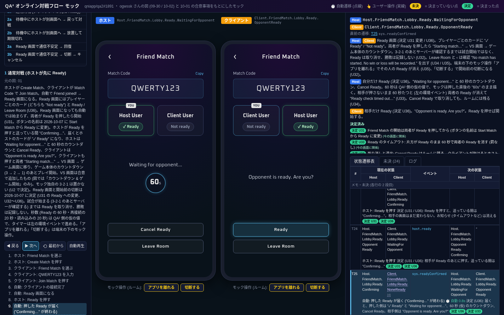
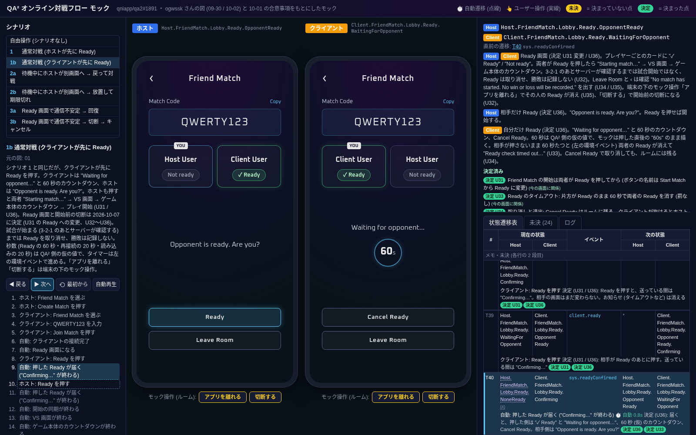
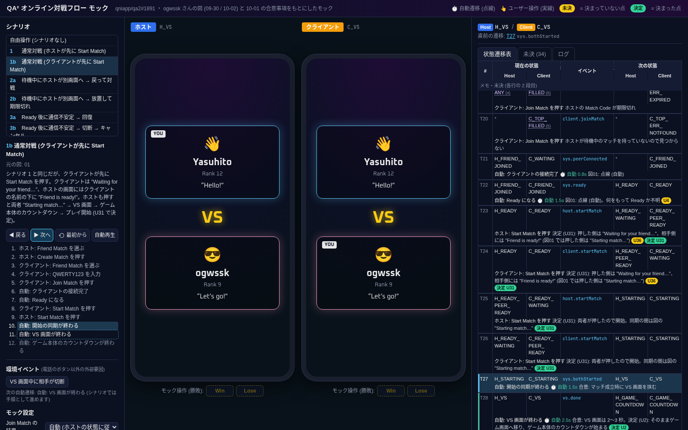
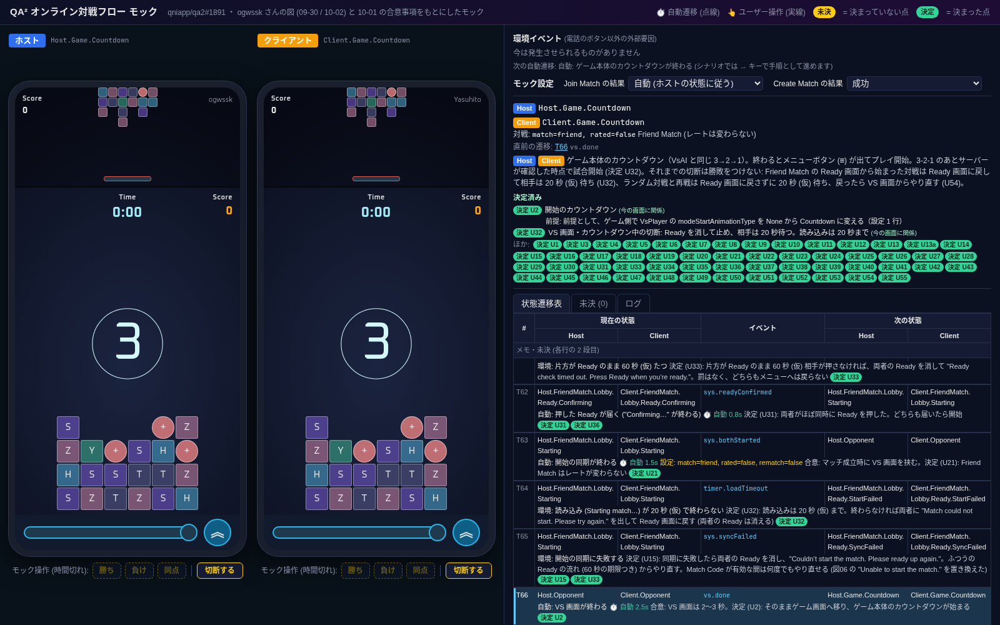
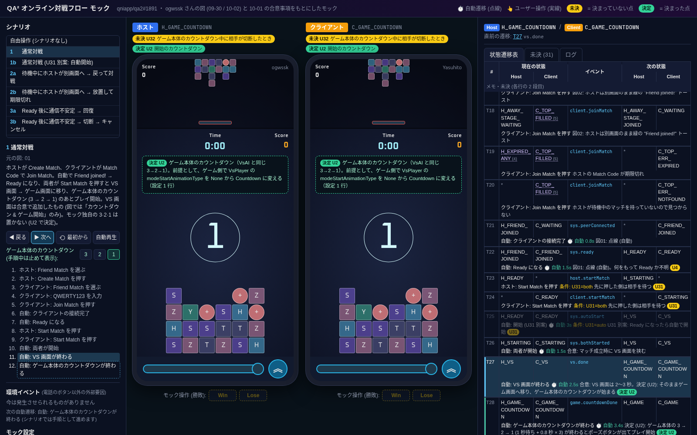
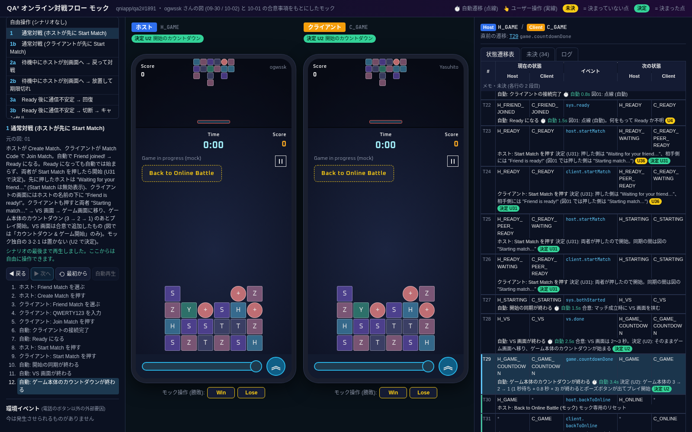
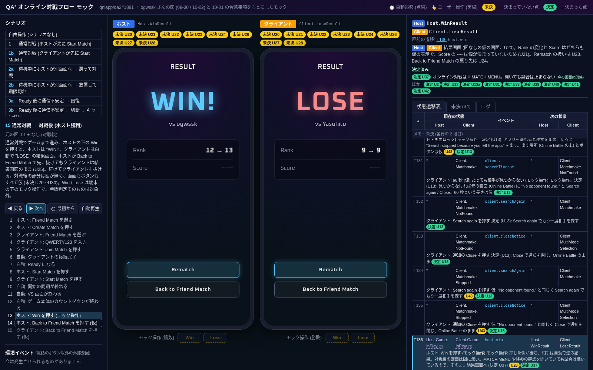
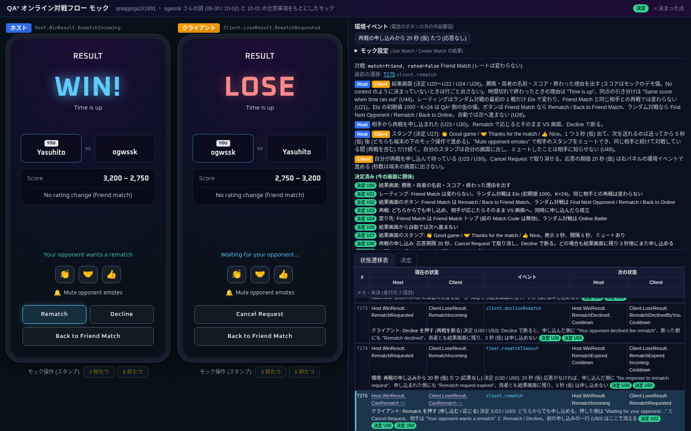

# qa2-match-mock

QA² のオンライン対戦 (Friend Match) の導線を議論するための、使い捨ての HTML モックです (qniapp/qa2#1891)。
ホストとクライアントの 2 台の画面を並べ、同じ操作で両方がどう変わるかを一度に見られるようにしています。
見た目の作り込みよりも、流れの分かりやすさを優先しています。

> 注意: このリポジトリは使い捨てのモックで、製品コードではありません。リポジトリは public で、GitHub Pages (https://qniapp.github.io/qa2-match-mock/ 、`match-flow-mock` ブランチから配信) で公開しています。

## 目的

- ogwssk さんの図 (2026-09-30 の旧案 00、2026-10-02 の 01〜10) の画面遷移を、ホストとクライアントを同時に動かして確認する
- 10-01 に合意した文言・ボタン・VS 画面を反映した状態で、残っている **未決** を洗い出して議論する

## 開き方

ビルドも依存パッケージも不要です。

- `index.html` をブラウザで直接開く (`file://` で動きます)
- またはローカルサーバーで開く: `python3 -m http.server` → <http://localhost:8000/>

URL の `#s=<シナリオ ID>&step=<手順数>` で、特定のシナリオの特定の手順を直接開けます (例: `index.html#s=1&step=6`)。
`#s=free` は自由操作です。キーボードの ← / → でも手順を戻す / 進めることができます。
ゲーム本体のカウントダウン中の手順では、`&cd=3` / `&cd=2` / `&cd=1` で止めて表示する数字を選べます
(例: `index.html#s=1&step=11&cd=1`。省略すると 3)。詳しくは「ゲーム画面とゲーム本体のカウントダウン」を見てください。

## 画面構成

- **左: シナリオ** - シナリオを選ぶと両方の端末がリセットされ、説明と手順の一覧が出ます。
  `▶ 次へ` / `◀ 戻る` / `⟲ 最初から` / `自動再生` (1 手順あたり約 1.2 秒、VS 画面とゲーム本体のカウントダウンは実際の長さ) で進めます。
  手順をクリックするとその手順まで飛べます。下の「環境イベント」は、通信切断や期限切れなど電話のボタン以外の外部要因です。
  「モック設定」で Join Match / Create Match の結果 (Match not found・期限切れ・満員・接続失敗) を切り替えられます。
- **中央: 2 台の端末** - 左が `ホスト` (青)、右が `クライアント` (橙)。電話のボタンは直接押せます (押すと遷移表の同じイベントが発火します)。
  シナリオの次の手順と同じ操作ならシナリオが進み、違う操作ならシナリオを外れて自由操作になります。
  遷移表に行が無い操作は破線・半透明で表示し、押しても何も起きません (ログに「行なし」と残ります)。
  端末の上の黄色い `未決` バッジは、その画面や直前の遷移が未決事項に依存していることを示します。クリックすると未決一覧へ移動します。
  緑の `決定` バッジは、もとは未決で、その後に決まった項目です (ID はそのまま)。
- **右: 状態遷移表** - 両端末の現在の状態、遷移表 (直前に発火した行を青、今の状態から発火できる行を緑の線で表示)、
  未決一覧 (トグル付き)、イベントログ (新しい順) をタブで切り替えます。

シナリオを手順で進めている間は、自動遷移 (図の点線矢印) は手順として 1 つずつ進み、VS 画面やゲーム本体のカウントダウンのアニメーションも止まります
(スクリーンショットを決定的にするため。カウントダウンは `cd` で選んだ数字の静止した姿勢)。自由操作中と自動再生中は、自動遷移とアニメーションが実時間で進みます。

## 状態遷移表

画面の変化を決めるのは `js/transitions.js` の `TRANSITIONS` (1 本の配列) だけです。`js/app.js` は `state.host` / `state.client` を
`SCREENS` に従って描画し、イベントを `js/engine.js` に渡すだけです。

```js
{ from: { host: 'H_WAITING', client: C_TOP_FILLED }, event: 'client.joinMatch',
  to: { host: 'H_FRIEND_JOINED', client: 'C_WAITING' }, note: '...', undecided: ['U4'] }
```

- `from` / `to` の `host` / `client`: 状態名、状態名の配列 (表ではグループ名で表示)、`'*'` (何でもよい / 変更なし)、`'='` (同じ状態のままダイアログだけ変える)
- `from.hostDialog` / `dialog: { host: 'cancel' }`: 確認ダイアログの開閉 (ダイアログの文言は `DIALOGS`)
- `when`: 未決トグル (`{ U14: 'keep' }`) やモック設定 (`{ codeResult: 'notFound' }`) の条件
- `auto`: 自由操作中に自動で発火するまでのミリ秒 (図の点線矢印)
- 上から順に評価し、最初に一致した行が使われます。行の ID (T01〜) は並び順から自動で振られます。

- `decided`: その行に関係する決定済みの項目 (例: `['U2']`)。表では緑の `決定` バッジで表示します。

ほかに `SCREENS` (状態 → 画面の描画仕様、トーストもここで決まる)、`DIALOGS`、`TOASTS`、`UNDECIDED` (未決一覧。決定済みの項目は `decided` 付き) が同じファイルにあります。
シナリオは `js/scenarios.js` にイベントの列として定義しており、遷移表の行をそのまま再生します。

自己テスト: `node tests/check.js` で、全シナリオが遷移表どおりに最後まで再生できること、未定義の状態や未決 ID が無いこと、
シナリオが前提にしていない未決トグルをどれに切り替えても再生できることを確認します。
対戦後の遷移 (Win / Lose の 4 イベント、Win / Lose が対戦中以外では押せないこと、再戦、Back to Friend Match) も個別に確認します。
また、モック独自の 3·2·1 (状態 `H_COUNTDOWN` / `C_COUNTDOWN`、イベント `countdown.done`、その画面) が残っていないこと、
VS 画面のあとは両端末ともゲーム画面のカウントダウン (`H_GAME_COUNTDOWN` / `C_GAME_COUNTDOWN`) になること、
カウントダウン中は Win / Lose の行が無く、プレイ開始後 (`H_GAME` / `C_GAME`) にはあることも確認します。
開始 (U31 で決定) については、ホストが先・クライアントが先のどちらでも、1 回目の Start Match で「押した側は待機 / 相手側は "Friend is ready!"」、
2 回目で "Starting match…"、続く自動遷移で VS 画面になること、Ready のままや片方だけ押した状態から VS 画面へ進む行が無いこと、
自動開始 (`sys.autoStart`・U31 のトグル・シナリオの別案) が残っていないことを確認します。

## シナリオ一覧

元の図は qniapp/qa2#1891 の ogwssk さんのコメント (09-30 の図 00、10-02 の図 01〜10) です。

| ID | シナリオ | 元の図 |
|---|---|---|
| 1 | 通常対戦 (ホストが先に Start Match) | 01 |
| 1b | 通常対戦 (クライアントが先に Start Match) | 01 |
| 2a | 待機中にホストが別画面へ → 戻って対戦 | 02 |
| 2b | 待機中にホストが別画面へ → 放置して期限切れ | 02 |
| 3a | Ready 後に通信不安定 → 回復 | 03 |
| 3b | Ready 後に通信不安定 → 切断 → キャンセル | 03 |
| 3c | Ready 後に通信不安定 → 切断 → ‹ で戻る | 03 |
| 4 | Ready 後にホストがキャンセル | 04 |
| 4b | キャンセル確認で Keep Waiting | 04 |
| 5 | Ready 後にクライアントが退出 | 05 |
| 6 | Start Match 直後の切断・同期失敗 | 06 |
| 7a | Ready 後にクライアントが別画面へ → 戻って対戦 | 07 |
| 7b | Ready 後にクライアントが別画面へ → 期限切れ | 07 |
| 8 | 無効な Match Code | 08 |
| 9 | Match Code が期限切れ | 09 |
| 10 | マッチが満員 | 10 |
| 11 | ランダム対戦 (旧案) | 00 |
| 12 | VS 画面中の切断 | なし (合意事項) |
| 13 | 接続失敗 (仮) | 00 (トーストのみ) |
| 14 | 離席中に Create Match を押す | なし (10-01 合意) |
| 15 | 通常対戦 → 対戦後 (ホスト勝利) | 01 + なし (対戦後) |
| 15b | 通常対戦 → 対戦後 (ホストが Lose を押す) | 01 + なし (対戦後) |
| 15c | 対戦後に再戦 (仮) | なし (対戦後) |

## 開始は両者の Start Match (2026-10-03 決定、U31)

高宮さんの決定 (2026-10-03、未決 U31): 両者が Start Match を押したら開始します。Ready になっても自動では開始しません。
片方が押すと、押した側は待機表示になり、相手側には相手が準備完了であることを表示します。

### モックでの表示

| 段階 | 押した側 | 相手側 |
|---|---|---|
| 両者 Ready | "Ready"、[Start Match] (有効) | 同じ |
| 片方が押した | 相手の名前の下に "Waiting for your friend…"。[Start Match] は無効表示 (半透明・実線。遷移表の「行なし」の破線とは別) | 相手の名前の下に緑の "Friend is ready!"、"Ready"、[Start Match] (有効) |
| 両者が押した | "Starting match…" (同期中、約 1.5 秒) | 同じ |
| そのあと | VS 画面 → ゲーム画面でゲーム本体のカウントダウン → プレイ開始 | 同じ |

- 押した側の文言は、合意済みのフレンド待機の文言 "Waiting for your friend…" をそのまま使いました (相手を待つ、同じ状況のため)。
- もう一方のボタン (ホストの Cancel Match、クライアントの Leave Match) は Ready のときと同じく残しています。
- 文言・無効表示にするか隠すか・ホストとクライアントで同じ表示にするかはモックの仮で、未決 U36 にしています。

### 状態・イベント

| 変更 | 状態 / イベント |
|---|---|
| 追加 | `H_READY_WAITING` / `C_READY_WAITING` (自分が先に押して相手を待つ)、`H_READY_PEER_READY` / `C_READY_PEER_READY` (相手が先に押した。"Friend is ready!")。遷移表ではグループ `H_ONE_PRESSED` / `C_ONE_PRESSED` |
| 意味を変更 | `H_STARTING` / `C_STARTING` ("Starting match…"): 以前は「自分が押して相手を待つ」状態。今は「両者が押して開始の同期中」と、図06 の再試行で先に押した側の待機 |
| 削除 | イベント `sys.autoStart` (Ready 後の自動開始)、U31 のトグル、シナリオ 1b の「U31 別案: 自動開始」 |
| 変更なし | `host.startMatch` / `client.startMatch` / `sys.bothStarted` (ラベルは「自動: 開始の同期が終わる」に変更) |

流れ: `H_READY` / `C_READY` → (先に押した側の `startMatch`) → `H_READY_WAITING` / `C_READY_PEER_READY` (ホストが先) または
`H_READY_PEER_READY` / `C_READY_WAITING` (クライアントが先) → (もう一方の `startMatch`) → `H_STARTING` / `C_STARTING` → `sys.bothStarted` → `H_VS` / `C_VS`。

"Starting match…" をどこに残すか: 図01 では先に押した側が "Starting match…" で相手を待ちます。決定に合わせて、この待機は "Waiting for your friend…" にしました (「表記の修正」に表記差分として記載)。
"Starting match…" は、両者が押したあと VS 画面までの短い同期の間 (図06 の同期失敗 `sys.startFailed` はここで起きる) と、図06 の再試行で先に押した側の待機に残しています。
図06 の再試行を初回の開始と同じ表示 ("Waiting for your friend…" / "Friend is ready!") に揃えるかは決まっていないので、U15 に書き足しました。

手順の数は変わりません (Start Match 2 回と `sys.bothStarted` の 3 手順のまま) ので、既存の `#s=..&step=..` はそのまま使えます。

- `index.html#s=1&step=8` - ホストが先に押した: ホスト "Waiting for your friend…" / クライアント "Friend is ready!"
- `index.html#s=1b&step=8` - クライアントが先に押した: クライアント "Waiting for your friend…" / ホスト "Friend is ready!"
- `index.html#s=1&step=9` - 両者が押した: 両者 "Starting match…"
- `index.html#s=1b&step=10` - 両者が押したあとの VS 画面

### 片方だけ押した状態と、ほかの流れ

片方だけ押した状態は、図にも決定にも無い場面と重なります。新しい挙動は作らず、次のようにしています。

| 場面 | モック | 未決 |
|---|---|---|
| 相手が切断した / いつまでも押さない / 押した側が取り消したい | 遷移行なし (環境イベントは出ない。押した側の Start Match は無効表示のまま) | U33 |
| ホストの Cancel Match / クライアントの Leave Match | Ready からのキャンセル (図04)・退出 (図05) と同じ結果を仮に置く | U34 |
| どちらかが ‹ で別画面へ移る (離席) | 遷移行なし (‹ は破線で押せない)。そのため、クライアントが押したあとにホストの "Ready to start" トーストが出る場面も無い | U35 |
| 再戦 (Rematch) | 今までどおり両者の Rematch で VS 画面へ。ロビーの Start Match は挟まない | U23 |
| ランダム対戦 | 今までどおり相手が見つかると VS 画面へ (旧案のまま) | U13 |

Start Match を押す前 (両者 Ready) の通信不安定 (3a/3b/3c)・キャンセル (4/4b)・退出 (5)・離席 (2a/7a/7b) は今までどおりで、続きは両者の Start Match になります。
U1 の別案 (トーストのタップで開始扱い) は、「ホストが Start Match を押した扱い」に変えました (ホスト "Waiting for your friend…" / クライアント "Friend is ready!")。

遷移表は 126 行から 131 行になりました (自動開始の 1 行と古い Start Match の 2 行を削除し、Start Match の 4 行と、片方が押したあとのキャンセル・退出の仮の 4 行を追加)。







## ゲーム画面とゲーム本体のカウントダウン (2026-10-03 決定)

高宮さんの決定 (2026-10-03、未決 U2 のカウントダウンの部分): VS 画面のあとにモック独自の 3·2·1 は出しません (ランダム対戦・Friend Match・再戦とも)。
VS 画面が終わるとゲーム画面に移り、ゲーム本体の開始カウントダウンがそこで再生されます。
理由は、ゲーム本体にゲーム開始時のカウントダウンがあり、モック側の 3·2·1 は要らないためです。

**前提として、ゲーム側で VsPlayer の modeStartAnimationType を None から Countdown に変える（設定 1 行）。**
今のゲームで 3-2-1 の `CountdownTimer` を使うのは VsAI (AI 対戦) だけで、VsPlayer (オンライン対戦) は `None` になっています。

### モックでの再現 (実機の VsAI の画面と同じ見た目・タイミング)

- 自分のフィールドの上の中央に、細い水色 (`#D3F7FB`) の数字と、同じ色の細い円のリング。3 → 2 → 1 だけで、"GO" / "START" の文字は出ません (ゲームでは開始は効果音だけ)。
- タイミング: ゲーム画面が出てから 1 秒待ち、数字 1 つにつき 0.8 秒 (合計 3.4 秒)。数字は 0.5 → 0.66 倍に拡大しながら 0.15 秒で現れ、0.55 秒まで少しずつ大きくなり、
  最後の 0.25 秒で 1.6 倍に広がりながら消えます。リングも同じタイミングで 0.2 → 0.34 → 1.6 倍。
- カウントダウン中はポーズボタンが無く、端末の下の Win / Lose も押せません (遷移表に行が無い)。"1" が消えるとポーズボタン (右上の ‖) が出てプレイ開始になり、Win / Lose が押せるようになります。
- ゲーム画面は実機にならったプレースホルダーです: 上に相手の小さなフィールド、その下に "Time 0:00" と "Score 0"、自分のフィールド、下のバー。
- カウントダウンの画面には、緑の `決定 U2` バッジ付きで次の注記を出しています:
  「ゲーム本体のカウントダウン（VsAI と同じ 3→2→1）。前提として、ゲーム側で VsPlayer の modeStartAnimationType を None から Countdown に変える（設定 1 行）」

### 状態・イベント

| 変更 | 状態 / イベント |
|---|---|
| 削除 | 状態 `H_COUNTDOWN` / `C_COUNTDOWN` (モック独自の 3·2·1 の画面)、イベント `countdown.done` |
| 追加 | 状態 `H_GAME_COUNTDOWN` / `C_GAME_COUNTDOWN` (ゲーム画面 + ゲーム本体のカウントダウン、ポーズボタンなし)、イベント `game.countdownDone` (自動、3.4 秒) |
| 変更なし | `H_GAME` / `C_GAME` (プレイ中、ポーズボタンあり、Win / Lose を押せる) |

流れ: `H_VS` / `C_VS` → `vs.done` → `H_GAME_COUNTDOWN` / `C_GAME_COUNTDOWN` → `game.countdownDone` → `H_GAME` / `C_GAME`。
このときの遷移表の行数は 126 行のままでした (`vs.done` の行き先を変え、`countdown.done` の行を `game.countdownDone` に置き換えた)。
手順の数も変わらないので、既存の `#s=..&step=..` はそのまま使えます (例: 通常対戦の手順 11 がカウントダウン、手順 12 がプレイ開始)。

### 手順で止めて見る (`cd`)

シナリオを手順で進めている間は、カウントダウンを 1 つの数字で止めて表示します。表示する数字は URL の `&cd=3` / `&cd=2` / `&cd=1`、
またはカウントダウン中に左のパネルに出る `3` `2` `1` のボタンで選べます (省略時は 3)。自由操作中と自動再生中は実時間でアニメーションします。

- `index.html#s=1&step=11&cd=3` - 両端末に "3" とリング
- `index.html#s=1&step=11&cd=1` - 両端末に "1" とリング
- `index.html#s=1&step=12` - カウントダウンが終わってプレイ開始 (ポーズボタンあり、Win / Lose が押せる)

カウントダウン中に相手が切断した場合の扱いは決まっていないので、遷移行は作らず未決 U32 にしています。







## 対戦後 (Win / Lose)

ogwssk さんの図は「カウントダウン & ゲーム開始」で終わっていて、対戦後の画面はありません。
そこで対戦後は、画面もボタンもすべて仮のプレースホルダーとして作り、決まっていない点を未決 U20〜U30 にしています。

### 使い方

- 各端末の下に `モック操作 (勝敗): [Win] [Lose]` があります。ゲーム内 UI ではなく、勝敗を決めるためのモック操作です (勝敗判定そのものは対象外)。
- 押せるのは両端末が対戦中 (ゲーム本体のカウントダウンが終わったあとのゲーム画面、`H_GAME` / `C_GAME`) のときだけです。カウントダウン中 (`H_GAME_COUNTDOWN` / `C_GAME_COUNTDOWN`) は押せません。
  押せるかどうかは遷移表で決まり、行が無いときは他のボタンと同じく破線・半透明になります。
- 片方で **Win** を押すと、その端末は "WIN!"、もう片方は自動で "LOSE" の結果画面になります。**Lose** を押すとその逆です。

### 結果画面 (仮)

QA² の既存の 1 人用リザルト画面 ("RESULT" の見出しと大きな "WIN!" / "LOSE") と、ゲームの UI キットにある "REMATCH" ボタンにならっています。
issue の当初のチェックリストにある「ランクアップ　ランクダウン」も仮の値で表示しています。

- 見出し "RESULT"、大きな "WIN!" / "LOSE"、対戦相手の名前 ("vs ogwssk")
- ランクの変化 (例: 勝った側 "Rank 12 → 13"、負けた側 "Rank 9 → 9") とスコア ("----")。どちらも `仮` の印付き
- ボタン "Rematch" / "Back to Friend Match"
- 未決の要素には、端末の上の `未決` バッジに加えて、画面の中の該当箇所にも小さな `未決` バッジを付けています

ボタンの配線は、中立と言える範囲にとどめています。

- **Back to Friend Match**: 押した端末だけ Friend Match トップへ戻ります (U24)。もう片方は結果画面のままです (U25)。
- **Rematch**: 押した端末に "Waiting for your friend…"、もう片方に "Your friend wants a rematch" を出し、両者が押したら VS 画面からやり直します (U23)。
  再戦でもロビーに戻って両者の Start Match (U31) を挟むかは決まっていないので、モックは挟みません (U23)。
  再戦待ちの取り消しは未決 (U30) なので、待機中の Rematch には行が無く押せません。

Rematch を行の無いボタン (破線) にするだけの案も考えましたが、配線することにしました。
再戦の有無・同意の要否・VS 画面を挟むか・Match Code を再利用するかは、実際に両端末で動かしてみると論点が具体的になります。
そこで「片方が申し込み、もう片方が応じる」という最小限の流れだけを置き、関係する行と画面にはすべて U23 / U30 を付けています。

### 追加した状態・イベント・行

- 状態 (12): `H_RESULT_WIN`, `H_RESULT_LOSE` と、それぞれの `_REMATCH_WAIT` (自分が申し込んで待機中) / `_REMATCH_ASKED` (相手から申し込まれた)。
  クライアント側も同じく `C_RESULT_*`。遷移表ではグループ `H_RESULT_ANY` / `C_RESULT_ANY` として表示します。
- イベント: `host.win` / `host.lose` / `client.win` / `client.lose` (モック操作)、`host.rematch` / `client.rematch`、
  `host.backToFriendMatch` / `client.backToFriendMatch`
- 行: 同じ `TRANSITIONS` の末尾に 16 行を追加しました (追加時は T111〜T126。U31 の行を足したので、今は T116〜T131)。
  「相手は結果画面のまま」の行は `to` を `'='` (同じ状態のまま) で書いており、残された側の端末にも U25 のバッジが出ます。

### シナリオ

| ID | 手順 | 見られる画面 |
|---|---|---|
| 15 | 15 | 手順 11: ゲーム本体のカウントダウン (Win / Lose は押せない) → 12: プレイ開始 (Win / Lose が押せる) → 13: ホスト WIN! / クライアント LOSE → 14: ホストだけ Friend Match トップ (クライアントは結果画面のまま) → 15: 両者 Friend Match トップ |
| 15b | 14 | 手順 13: ホスト LOSE / クライアント WIN! → 14: クライアントだけ Friend Match トップ |
| 15c | 18 | 手順 13: ホスト WIN! / クライアント LOSE → 14: クライアント "Waiting for your friend…" / ホスト "Your friend wants a rematch" → 15: VS 画面 → 16: ゲーム本体のカウントダウン → 17: プレイ開始 → 18: ホスト LOSE / クライアント WIN! |

例: `index.html#s=15&step=13` (結果画面)、`index.html#s=15c&step=14` (再戦待ち)。





## 合意事項の反映 (10-01 の yasuhito のコメントで合意)

1. 用語は **Match Code** に統一 (図の Friend Match トップの "Enter Match ID" は "Enter Match Code" にした)
2. トーストは sentence case: "Waiting for your friend…" / "Friend joined!" / "Ready to start" / "Match code expired" / "Connection failed" / "Connection lost"
3. ボタンは何が起きるかを書く: "Create a new match?" / "Join another match?" は **Keep Current Match**、"Cancel this match?" は **Keep Waiting** / **Cancel Match**
4. フレンド待機の文言は **"Waiting for your friend…"** (三点リーダー 1 文字)
5. マッチ成立時に **VS 画面** (両者の名前・ランク・あいさつ + 絵文字、約 2.5 秒) → ~~**3 · 2 · 1**~~ → ゲーム開始 (プレースホルダー)。
   VS 画面のプレイヤー情報はモック用の架空データです。
   → 変更 (2026-10-03、U2 で決定): VS 画面のあとのモック独自の 3·2·1 はやめ、ゲーム画面でゲーム本体のカウントダウン (3 → 2 → 1) を使います。

## 表記の修正 (図との差分)

| 図の表記 | モックの表記 | 理由 |
|---|---|---|
| Enter Match ID | Enter Match Code | 合意 1 (用語の統一) |
| ONLINE BATTE | ONLINE BATTLE | 誤字 |
| Match not found. check the Match Code and try again | Match not found. Check the Match Code and try again. | 文頭の大文字・句点 |
| Connection was lost. | Connection lost. | 合意 2 のトースト文言に合わせた |
| Connecting... / Connectinng... | Connecting… | 誤字・三点リーダー |
| "Cancel this match?" の Go Back | Keep Waiting | 合意 3 (10-02 の図は Go Back のまま。未決ではなく表記差分) |
| Starting match.... (点 4 つ) | Starting match… | 三点リーダーに統一 |
| Connection Failed (09-30 のトースト) | Connection failed | 合意 2 (sentence case) |
| Waiting for opponent... | Waiting for opponent… | 三点リーダーに統一 |
| 図01 で先に Start Match を押した側の "Starting match…" | "Waiting for your friend…" (相手側には "Friend is ready!") | U31 の決定 (押した側は待機表示、相手側には準備完了を表示)。"Starting match…" は両者が押したあとの同期中と図06 の再試行に残した。文言は U36 |

"Leave this match?" の "Go Back" は合意の対象外なので図のまま残し、未決 U11 にしています。

## 未決一覧

画面上の `未決` バッジ・未決タブと同じ ID です。選択肢があるものは未決タブのトグルで切り替えられ、既定は図の通り (図に無ければ最も中立な案) です。
決まった項目は ID を変えずに下の「決定済み」に移し、画面では緑の `決定` で表示します。

### 決定済み

- **U2 開始のカウントダウン** - 決定 (高宮さん 2026-10-03)  
  元の論点は「開始は両者の Start Match か、自動カウントダウンか」。このうちカウントダウンの部分が決まりました:
  VS 画面のあと (ランダム対戦・Friend Match・再戦とも) はモック独自の 3·2·1 を出さず、ゲーム画面に移ってゲーム本体のカウントダウン (VsAI と同じ 3 → 2 → 1) を使います。  
  理由: ゲーム本体にゲーム開始時のカウントダウンがあるため、モック側の 3·2·1 は不要。  
  前提として、ゲーム側で VsPlayer の modeStartAnimationType を None から Countdown に変える（設定 1 行）。  
  決定はモックの 3·2·1 をやめることだけで、「両者が Start Match を押すか、Ready 後に自動で開始するか」は決めていません。
  そこでこの残りの論点 (と、そのトグル) を新しい未決 **U31** に分けました。U31 も同じ日に決まりました (下)。
- **U31 開始は両者が Start Match を押してから** - 決定 (高宮さん 2026-10-03)  
  両者が Start Match を押したら開始する (Ready 後の自動開始はしない)。片方が押すと、押した側は待機表示、相手側には相手が準備完了であることを表示する。
  U31 のトグルと、自動開始の別案だったシナリオ 1b は削除し、1b は「クライアントが先に Start Match」にしました。
  詳しくは「開始は両者の Start Match」を見てください。表示の細部 (U36) と、片方だけ押した状態の扱い (U33〜U35) は未決です。

U1 (Ready トーストから VS への入り方) にも同じ決定を当てはめるか確認しましたが、U1 の論点は「トーストをタップしたあと、ロビーの Ready 画面に戻るか、直接開始するか」で、
3·2·1 には触れていません。そのため U1 は未決のまま残し、「VS 画面のあとの流れは U2 で決定済み」という一文だけを足しました。

### 未決

- **U1 Ready トーストから VS への入り方**  
  別画面にいるホストが赤い "Ready to start" トーストをタップしたあと、ロビーの Ready 画面に戻って Start Match を押すのか、タップで Start Match を押した扱いにするのか。
  U31 の決定により、どちらでもクライアントが Start Match を押すまで開始しない (別案ではホストは "Waiting for your friend…"、クライアントには "Friend is ready!")。
  VS 画面のあとの流れ (モックの 3·2·1 をやめてゲーム本体のカウントダウン) は U2 で決定済みで、どちらの入り方でも同じ。トーストのタップ後の入り方は決まっていない。  
  トグル: ロビーの Ready 画面へ (図02) (既定) / タップで Start Match を押した扱い
- **U2** - 決定済み (上の「決定済み」を参照)。残りの論点だった U31 も決定済み
- **U3 VS 画面中に相手が切断したときの戻り先**  
  合意済みの VS 画面中に切断した場合の画面は図に無い。  
  トグル: ロビーで "Connection lost." (既定) / Friend Match トップ / Online Battle
- **U4 Friend joined! → Ready の条件**  
  何をもって Ready になるのか (自動遷移の条件・待ち時間) が不明。モックでは 1.5 秒後に自動で Ready にしている。
  Ready は Start Match を押せるようになる段階で、Ready になっても自動では開始しない (U31 で決定: 両者が Start Match を押したら開始)。
- **U5 Connection lost 時の扱いとクライアント側の表示**  
  図03 の赤字メモ「しばらく待つか、導線的にキャンセルしかないようにするか」。タイムアウトの長さも未定。クライアント側の画面は図に無く、モックではホストと対称の "Connecting…" / "Connection lost." を仮表示している。  
  トグル: キャンセルのみ (図03) (既定) / しばらく待てば復帰できる
- **U6 "Connection failed" トーストの発生条件**  
  09-30 の図にトーストだけあり、出る場面が描かれていない。モックでは Create Match / Join Match の接続失敗として仮に表示している。
- **U7 Match Code の有効期限と文言の差**  
  有効期限の長さが未定。ホスト側は "Match code expired." / トースト "Match code expired"、クライアント側は "Match expired." と文言が異なる。
- **U8 ホストがキャンセルした後のクライアントの出口**  
  "Host User / cancelled the match." の画面にボタンが無い (‹ のみ)。モックでは ‹ で Friend Match トップに戻る。
- **U9 クライアント待機中 (C_WAITING) の退出方法**  
  "Waiting for your friend…" のクライアント画面にボタンが無い。モックでは ‹ で抜けて Match Code 入力済みのトップへ戻る。
- **U10 クライアント離脱で期限切れ後のホスト画面の Start Match**  
  図07 で "Match expired." の画面に Start Match と Cancel Match がある。期限切れで開始できる意味が不明なため、モックでは Start Match に遷移行を用意していない (押せない)。
- **U11 "Leave this match?" の "Go Back" の文言**  
  "Cancel this match?" は合意で "Keep Waiting" にしたが、"Leave this match?" の "Go Back" は合意の対象外。"Stay in Match" などに揃えるか。
- **U12 "Create a new match?" / "Join another match?" の本文と影響**  
  10-01 の合意でボタンは [Create Match]/[Join Match] + [Keep Current Match]。本文は残っている図に無いので仮に "Your current Match Code will no longer be valid." を表示。古いマッチに入っていたクライアントの扱いも未定 (モックでは "cancelled the match.")。
- **U13 ランダム対戦の待機・離脱・Ready の扱い**  
  ランダム対戦は 09-30 の旧案 (図00) のみで、10-02 の図に無い。トースト・離席・Ready / Start Match・キャンセル確認の有無が未定。
  U31 の決定 (両者が Start Match を押したら開始) は Friend Match の図01 についてのもので、ランダム対戦でも両者の Start Match を挟むかは決まっていない。モックでは相手が見つかると Start Match なしで VS 画面へ進む (旧案のまま)。
- **U14 ホストが ‹ で戻ったときにマッチを維持するか**  
  図02 はバナーを出してマッチを維持する。‹ でキャンセル確認を出す案もありうる。  
  トグル: 維持してバナー表示 (図02) (既定) / キャンセル確認を出す
- **U15 同期失敗時に片方だけ再試行した場合**  
  図06 は両者が Start Match で再試行する。片方だけ再試行した場合や、再試行の回数制限が未定。
  再試行で先に押した側は図06 どおり "Starting match…" で相手を待ち、相手側には何も出ない。初回の開始 (U31) の "Waiting for your friend…" / "Friend is ready!" に揃えるかも未定。
- **U16 青 / 緑のバナーをタップしてロビーに戻れるか**  
  図02 で "Ready to start" と "Match code expired" はタップで遷移するが、"Waiting for your friend…" と "Friend joined!" のタップは描かれていない。  
  トグル: タップできない (図02) (既定) / タップでロビーへ
- **U17 ホストが戻ったときクライアントに "Friend joined!" を再表示するか**  
  図02 では Away → Friend joined! → Ready の順。すでに一度 Ready だった場合も同じか。ホスト離席中にクライアントが退出した場合のホスト側表示も図に無い。
  ホストが戻って Ready になったあとも、開始には両者の Start Match が必要 (U31 で決定)。
- **U18 クライアントが別画面にいる間に期限切れになったときのクライアント側**  
  図07 はホスト側のみ。モックではクライアントに "Match code expired" トーストを出し、タップで "Match expired." を表示している。
- **U19 Connection lost から ‹ で戻ると青い "Waiting for your friend…" バナー**  
  図03 では Connection lost の画面から ‹ で戻ると、待機中のバナー付き Friend Match トップになる。相手が切断されたのに待機扱いでよいか。
- **U20 対戦後の画面の内容**  
  ogwssk さんの図は「カウントダウン & ゲーム開始」で終わり、対戦後の画面は無い。モックは QA² の既存の 1 人用リザルト画面 ("RESULT" の見出しと大きな "WIN!" / "LOSE") にならった仮の画面。WIN! / LOSE の見せ方、スコアや対戦の詳細を出すかは未定。
- **U21 ランク変動の表示と計算**  
  issue の当初のチェックリストにある「ランクアップ　ランクダウン」。モックの "Rank 12 → 13" (勝つと +1、負けると変わらない) は仮の値。Friend Match でランクが変わるのか、負けたら下がるのか、ランクアップ・ランクダウンの見せ方も未定。
- **U22 対戦後のボタン構成と文言**  
  "Rematch" / "Back to Friend Match" は仮。ゲームの UI キットには "REMATCH" ボタンがある。ほかのボタン (Online Battle へ戻るなど) が要るか、文言や大文字・小文字も未定。
- **U23 再戦の有無と進め方**  
  再戦できるか、両者の同意が必要か、VS 画面を挟むか、同じ Match Code (同じマッチ) を使うか。モックは中立な仮の流れとして、押した側に "Waiting for your friend…"、相手に "Your friend wants a rematch" を出し、両者が押したら VS 画面からやり直す。
  U31 の決定 (両者が Start Match を押したら開始) は初回の開始についてのもので、再戦でもロビーに戻って両者の Start Match を挟むのか、両者の Rematch だけで開始するのかは決まっていない。
- **U24 対戦後の戻り先**  
  モックでは "Back to Friend Match" で Friend Match トップ (Match Code 入力欄は空) に戻る。Online Battle や、同じマッチのロビーに戻る案もありうる。
- **U25 結果画面で相手が先に抜けた・切断したときの表示**  
  モックでは相手が "Back to Friend Match" で抜けても、自分の結果画面は変わらない (再戦待ちの "Waiting for your friend…" や "Your friend wants a rematch" もそのまま残る)。相手が抜けた・切断したことをどう伝えるかは未定。
- **U26 結果画面から自動で次へ進むか**  
  タイムアウトで自動的に次の画面へ進むのか、ボタンを押すまで結果画面に留まるのか。両者の操作が必要か。モックには自動遷移が無い。
- **U27 結果画面であいさつ絵文字を送れるか**  
  issue の「あいさつ＋絵文字」はモックでは VS 画面に表示している。対戦後にもあいさつや絵文字を送れるか。
- **U28 勝敗が決まらない場合 (引き分け・対戦中の切断・降参)**  
  端末の下の Win / Lose ボタンはモック操作で、勝敗の判定そのものと、両端末に同じ結果を出す同期は対象外。引き分け、対戦中の切断、降参したときの扱いと画面は未定。
- **U29 ランダム対戦の対戦後**  
  ランダム対戦 (U13) の対戦後も Friend Match と同じ結果画面か。モックでは同じ画面になり、"Back to Friend Match" も出てしまう。再戦や戻り先 (Random Match の待機に戻るなど) が違うかは未定。
- **U30 再戦の申し込みの取り消し・応答待ちのタイムアウト**  
  モックでは Rematch を押したあと取り消せない (待機中の Rematch は押せない)。相手が応じないときのタイムアウトや、申し込まれた側が断る手段も未定。
- **U31** - 決定済み (上の「決定済み」を参照)
- **U32 ゲーム本体のカウントダウン中に相手が切断したとき**  
  VS 画面中の切断 (U3) と対戦中の切断 (U28) の間にある、ゲーム画面のカウントダウン (約 3.4 秒) 中に相手が切断した場合の扱いと画面は決まっていない。モックには遷移行が無い。
- **U33 片方だけ Start Match を押した状態で、相手が切断した / いつまでも押さないとき**  
  U31 の決定で、片方が押すと相手が押すまで待つ。その間に相手が切断した場合や、相手がいつまでも押さない場合の扱い (タイムアウトするか、キャンセルになるか、押した側が押したことを取り消せるか) は決まっていない。
  モックには遷移行が無い (片方が押したあとは「通信が不安定になる」などの環境イベントを出せず、押した側の Start Match は無効表示のまま)。
- **U34 片方が Start Match を押したあとの Cancel Match / Leave Match**  
  片方が押して相手を待っている間に、ホストが Cancel Match、またはクライアントが Leave Match を押したときの扱いは図に無い。押した側が自分でキャンセル・退出する場合と、準備完了の相手を残してキャンセル・退出する場合がある。
  モックでは Ready からのキャンセル (図04: クライアントに "cancelled the match.") ・退出 (図05: ホストに "left the match." → 待機に戻る) と同じ結果を仮に置いている。相手に何を伝えるかは未定。
- **U35 片方が Start Match を押したあとに別画面へ移る (‹) とき**  
  押した側、または準備完了の相手を待たせている側が ‹ で別画面へ移ったときの扱いは図に無い。マッチを維持してトーストを出すのか (図02 / 図07 のように)、押したことが取り消されるのかが未定。
  クライアントが押したあとにホストが離れた場合の "Ready to start" トーストの扱いも未定。モックには遷移行が無い (‹ は押せない)。
- **U36 片方が Start Match を押したあとの表示の細部**  
  U31 で決まったのは「押した側は待機表示、相手側には相手が準備完了であることを表示」まで。モックの文言 (押した側の "Waiting for your friend…"、相手側の名前の下の "Friend is ready!")、
  押した側の Start Match を無効表示にするか隠すか、ホスト・クライアントで同じ表示にするかは仮。
