# qa2-match-mock

QA² のオンライン対戦 (Friend Match) の導線を議論するための、使い捨ての HTML モックです (qniapp/qa2#1891)。
ホストとクライアントの 2 台の画面を並べ、同じ操作で両方がどう変わるかを一度に見られるようにしています。
見た目の作り込みよりも、流れの分かりやすさを優先しています。

> 注意: このリポジトリは使い捨てのモックで、製品コードではありません。リポジトリは public で、GitHub Pages (https://qniapp.github.io/qa2-match-mock/ 、`main` ブランチから配信) で公開しています。

## 目的

- ogwssk さんの図 (2026-09-30 の旧案 00、2026-10-02 の 01〜10) の画面遷移を、ホストとクライアントを同時に動かして確認する
- 10-01 に合意した文言・ボタン・VS 画面を反映した状態で、残っている **未決** を洗い出して議論する

## 開き方

ビルドも依存パッケージも不要です。

- `index.html` をブラウザで直接開く (`file://` で動きます)
- またはローカルサーバーで開く: `python3 -m http.server` → <http://localhost:8000/>

シナリオを付けずに開く (`#s=` なし、または `#s=free`) と **自由操作** です。両端末が最初の画面 (Online Battle) から始まり、
電話のボタンを自由に押せます。自動遷移 (図の点線矢印) は実時間で進みます。
自由操作で Profile を Save すると、絵文字とあいさつがブラウザの localStorage に残り、次に開いた自由操作もその値から始まります (「Profile (絵文字とあいさつ)」を参照)。

URL の `#s=<シナリオ ID>&step=<手順数>` で、特定のシナリオの特定の手順を直接開けます (例: `index.html#s=1&step=6`)。
シナリオの ID・説明・手順は下の [シナリオ一覧](#シナリオ一覧) と `js/scenarios.js` にあります (ページにはシナリオの一覧も説明も出しません)。
開いたあとはキーボードの ← / → で手順を戻す / 進めることができ、電話のボタンでシナリオの次の手順と同じ操作をしても進みます。
ゲーム本体のカウントダウン中の手順では、`&cd=3` / `&cd=2` / `&cd=1` で止めて表示する数字を選べます
(例: `index.html#s=1&step=12&cd=1`。省略すると 3)。詳しくは「ゲーム画面とゲーム本体のカウントダウン」を見てください。

## 画面構成

ページは左の 2 台の端末と右パネルの 2 列です (シナリオを選ぶ左のパネルは 2026-10-08 に消しました。シナリオは上の URL で開きます)。
同じ日に、未決が 0 件になって要らなくなった部品 (右パネルの状態名の行、決定済みの「ほか:」の列、ログタブ、凡例の `未決` と点線 / 実線、端末の上の黄色い未決の帯、未決トグル) も消しました。

- **左: 2 台の端末** - 左が `ホスト` (青)、右が `クライアント` (橙)。電話のボタンは直接押せます (押すと遷移表の同じイベントが発火します)。
  最初の画面 Online Battle には Random Match / Friend Match と、その下に控えめな Profile (保存した絵文字付き、2026-10-08 の U56) があります。
  シナリオの次の手順と同じ操作ならシナリオが進み、違う操作ならシナリオを外れて自由操作になります。
  遷移表に行が無い操作は破線・半透明で表示し、押しても何も起きません。
  端末の下の `モック操作` はゲーム内 UI ではない操作で、ふだんは時間切れの決着と切断 (`時間切れ: 勝ち` / `負け` / `同点` と `切断する`)、ランダム対戦で相手を探している間は `アプリを離れる` / `60 秒たつ`、
  Friend Match のロビー (Ready 画面など) では `アプリを離れる` / `切断する`、結果画面ではスタンプの `3 秒たつ` / `5 秒たつ`、切断を待っている間は `再接続する` (相手側は `相手が戻る`) / `20 秒たつ` です
  (「フレンド対戦の部屋」「Ready 画面と開始前の切断」「ランダム対戦の待機中の操作」「対戦後の結果画面」を参照)。
  端末の上には、その端末の今の状態名を出します。
  電話の画面の中には、ゲームが実際に出すものだけを描きます (決定・未決・仮の印やモックの注記は出さない。「端末の画面にはゲームが出すものだけ」を参照)。
- **右: 状態遷移表** - いちばん上の「環境イベント」は、通信切断や期限切れなど電話のボタン以外の外部要因です (その下に次の自動遷移の予定)。
  その下の「モック設定」はふだん閉じています。開くと Join Match / Create Match の結果 (Match not found・期限切れ・満員・接続失敗) を切り替えられます
  (シナリオ 8〜10 / 13 はこの値を自分で設定するので、閉じたままで動きます)。
  その下に対戦のセッション (Friend Match かランダム対戦か、レートが変わるか)、直前の遷移 (表の行へのリンク)、今の画面の説明 (例: ゲーム本体のカウントダウン、MATCH MENU や結果画面の仮の点、シナリオ 8〜10 の「ホストは関与しない」)、
  今の画面や直前の遷移に関係する「決定済み」の項目 (緑の `決定` バッジと題名。U2 は前提も表示) を出します。
  この上の部分は長くなると、遷移表が見えるようにスクロールします。その下で、遷移表 (直前に発火した行を青、今の状態から発火できる行を緑の線で表示) と
  「決定」(すべての決定と、その理由・前提) をタブで切り替えます。
  ページの上の凡例は、緑の `決定` バッジの意味だけです。

シナリオを手順で進めている間は、自動遷移 (図の点線矢印) は手順として 1 つずつ進み、VS 画面やゲーム本体のカウントダウンのアニメーションも止まります
(スクリーンショットを決定的にするため。カウントダウンは `cd` で選んだ数字の静止した姿勢)。自動遷移の手順は → キーで進めます。自由操作中は、自動遷移とアニメーションが実時間で進みます。

## 状態遷移表

画面の変化を決めるのは `js/transitions.js` の `TRANSITIONS` (1 本の配列) だけです。`js/app.js` は `state.host` / `state.client` を
`SCREENS` に従って描画し、イベントを `js/engine.js` に渡すだけです。

```js
{ from: { host: hostWaitingForFriend, client: clientRoomFilled }, event: 'client.joinMatch',
  to: { host: 'Host.FriendMatch.Lobby.FriendJoined', client: 'Client.FriendMatch.Lobby.Connecting' }, note: '...', decided: ['U4', 'U17'] }
```

- `from` / `to` の `host` / `client`: 状態名、状態名の配列 (表ではグループ名で表示。例の `hostWaitingForFriend` はグループ `Host.FriendMatch.Lobby.WaitingForFriend`、`clientRoomFilled` は `Client.FriendMatch.Room.CodeFilled`)、`'*'` (何でもよい / 変更なし)、`'='` (同じ状態のままダイアログだけ変える)
- `from.hostDialog` / `dialog: { host: 'closeRoom' }`: 確認ダイアログの開閉 (ダイアログの文言は `DIALOGS`)
- `when`: モック設定 (`{ codeResult: 'notFound' }`) やセッション (`{ match: 'friend', rematch: false }`) の条件 (以前の未決トグルの条件は 2026-10-08 にしくみごと消しました)
- `auto`: 自由操作中に自動で発火するまでのミリ秒 (図の点線矢印)
- 上から順に評価し、最初に一致した行が使われます。行の ID (T01〜) は並び順から自動で振られます。

- `decided`: その行に関係する決定済みの項目 (例: `['U2']`)。表では緑の `決定` バッジで表示します。
- `set`: 行が発火したときに書き換えるセッション (`match` / `rated` / `rematch`) と端末ごとの付属状態 (`hostStamp` / `hostMute` / `hostFailed` など)。
  `from` にも付属状態の条件 (例: `hostStamp: null`) を書けます。どちらも表のメモに「設定:」「条件:」と出します (「対戦後の結果画面」を参照)。
- `copy`: 付属状態の値を別の付属状態へ写す (`{ 写す先: 写す元 }`)。Profile の下書き・保存と、部屋を作る・入る・探し始めるときの固定に使い、表のメモに「写す:」と出します (「Profile (絵文字とあいさつ)」を参照)。

ほかに `SCREENS` (状態 → 画面の描画仕様、トーストもここで決まる)、`DIALOGS`、`TOASTS`、`UNDECIDED` (未決一覧。決定済みの項目は `decided` 付き)、
`DEVICE_FIELDS` (端末ごとの付属状態: ダイアログ・スタンプ・ミュート・Profile の絵文字とあいさつ)、`SESSION_FIELDS` (対戦のセッション) が同じファイルにあります。
シナリオは `js/scenarios.js` にイベントの列として定義しており、遷移表の行をそのまま再生します。

自己テスト: `node tests/check.js` で、全シナリオが遷移表どおりに最後まで再生できること、未定義の状態や未決 ID が無いこと、
未決トグルのしくみが残っていないこと、どのシナリオにも README のシナリオ一覧に説明の行があることを確認します。
対戦後 (U20〜U30 で決定) の遷移も個別に確認します (下の段落)。
また、モック独自の 3·2·1 (その画面 `view: 'countdown'`、イベント `countdown.done`) が残っていないこと、
VS 画面のあとは両端末ともゲーム画面のカウントダウン (`Host.Game.Countdown` / `Client.Game.Countdown`) になること、
カウントダウン中は Win / Lose の行が無く、プレイ開始後 (`Host.Game.Play` / `Client.Game.Play`) にはあることも確認します。
開始 (U31 で決定、2026-10-07 にボタンを Ready に変更) と Ready 画面 (U33〜U36 で決定) については、ホストが先・クライアントが先のどちらでも、
1 回目の Ready で "Confirming…"、届くと「押した側は "Waiting for opponent…" / 相手側は "Opponent is ready. Are you?"」、2 回目の Ready が届くと "Starting match…"、
続く自動遷移で VS 画面になること、両者がほぼ同時に押しても開始すること、Ready 画面のどの組み合わせからも VS 画面へ直接進む行が無いこと、
送っている間と読み込み中に押せないものの行が無いこと (読み込み中は Match Code の期限も切れない)、Cancel Ready とアプリを離れたときに自分の Ready だけが消えて相手に "Opponent is no longer ready." が出ること
(Ready していない側が離れても変わらないこと)、60 秒で両者の Ready が消えて "Ready check timed out…" になること、
部屋の画面の出口が左上の ‹ だけで Close Room / Leave Room のボタンが無いこと (U57)、クライアントの ‹ が確認 "Leave this room?" を出し、Keep Waiting で Ready のまま残り、Leave Room でホストに "Your friend left. Waiting for another friend…" が出ること、
ホストの ‹ が確認 "Close this room?" を出し、Keep Waiting で残り、閉じるとクライアントに "Room closed. The host left." が出ること、お知らせ付きの Ready 画面 (同期の失敗を含む 4 種類) からも Ready を押せること、
部屋の画面のカード・文言・カウントダウン (60 / 20)・ボタン、Match Code の下の一行がホストにだけあること (U58)、期限切れと "Could not reconnect." の画面、2 つの確認の題名・本文・ボタンを確かめます。
フレンド対戦の部屋 (U1〜U19 で決定) については、参加のあとホスト "Friend joined!" / クライアント "Connecting…" で Ready を押せず、同期 (`sys.roomSynced`、1.5 秒の固定ではない) のあと Ready 画面になること、
部屋での切断のすべての組み合わせで "Connection lost. Reconnecting…" / "Your friend disconnected…" になり、回復・20 秒で "Could not reconnect."・Retry・‹・残った側の ‹ の行き先 (U5)、
部屋を残したまま離れる状態 (以前の U14 の離席) と帯が無いこと (U57)、"Friend joined!" になるのは本当に入った・入り直したときだけであること (U17)、
"Connection failed" がサーバーに届かないときだけで役割ごとの文言であること (U6)、期限切れで両者 "Match code expired." になり、ホストは Create Match、クライアントは今の画面のまま Join Match で、時計が止まる間は切れないこと (U7 / U10 / U18)、
U1〜U19 (と U32〜U36 / U43) が高宮さん 2026-10-07 の決定で、遷移表・画面・ダイアログに未決として残っていないこと、
U3 / U8 の説明に解消した決定があること、未決が 0 件であること、秒数と 30 分が仮の値であることが右パネルにあること、
図01 の開始ボタンの名前や古い文言 (Cancel Match / Leave Match / Go Back / Stay in Room / Ready to start / Match expired. など)・古い状態・イベント・トグルが残っていないことを確かめます。
VS 画面・カウントダウン中の切断 (U32 で決定) については、Friend Match の Ready 画面から始まった対戦のときだけ "Connection lost. Reconnecting…" / "Opponent disconnected…" になり
(ランダム対戦・再戦は U54 の VS 画面での待ち)、回復で両者 Ready 画面、20 秒でホスト側は "Match cancelled…"、クライアント側は "Room closed. The host disconnected." になり、
戻れなかった側は "Could not reconnect. The match did not start." の Friend Match トップになること (U52)、その間は期限が切れないこと、結果画面へ行かないこと、
読み込みが 20 秒で "Match could not start…"、同期の失敗で "Couldn’t start the match…" になること (U15) を確かめます。シナリオ 1〜7b / 12 / 13 / 19〜20 の流れも確認します。
ランダム対戦 (U13a で決定) については、相手が見つかると両端末とも直接 VS 画面になること、ランダム対戦の状態から Ready 画面 / "Starting match…" へ進む行が無いこと、
相手を探す画面が "Searching for an opponent…" と大きな Cancel だけ (トーストなし) であること、シナリオ 11 の流れを確認します。
相手を探している間の操作 (U13 で決定) については、両端末とも (相手の端末がどの状態でも) Cancel と ‹ が確認ダイアログなしで Online Battle に戻ること、
探している間に行が有るのは Cancel / ‹ / アプリを離れる / 60 秒たつ の 4 つだけで、行き先は Online Battle か通知だけであること、
アプリを離れると `*.Matchmake.Stopped` ("Search stopped while the app was in the background.")、60 秒たつと `*.Matchmake.NotFound` ("No opponent found.") になり、
どちらも Search again (→ `*.Matchmake`) / Close (→ `*.MultiModeSelection`) を出すこと、通知の文言に数字 (60 秒) が無いこと、
U13 が高宮さん 2026-10-07 の決定で、説明に「60 秒という長さは仮」があること、遷移表に U13 が未決として残っていないこと、
端末の下のモック操作に「アプリを離れる」「60 秒たつ」があること、シナリオ 11b〜11f の流れを確認します。
検索停止のお知らせ (U43 で決定) については、U43 が高宮さん 2026-10-07 の決定で遷移表・画面に未決として残っていないこと、古い文言 "…because you left the app." が残っていないこと、
`*.Matchmake.Stopped` の通知が Online Battle の中 (モーダルではない) で、"No opponent found." だけがモーダルのままであること、
通知を出したまま Random Match / Friend Match が Online Battle と同じ行き先へ行けること (両端末、相手の端末がどの状態でも)、
通知から出ていく行はすべてその端末のユーザー操作で、行き先に通知が無いこと (自動遷移・環境イベントでは消えない)、シナリオ 11g の流れを確認します。
MATCH MENU (U37〜U42 で決定) については、両端末とも ☰ で `Host.Game.MatchMenu` / `Client.Game.MatchMenu` が開き、相手の端末が (プレイ中・メニュー中・確認中のどれでも) 変わらないこと、
CONTINUE でプレイに戻ること、SURRENDER で確認 (`*.Game.SurrenderConfirm`) を挟み、確認の CONTINUE でプレイに戻り、SURRENDER で
自分は `*.LoseResult.Surrendered`、相手は `*.WinResult.OpponentSurrendered` になること、負けた側は Back to Online で Online Battle に戻ることを確認します。
メニュー・確認の文言とボタン (CONTINUE / SURRENDER だけで REMATCH / QUIT は無い)、メニュー中・確認中も Win / Lose の行があること (試合は止まらない)、
カウントダウン中・メニュー中に ☰ の行が無いこと、ポーズの状態・イベント・`timeScale` が残っていないこと、
U37〜U42 が高宮さん 2026-10-07 の決定であること、モック専用の "Game in progress (mock)" が残っていないことも確かめます。
対戦後 (U20〜U30 で決定) については、U20〜U30 が高宮さん 2026-10-07 の決定で遷移表に未決として残っていないこと、
時間切れの決着 (勝ち / 負け / 同点) と「切断する」が両端末とも試合中だけ押せること、結果画面 (106 状態) の勝敗と終わった理由、No contest 以外にスコアがあること、
レーティング (Friend Match・Elo の +12 / -12 / ±0・再戦・No contest) の文言、シナリオの途中のセッション (`match` / `rated`)、
結果画面のボタン (Friend Match / ランダム対戦 × 再戦の段階 × 降参・切断・No contest) と、そのボタンにすべて行があること、
戻り先と、相手に "Your opponent left. Rematch is not available." が出ること (勝敗は同じ)、Friend Match のボタンがランダム対戦に無いこと (と逆)、
再戦の申し込み・応じる (VS 画面、レートは変わらない)・取り消す・断る・期限切れ (両者に一行、3 秒たっても一行は残り、また申し込める)・同時・3 秒の間は申し込めないこと (勝ち / 負け / 引き分け、両方向)、結果画面からの自動遷移が無いこと、
スタンプ (3 種類、5 秒の間は送れない、3 秒で消える、ミュート、再戦の間はミュートが続き結果画面を抜けると戻る、送れない結果画面)、
対戦中の切断 (20 秒で切断した側の負け、回復、両者の切断・サービス障害は No contest、待っている間は決着を押せず、両者に残りの秒数)、
次の相手を探す (60 秒で "No opponent found." と Search again / Back to Online、アプリを離れると "Search stopped…"、見つかればレートが変わる対戦)、
右パネルの説明に秒数と Elo の値が仮であることが書いてあること、結果画面の文言に数字が無いこと、シナリオ 15〜15h / 16d / 17 / 17b / 18〜18e の流れを確かめます。
最後に、端末の画面に決定の注記を出すコードと、端末の上に `決定` バッジを出すコードが無いこと、
結果画面の決定 (U44 / U45 / U49 / U50) が右パネルの「決定済み」に、仮の値の説明が右パネルにあることも確認します。
2026-10-08 の決定 (U44〜U55) については、U44〜U55 が高宮さん 2026-10-08 の決定で、遷移表・画面・ダイアログに未決が 1 つも残っていないこと、
時間切れの勝ち・負けが "Time is up"、同点が "Same score when time ran out" で "Match finished" が残っていないこと (U44)、降参・切断・No contest のあとにどちらからも Rematch が無いこと (U45)、
切断を待つ間の暗幕が止まった濃さで MATCH MENU は薄いままであること (U46)、次の相手を探している間のアプリを離れると "Search stopped…" (U47)、VS 画面が "Rating {n}" で Rank が無いこと (U48)、
ミュートのボタンの文言と、VS 画面の切断待ちでもミュートが続くこと (U49)、ホストの確認の題名が "Close this room?" で U12 のクライアント向けの本文が保留であること (U51)、
部屋のお知らせ 5 種類の文言・Close・Match Code を入れても消えないこと・入れたまま Join Match できること (U52)、Ready を送っている間・読み込み・VS 画面から先に Cancel Ready の行が無いこと (U53)、
ランダム対戦・ランダム対戦の再戦・Friend Match の再戦の開始前の切断が VS 画面で 20 秒待ち、戻れば VS 画面から、戻らなければ結果画面へは行かずに取りやめになり、
ランダム対戦は Online Battle の中の通知 (Search again / Close) になること (U54)、
部屋での切断の再接続待ちの間に Match Code の期限が切れ、戻った側も "Match code expired." になること (pi の仮定 3)、"Back to Online Battle" が無いこと (仮定 5) を確かめます
(U55 の帯と、仮定 1 の「ホストの ‹ に確認が無い」は 2026-10-09 の U57 で無くなった)。
再戦の取り消し (2026-10-08) については、両者のすべての取り消しの状態の一行が "Rematch request cancelled" であることと、リポジトリの文章 (js・README・テストなど) に以前の "was" 付きの文言が残っていないことを確かめます。
Profile (U56、2026-10-08) については、U56 が高宮さん 2026-10-08 の決定で未決が 0 件のままであること、絵文字 10 個とあいさつ 10 個の候補 (内容と順番)、あいさつの候補・既定値・相手の値・どのシナリオの VS 画面のあいさつにもまっすぐな `'` が無いこと、既定値 👋 "Hello!" とクライアント (ogwssk) の最初の値、
Profile を開く行とボタンが Online Battle (と、その中の通知) だけにあり、探している間・部屋・対戦中には無いこと (両端末のすべての状態)、Profile 画面の操作と、Save で保存し Cancel / ‹ で捨てること、
相手に見せる値を固定するのが部屋を作る・入る・探し始める行だけで、固定したあとに保存した値が変わってもその部屋・その相手には前の値が出て、次の部屋・次の検索から新しい値になること (再戦では変わらない)、
どのシナリオでも VS・ゲーム・結果画面で両者の値が決まっていること、シナリオ 22 / 22b の流れ (ミュートしたままの再戦の VS 画面を含む)、結果画面のスタンプが変わっていないこと、
localStorage のキーがモックの名前で区切られ、保存して読み直すと同じ値になり、壊れた値・候補に無い値は最初の値に戻ること、シナリオが保存した値を使わないことを確かめます。

端末の画面の検査: `node tests/scan-screens.mjs` (ヘッドレス Chromium が必要。場所は環境変数 `CHROMIUM` で変えられます) で、
全シナリオの全手順 (ゲーム本体のカウントダウンは 3 / 2 / 1 それぞれ。計 825 枚) を 1280x720 の画面で実際に描画し (手順は `#s=..&step=..&cd=..` と同じ `MockApp.show` で開く)、
両端末の画面 (`.screen`) に `仮`・`未決`・`決定`・U 番号・日本語・モックの注記 (`.mock-note`、`.pill-*` など) が無いこと、
を確認します。各手順で両端末の状態が遷移表の再生結果と同じかも確かめます。
その前に、hash なしで開いたページが自由操作 (シナリオなし、両端末が Online Battle で、ボタンを押すと進み、参加のあとの同期が実時間で進む) であること、
消した部品 (左のシナリオのパネル、右パネルの状態名の行・「ほか:」の列・ログタブ、凡例の `未決` と点線 / 実線、端末の上の黄色い未決の帯、トグルのラジオ) が無いこと、
タブの名前が「決定」であること、モック設定が閉じた `<details>` で環境イベントの下にあることも確かめます。
ランダム対戦の画面 (`*.Matchmake*`) に数字 (60 秒という仮の長さ) が無いこと、「アプリを離れる」「60 秒たつ」が端末の画面の中には無く、相手を探している間は端末の下で押せることも確かめます。
結果画面とゲーム画面に秒数 (20 秒・3 秒・5 秒) と `----` が無いこと (切断を待つ間 (U46 / U54) だけは、濃い暗幕の上のパネルに "20s" と決定どおりの文言があり、端末の下で「再接続する」「20 秒たつ」を押せること)、
No contest にスコアの行が無いこと、モック操作 (時間切れの勝ち・同点 / 切断する / スタンプの 3 秒・5 秒) が端末の画面の中に無いこと、
スタンプを送った端末では端末の下の「3 秒たつ」「5 秒たつ」を押せて、自分の名前の上に吹き出しがあることも確かめます。
アプリを離れて検索が止まった画面 (`*.Matchmake.Stopped`) では、通知のボックスが Online Battle のメニューの中にあって暗幕 (`.dim`) が無いこと、
ボックスが端末の画面に収まっていること、Random Match / Friend Match / Profile と通知のボタンの真ん中を押すとそのボタン自身に当たる (上に何も重なっていない) ことも確かめます (U43)。
Ready 画面 (U31 / U32 / U36) では、カードが 2 枚 ("✓ Ready" / "Not ready"、自分のカードに `YOU`) あること、数字は決定どおりのカウントダウン (Ready の "60s"、再接続を待つ両者の "20s"、U5 / U32 / U52) だけであること、
カード・お知らせ・文言・ボタンが画面に収まって重ならないこと、‹ の確認 (Close this room? / Leave this room?) を開いても後ろのボタンが消えないこと、
「アプリを離れる」「切断する」が端末の画面の中には無く、端末の下にあることも確かめます。
部屋の画面 (U1〜U19) では、Match Code の期限の表示がどこにも無く、ホストにだけ Match Code の下に "Share this code with your friend!" があること (クライアントと、期限切れ・"Could not reconnect." の画面には無い、U58)、数字が Match Code・カウントダウンだけであること、
クライアントのカードに "Away" が無いこと、古い文言 (Cancel Match / Leave Match / Go Back / Stay in Room / Ready to start / Match expired. など) が無いこと、
画面の下の帯 (2 行の "Connection failed" を含む) が画面に収まり、ボタン・入力欄・お知らせと重ならず、文字と › がはみ出さないことも確かめます。
部屋の画面 (U57) では、Close Room / Leave Room のボタンがどこにも無く、‹ を押すとホストは "Close this room?"、クライアントは "Leave this room?" の確認が画面に収まって開き、Close Room / Leave Room と Keep Waiting を押せることも確かめます。
2026-10-08 の決定 (U44〜U55) では、VS 画面の両者のカードが "Rating 1000" で "Rank" がどこにも無いこと (U48)、部屋のお知らせの帯がその状態のときだけあり、Close を押せ、暗幕が無く、画面に収まってほかの部品と重ならないこと (U52)、
ミュートのボタンが "Mute opponent emotes" / "Unmute opponent emotes" で状態と合っていること (U49) も確かめます。
Profile (U56) では、自由操作で Cancel と ‹ は localStorage に書かず、Save した値がページを開き直しても Online Battle と Profile に残ること、
localStorage に既定値と違う値がある状態で全シナリオを描いても、シナリオの画面が最初の値のままであることを確かめます (シナリオの画面は localStorage に左右されない)。
各手順では、VS 画面の両者の絵文字とあいさつが固定した値で、まっすぐな `'` が無いこと (ミュートしたままの VS 画面を含む)、Online Battle の Profile のボタンに保存した絵文字があること、
Profile 画面の候補・選ばれているもの (1 つずつ)・見本・Save / Cancel が画面に収まって重ならず、あいさつがどれも 1 行に収まり、自由入力の欄が無いことも確かめます。
遷移表に行が無いボタンの破線・半透明 (`[data-norow]`) はモックの操作の手がかりとして残しているので、数を表示するだけです。

## 状態名 (案 C: Host. / Client. + 本体の画面名、2026-10-03)

高宮さんが案 C を選んだので (2026-10-03)、状態名をすべて `役割.画面.状態` の形に改名しました。
役割と画面の名前は、qa2 本体のコードの名前 (`/home/yasuhito/Work/qa2-verify` で確認、`7fbb97305`) をもとにしています。

- 役割: `Host.` / `Client.` (本体の `MultiplayManager.IsHost()` / `IsClient()` [1])
- 画面: `MultiModeSelection` (Online Battle) / `FriendMatch.Room` (Friend Match トップ) / `FriendMatch.Lobby` (Match Code を発行したあとの待機・Ready) /
  `Matchmake` (ランダム対戦で相手を探す) / `Opponent` (VS 画面) / `Game.Countdown` / `Game.Play` / `Game.MatchMenu` / `Game.SurrenderConfirm` / `WinResult` / `LoseResult`、
  ホストの離席は `Host.Away.FriendMatchRoom.*` / `Host.Away.StageSelection.*` (2026-10-09 の U57 で削除)、Profile 画面は `Profile` (2026-10-08。qa2 本体にまだ無い画面なので、画面の名前をそのまま当てた)
- 本体に 1 対 1 の名前が無いもの (Room、Lobby、Opponent (VS 画面)、Countdown、離席の Away、ステージ選択、図の段階名) には **近い名前を当てた** ので、下の表の「対応」に書いています。
- 遷移表のグループ名も同じ形にしました (例: `Host.FriendMatch.Lobby.Cancelable`)。グループは状態名と重ならない名前 (`.Any` や形容詞) にしています。JS の変数名は `hostCancelable` などの camelCase です。

改名は 67 状態と 12 グループ (計 79 個) です。遷移表の行・画面の描画仕様は改名前と同じです (改名前の遷移表を下の表で写したものと、改名後の 135 行が一致することを確認)。
URL (`#s=..&step=..&cd=..`) とスクリーンショットのファイル名には状態名が入っていないので、どちらもそのまま使えます。
その後、MATCH MENU の決定 (2026-10-07) で `Game.Pause` を `Game.MatchMenu` に改名し、`Game.SurrenderConfirm` と降参の結果画面 (`LoseResult.Surrendered` / `WinResult.OpponentSurrendered`) を足したので、
73 状態・14 グループ、遷移表は 141 行になりました (「対戦中の MATCH MENU」を参照)。
さらに、ランダム対戦の待機中の操作の決定 (U13、2026-10-07) で `Matchmake.Stopped` / `Matchmake.NotFound` を足して 77 状態・14 グループ、遷移表は 153 行になりました (「ランダム対戦の待機中の操作」を参照)。
対戦後の結果画面の決定 (U20〜U30、2026-10-07) で結果画面を作り直したので、127 状態・34 グループ、遷移表は 235 行になりました (「対戦後の結果画面」を参照)。
検索停止のお知らせの決定 (U43、2026-10-07) で通知から Random Match / Friend Match へ行く行を足したので、127 状態・34 グループ、遷移表は 239 行になりました (「検索停止のお知らせ」を参照)。
Ready の決定 (U31 の変更・U32〜U36、2026-10-07) で Ready 画面と開始前の切断を作り直したので、137 状態・44 グループ、遷移表は 258 行になりました (「Ready 画面と開始前の切断」を参照)。
フレンド対戦の部屋の決定 (U1〜U19、2026-10-07) で部屋の切断・離席の帯・期限切れを作り直したので、145 状態・55 グループ、遷移表は 297 行になりました (「フレンド対戦の部屋」を参照)。
その後の 2026-10-08 の決定で 213 状態・68 グループ・408 行になり、部屋の出口を ‹ だけにした決定 (U57、2026-10-09) で離席の状態を消したので、今は 199 状態・61 グループ、遷移表は 325 行です (「2026-10-09 の決定 (U57)」を参照)。
このとき `Client.FriendMatch.Lobby.MatchExpired` → `Client.FriendMatch.Lobby.CodeExpired`、`Host.Away.*.Ready` → `Host.Away.*.FriendReady` に改名し、図03 の `Host.FriendMatch.Lobby.Connecting` と、同期の前のクライアントの `Waiting` / `FriendJoined` / `HostAway` を削除しました。
このとき `Ready.WaitingForFriend` → `Ready.WaitingForOpponent`、`Ready.FriendReady` → `Ready.OpponentReady`、`Lobby.StartFailed` → `Lobby.Ready.StartFailed` に改名し、図07 の離席と図04 の "cancelled the match." の状態を削除しました (下の対応表の新名は改名当時のもの)。
このとき再戦の段階の名前を変えました: 自分が申し込んだ `.RematchWaiting` → `.RematchRequested`、相手から申し込まれた `.RematchRequested` → `.RematchIncoming` (下の対応表の新名は改名当時のもの)。
`node tests/check.js` は、すべての状態名とグループ名が `Host.` / `Client.` + 大文字で始まる名前をドットでつないだ形であること、遷移表の host 欄に `Host.`、client 欄に `Client.` の状態だけがあることも確かめます。

根拠にした qa2 本体のファイル (`/home/yasuhito/Work/qa2-verify` からの相対パス):

1. `Assets/Scripts/Runtime/Core/Multiplay/MultiplayManager.cs` - `IsHost()` (357 行目) / `IsClient()` (364 行目)、Unity Lobby (`using Unity.Services.Lobbies`、`public Lobby Lobby` 36 行目)
2. `Assets/Scripts/Runtime/Features/Title/MultiModeSelectionView.cs` - `MultiModeSelectionView`
3. `Assets/Scripts/Runtime/Features/Title/FriendMatchView.cs` - `ShowRoomScreen` (98 行目) / `ShowHostScreen` (106 行目) / `ShowClientScreen` (115 行目) / `ShowReadyScreen` (123 行目)
4. `Assets/Scripts/Runtime/Features/Title/MatchmakeView.cs` - `MatchmakeView`
5. `Assets/Scripts/Runtime/Features/Title/OpponentView.cs` - `OpponentView.Show(opponentName)`
6. `Assets/Scripts/Runtime/Core/Game/GameContext.cs` - `enum GameState { Idle, Play, Win, Lose }` (`Play` は 12 行目)
7. `Assets/Scripts/Runtime/Features/GameModes/GameModeTransition.cs` - `enum GameModeTransitionScreen` の `AiStageRankSelection` / `Pause` / `WinResult` / `LoseResult` (63〜66 行目)
8. `Assets/Scripts/Runtime/Features/ModeStartAnimation/CountdownTimer.cs` - `CountdownTimer`
9. `Assets/App/Scenes/Main/Scripts/Views/PauseView.cs` - `PauseView`
10. `Assets/App/Scenes/Main/Scripts/Views/WinView.cs` / `LoseView.cs` - `WinView` / `LoseView`

### 旧名 → 新名の対応表 (状態 67)

対応: 「一致」= 本体に同じ名前がある。「近い名前を当てた」= 本体に 1 対 1 の名前が無く、近い画面・クラスの名前を使った。「段階名はモック独自」= 図の段階をモックが分けたもので、本体に対応するものが無い。

| 旧名 | 新名 | 本体での名前・根拠 | 対応 |
|---|---|---|---|
| `H_ONLINE` | `Host.MultiModeSelection` | `MultiModeSelectionView` [2] | 一致 |
| `C_ONLINE` | `Client.MultiModeSelection` | `MultiModeSelectionView` [2] | 一致 |
| `H_TOP` | `Host.FriendMatch.Room` | `FriendMatchView` の Room 画面 (`ShowRoomScreen`) [3] | 近い名前を当てた |
| `C_TOP` | `Client.FriendMatch.Room` | `FriendMatchView` の Room 画面 (`ShowRoomScreen`) [3] | 近い名前を当てた |
| `H_TOP_CONN_FAILED` | `Host.FriendMatch.Room.ConnectionFailed` | `FriendMatchView` の Room 画面 [3] + モックの段階 `ConnectionFailed` | 近い名前を当てた (段階名はモック独自) |
| `C_TOP_CONN_FAILED` | `Client.FriendMatch.Room.ConnectionFailed` | `FriendMatchView` の Room 画面 [3] + モックの段階 `ConnectionFailed` | 近い名前を当てた (段階名はモック独自) |
| `C_TOP_CODE` | `Client.FriendMatch.Room.CodeEntered` | `FriendMatchView` の Room 画面 [3] + モックの段階 `CodeEntered` | 近い名前を当てた (段階名はモック独自) |
| `C_TOP_ERR_NOTFOUND` | `Client.FriendMatch.Room.Error.NotFound` | `FriendMatchView` の Room 画面 [3] + モックの段階 `Error.NotFound` | 近い名前を当てた (段階名はモック独自) |
| `C_TOP_ERR_EXPIRED` | `Client.FriendMatch.Room.Error.Expired` | `FriendMatchView` の Room 画面 [3] + モックの段階 `Error.Expired` | 近い名前を当てた (段階名はモック独自) |
| `C_TOP_ERR_FULL` | `Client.FriendMatch.Room.Error.Full` | `FriendMatchView` の Room 画面 [3] + モックの段階 `Error.Full` | 近い名前を当てた (段階名はモック独自) |
| `H_WAITING` | `Host.FriendMatch.Lobby.Waiting` | Unity Lobby (`MultiplayManager.Lobby`) [1] と `FriendMatchView` の Host / Client 画面 [3] + モックの段階 `Waiting` | 近い名前を当てた (段階名はモック独自) |
| `C_WAITING` | `Client.FriendMatch.Lobby.Waiting` (2026-10-07 に削除、U4。同期の前は `Client.FriendMatch.Lobby.Connecting`) | Unity Lobby (`MultiplayManager.Lobby`) [1] と `FriendMatchView` の Host / Client 画面 [3] + モックの段階 `Waiting` | 近い名前を当てた (段階名はモック独自) |
| `H_FRIEND_JOINED` | `Host.FriendMatch.Lobby.FriendJoined` | Unity Lobby (`MultiplayManager.Lobby`) [1] と `FriendMatchView` の Host / Client 画面 [3] + モックの段階 `FriendJoined` | 近い名前を当てた (段階名はモック独自) |
| `C_FRIEND_JOINED` | `Client.FriendMatch.Lobby.FriendJoined` (2026-10-07 に削除、U4 / U17) | Unity Lobby (`MultiplayManager.Lobby`) [1] と `FriendMatchView` の Host / Client 画面 [3] + モックの段階 `FriendJoined` | 近い名前を当てた (段階名はモック独自) |
| `C_HOST_AWAY` | `Client.FriendMatch.Lobby.HostAway` (2026-10-07 に削除、U14。Away はカードの表示に) | Unity Lobby (`MultiplayManager.Lobby`) [1] と `FriendMatchView` の Host / Client 画面 [3] + モックの段階 `HostAway` | 近い名前を当てた (段階名はモック独自) |
| `H_READY` | `Host.FriendMatch.Lobby.Ready` | `FriendMatchView` の Ready 画面 (`ShowReadyScreen`) [3] | 近い名前を当てた |
| `C_READY` | `Client.FriendMatch.Lobby.Ready` | `FriendMatchView` の Ready 画面 (`ShowReadyScreen`) [3] | 近い名前を当てた |
| `H_READY_WAITING` | `Host.FriendMatch.Lobby.Ready.WaitingForFriend` → `Host.FriendMatch.Lobby.Ready.WaitingForOpponent` (2026-10-07) | `FriendMatchView` の Ready 画面 (`ShowReadyScreen`) [3] + モックの段階 `WaitingForFriend` (U31) | 近い名前を当てた (段階名はモック独自) |
| `C_READY_WAITING` | `Client.FriendMatch.Lobby.Ready.WaitingForFriend` → `Client.FriendMatch.Lobby.Ready.WaitingForOpponent` (2026-10-07) | `FriendMatchView` の Ready 画面 (`ShowReadyScreen`) [3] + モックの段階 `WaitingForFriend` (U31) | 近い名前を当てた (段階名はモック独自) |
| `H_READY_PEER_READY` | `Host.FriendMatch.Lobby.Ready.FriendReady` → `Host.FriendMatch.Lobby.Ready.OpponentReady` (2026-10-07) | `FriendMatchView` の Ready 画面 (`ShowReadyScreen`) [3] + モックの段階 `FriendReady` (U31) | 近い名前を当てた (段階名はモック独自) |
| `C_READY_PEER_READY` | `Client.FriendMatch.Lobby.Ready.FriendReady` → `Client.FriendMatch.Lobby.Ready.OpponentReady` (2026-10-07) | `FriendMatchView` の Ready 画面 (`ShowReadyScreen`) [3] + モックの段階 `FriendReady` (U31) | 近い名前を当てた (段階名はモック独自) |
| `H_STARTING` | `Host.FriendMatch.Lobby.Starting` | Unity Lobby (`MultiplayManager.Lobby`) [1] と `FriendMatchView` の Host / Client 画面 [3] + モックの段階 `Starting` | 近い名前を当てた (段階名はモック独自) |
| `C_STARTING` | `Client.FriendMatch.Lobby.Starting` | Unity Lobby (`MultiplayManager.Lobby`) [1] と `FriendMatchView` の Host / Client 画面 [3] + モックの段階 `Starting` | 近い名前を当てた (段階名はモック独自) |
| `H_START_FAILED` | `Host.FriendMatch.Lobby.StartFailed` → `Host.FriendMatch.Lobby.Ready.StartFailed` (2026-10-07) | Unity Lobby (`MultiplayManager.Lobby`) [1] と `FriendMatchView` の Host / Client 画面 [3] + モックの段階 `StartFailed` | 近い名前を当てた (段階名はモック独自) |
| `C_START_FAILED` | `Client.FriendMatch.Lobby.StartFailed` → `Client.FriendMatch.Lobby.Ready.StartFailed` (2026-10-07) | Unity Lobby (`MultiplayManager.Lobby`) [1] と `FriendMatchView` の Host / Client 画面 [3] + モックの段階 `StartFailed` | 近い名前を当てた (段階名はモック独自) |
| `H_CONNECTING` | `Host.FriendMatch.Lobby.Connecting` (2026-10-07 に削除、U5) | Unity Lobby (`MultiplayManager.Lobby`) [1] と `FriendMatchView` の Host / Client 画面 [3] + モックの段階 `Connecting` | 近い名前を当てた (段階名はモック独自) |
| `C_CONNECTING` | `Client.FriendMatch.Lobby.Connecting` (2026-10-07 から同期の前の画面、U4) | Unity Lobby (`MultiplayManager.Lobby`) [1] と `FriendMatchView` の Host / Client 画面 [3] + モックの段階 `Connecting` | 近い名前を当てた (段階名はモック独自) |
| `H_CONN_LOST` | `Host.FriendMatch.Lobby.ConnectionLost` (2026-10-07 から部屋で切れた側、U5) | Unity Lobby (`MultiplayManager.Lobby`) [1] と `FriendMatchView` の Host / Client 画面 [3] + モックの段階 `ConnectionLost` | 近い名前を当てた (段階名はモック独自) |
| `C_CONN_LOST` | `Client.FriendMatch.Lobby.ConnectionLost` (2026-10-07 から部屋で切れた側、U5) | Unity Lobby (`MultiplayManager.Lobby`) [1] と `FriendMatchView` の Host / Client 画面 [3] + モックの段階 `ConnectionLost` | 近い名前を当てた (段階名はモック独自) |
| `H_CLIENT_LEFT` | `Host.FriendMatch.Lobby.ClientLeft` | Unity Lobby (`MultiplayManager.Lobby`) [1] と `FriendMatchView` の Host / Client 画面 [3] + モックの段階 `ClientLeft` | 近い名前を当てた (段階名はモック独自) |
| `H_CLIENT_AWAY` | `Host.FriendMatch.Lobby.ClientAway` (2026-10-07 に削除、U35) | Unity Lobby (`MultiplayManager.Lobby`) [1] と `FriendMatchView` の Host / Client 画面 [3] + モックの段階 `ClientAway` | 近い名前を当てた (段階名はモック独自) |
| `C_HOST_CANCELLED` | `Client.FriendMatch.Lobby.HostCancelled` (2026-10-07 に削除、U34) | Unity Lobby (`MultiplayManager.Lobby`) [1] と `FriendMatchView` の Host / Client 画面 [3] + モックの段階 `HostCancelled` | 近い名前を当てた (段階名はモック独自) |
| `H_EXPIRED` | `Host.FriendMatch.Lobby.MatchExpired` (2026-10-07 に削除、U35) | Unity Lobby (`MultiplayManager.Lobby`) [1] と `FriendMatchView` の Host / Client 画面 [3] + モックの段階 `MatchExpired` | 近い名前を当てた (段階名はモック独自) |
| `C_MATCH_EXPIRED` | `Client.FriendMatch.Lobby.MatchExpired` → `Client.FriendMatch.Lobby.CodeExpired` (2026-10-07、U7) | Unity Lobby (`MultiplayManager.Lobby`) [1] と `FriendMatchView` の Host / Client 画面 [3] + モックの段階 `MatchExpired` | 近い名前を当てた (段階名はモック独自) |
| `H_CODE_EXPIRED` | `Host.FriendMatch.Lobby.CodeExpired` | Unity Lobby (`MultiplayManager.Lobby`) [1] と `FriendMatchView` の Host / Client 画面 [3] + モックの段階 `CodeExpired` | 近い名前を当てた (段階名はモック独自) |
| `H_AWAY_TOP_WAITING` | `Host.Away.FriendMatchRoom.Waiting` (2026-10-09 に削除、U57) | 本体に無い (モックの離席。図02)。`FriendMatchRoom` は `FriendMatchView` の Room 画面 [3] | 近い名前を当てた (モック独自) |
| `H_AWAY_TOP_JOINED` | `Host.Away.FriendMatchRoom.FriendJoined` (2026-10-09 に削除、U57) | 本体に無い (モックの離席。図02)。`FriendMatchRoom` は `FriendMatchView` の Room 画面 [3] | 近い名前を当てた (モック独自) |
| `H_AWAY_TOP_READY` | `Host.Away.FriendMatchRoom.Ready` → `Host.Away.FriendMatchRoom.FriendReady` (2026-10-07、U1) (2026-10-09 に削除、U57) | 本体に無い (モックの離席。図02)。`FriendMatchRoom` は `FriendMatchView` の Room 画面 [3] | 近い名前を当てた (モック独自) |
| `H_AWAY_TOP_EXPIRED` | `Host.Away.FriendMatchRoom.Expired` (2026-10-09 に削除、U57) | 本体に無い (モックの離席。図02)。`FriendMatchRoom` は `FriendMatchView` の Room 画面 [3] | 近い名前を当てた (モック独自) |
| `H_AWAY_STAGE_WAITING` | `Host.Away.StageSelection.Waiting` (2026-10-09 に削除、U57) | 本体に無い (モックの離席。図02 / 図07)。`StageSelection` は `GameModeTransitionScreen.AiStageRankSelection` [7] に近い | 近い名前を当てた (モック独自) |
| `H_AWAY_STAGE_JOINED` | `Host.Away.StageSelection.FriendJoined` (2026-10-09 に削除、U57) | 本体に無い (モックの離席。図02 / 図07)。`StageSelection` は `GameModeTransitionScreen.AiStageRankSelection` [7] に近い | 近い名前を当てた (モック独自) |
| `H_AWAY_STAGE_READY` | `Host.Away.StageSelection.Ready` → `Host.Away.StageSelection.FriendReady` (2026-10-07、U1) (2026-10-09 に削除、U57) | 本体に無い (モックの離席。図02 / 図07)。`StageSelection` は `GameModeTransitionScreen.AiStageRankSelection` [7] に近い | 近い名前を当てた (モック独自) |
| `H_AWAY_STAGE_EXPIRED` | `Host.Away.StageSelection.Expired` (2026-10-09 に削除、U57) | 本体に無い (モックの離席。図02 / 図07)。`StageSelection` は `GameModeTransitionScreen.AiStageRankSelection` [7] に近い | 近い名前を当てた (モック独自) |
| `C_AWAY_STAGE_READY` | `Client.Away.StageSelection.Ready` (2026-10-07 に削除、U35) | 本体に無い (モックの離席。図02 / 図07)。`StageSelection` は `GameModeTransitionScreen.AiStageRankSelection` [7] に近い | 近い名前を当てた (モック独自) |
| `C_AWAY_STAGE_EXPIRED` | `Client.Away.StageSelection.Expired` (2026-10-07 に削除、U35) | 本体に無い (モックの離席。図02 / 図07)。`StageSelection` は `GameModeTransitionScreen.AiStageRankSelection` [7] に近い | 近い名前を当てた (モック独自) |
| `H_RANDOM_WAITING` | `Host.Matchmake` | `MatchmakeView` [4] | 一致 |
| `C_RANDOM_WAITING` | `Client.Matchmake` | `MatchmakeView` [4] | 一致 |
| `H_VS` | `Host.Opponent` | `OpponentView` (相手の名前を出す画面) [5]。モックの VS 画面 | 近い名前を当てた |
| `C_VS` | `Client.Opponent` | `OpponentView` (相手の名前を出す画面) [5]。モックの VS 画面 | 近い名前を当てた |
| `H_GAME_COUNTDOWN` | `Host.Game.Countdown` | `CountdownTimer` [8] (`Game` は `GameState` [6]) | 近い名前を当てた |
| `C_GAME_COUNTDOWN` | `Client.Game.Countdown` | `CountdownTimer` [8] (`Game` は `GameState` [6]) | 近い名前を当てた |
| `H_GAME` | `Host.Game.Play` | `GameState.Play` [6] | 一致 |
| `C_GAME` | `Client.Game.Play` | `GameState.Play` [6] | 一致 |
| `H_GAME_PAUSED` | `Host.Game.Pause` → `Host.Game.MatchMenu` (2026-10-07) | 改名時は `PauseView` [9] / `GameModeTransitionScreen.Pause` [7]。MATCH MENU はオンライン専用の新しい画面で、本体に名前は無い (U37) | 改名時は一致。今は本体に無い |
| `C_GAME_PAUSED` | `Client.Game.Pause` → `Client.Game.MatchMenu` (2026-10-07) | 改名時は `PauseView` [9] / `GameModeTransitionScreen.Pause` [7]。MATCH MENU はオンライン専用の新しい画面で、本体に名前は無い (U37) | 改名時は一致。今は本体に無い |
| `H_RESULT_WIN` | `Host.WinResult` | `GameModeTransitionScreen.WinResult` [7] / `WinView` [10] | 一致 |
| `C_RESULT_WIN` | `Client.WinResult` | `GameModeTransitionScreen.WinResult` [7] / `WinView` [10] | 一致 |
| `H_RESULT_WIN_REMATCH_WAIT` | `Host.WinResult.RematchWaiting` | `GameModeTransitionScreen.WinResult` [7] / `WinView` [10] + モックの段階 `RematchWaiting` (U23) | 近い名前を当てた (段階名はモック独自) |
| `C_RESULT_WIN_REMATCH_WAIT` | `Client.WinResult.RematchWaiting` | `GameModeTransitionScreen.WinResult` [7] / `WinView` [10] + モックの段階 `RematchWaiting` (U23) | 近い名前を当てた (段階名はモック独自) |
| `H_RESULT_WIN_REMATCH_ASKED` | `Host.WinResult.RematchRequested` | `GameModeTransitionScreen.WinResult` [7] / `WinView` [10] + モックの段階 `RematchRequested` (U23) | 近い名前を当てた (段階名はモック独自) |
| `C_RESULT_WIN_REMATCH_ASKED` | `Client.WinResult.RematchRequested` | `GameModeTransitionScreen.WinResult` [7] / `WinView` [10] + モックの段階 `RematchRequested` (U23) | 近い名前を当てた (段階名はモック独自) |
| `H_RESULT_LOSE` | `Host.LoseResult` | `GameModeTransitionScreen.LoseResult` [7] / `LoseView` [10] | 一致 |
| `C_RESULT_LOSE` | `Client.LoseResult` | `GameModeTransitionScreen.LoseResult` [7] / `LoseView` [10] | 一致 |
| `H_RESULT_LOSE_REMATCH_WAIT` | `Host.LoseResult.RematchWaiting` | `GameModeTransitionScreen.LoseResult` [7] / `LoseView` [10] + モックの段階 `RematchWaiting` (U23) | 近い名前を当てた (段階名はモック独自) |
| `C_RESULT_LOSE_REMATCH_WAIT` | `Client.LoseResult.RematchWaiting` | `GameModeTransitionScreen.LoseResult` [7] / `LoseView` [10] + モックの段階 `RematchWaiting` (U23) | 近い名前を当てた (段階名はモック独自) |
| `H_RESULT_LOSE_REMATCH_ASKED` | `Host.LoseResult.RematchRequested` | `GameModeTransitionScreen.LoseResult` [7] / `LoseView` [10] + モックの段階 `RematchRequested` (U23) | 近い名前を当てた (段階名はモック独自) |
| `C_RESULT_LOSE_REMATCH_ASKED` | `Client.LoseResult.RematchRequested` | `GameModeTransitionScreen.LoseResult` [7] / `LoseView` [10] + モックの段階 `RematchRequested` (U23) | 近い名前を当てた (段階名はモック独自) |

### 旧名 → 新名の対応表 (遷移表のグループ 12)

| 旧名 | 新名 | JS の変数名 | 内容 |
|---|---|---|---|
| `H_AWAY_PENDING` | `Host.Away.Pending` (2026-10-09 に削除、U57) | `hostAwayPending` | マッチがまだ有効なホストの離席 (FriendMatchRoom / StageSelection × Waiting / FriendJoined / Ready) (6 状態) |
| `H_CANCELABLE` | `Host.FriendMatch.Lobby.Cancelable` → `Host.FriendMatch.Lobby.Closable` (2026-10-07、U14) | `hostCancelable` → `hostClosable` | ホストが Cancel Match で確認ダイアログを出せるロビーの状態 (8 状態)。2026-10-07 から Close Room と ‹ (部屋を残して離れる) を押せる部屋の画面 (U14)。2026-10-09 から ‹ で "Close this room?" を出せる部屋の画面 (U57) |
| `H_WITH_CLIENT` | `Host.FriendMatch.Lobby.WithClient` | `hostWithClient` | クライアントがいるホストのロビーの状態 (7 状態) |
| `H_EXPIRED_ANY` | `Host.Expired.Any` (2026-10-09 に削除、U57) | `hostExpiredAny` | ホストの期限切れ (ロビーと離席) (4 状態) |
| `H_ONE_PRESSED` | `Host.FriendMatch.Lobby.Ready.OnePressed` (2026-10-07 に削除) | `hostOnePressed` | 片方だけ押した (U31。当時のボタンは図01 の名前) (2 状態)。Ready 画面のグループ (`*.FriendMatch.Lobby.Ready.Any` など) に置き換え |
| `C_ONE_PRESSED` | `Client.FriendMatch.Lobby.Ready.OnePressed` (2026-10-07 に削除) | `clientOnePressed` | 片方だけ押した (U31。当時のボタンは図01 の名前) (2 状態)。Ready 画面のグループ (`*.FriendMatch.Lobby.Ready.Any` など) に置き換え |
| `C_IN_MATCH` | `Client.InMatch` → `Client.FriendMatch.Lobby.InRoom` (2026-10-07) | `clientInMatch` → `clientInRoom` | クライアントがマッチに入っている状態 (ロビーと離席) (11 状態) |
| `C_LEAVABLE` | `Client.FriendMatch.Lobby.Leavable` | `clientLeavable` | クライアントが Leave Match で確認ダイアログを出せるロビーの状態 (6 状態)。2026-10-07 から Leave Room と ‹ で "Leave this room?" を出せる部屋の画面 (U9)。2026-10-09 から ‹ だけ (U57) |
| `C_TOP_ANY` | `Client.FriendMatch.Room.Any` | `clientRoomAny` | クライアントの Friend Match トップ (Room) のすべて (6 状態) |
| `C_TOP_FILLED` | `Client.FriendMatch.Room.CodeFilled` | `clientRoomFilled` | Match Code が入力済みの Room (5 状態) |
| `H_RESULT_ANY` | `Host.Result.Any` | `hostResultAny` | ホストの結果画面のすべて (6 状態) |
| `C_RESULT_ANY` | `Client.Result.Any` | `clientResultAny` | クライアントの結果画面のすべて (6 状態) |

2026-10-07 (MATCH MENU) の変更: `Host.Result.Any` / `Client.Result.Any` に相手が降参した勝ちの結果画面 (`*.WinResult.OpponentSurrendered`) を足して 7 状態にしました
(降参した側の `*.LoseResult.Surrendered` は Back to Friend Match が無いので入れていない)。
新しいグループ `Host.Game.InPlay` / `Client.Game.InPlay` (`hostInPlay` / `clientInPlay`、3 状態ずつ) は、試合が続いている状態 (`Game.Play` / `Game.MatchMenu` / `Game.SurrenderConfirm`) です。

2026-10-07 (対戦後の結果画面、U20〜U30) の変更: `Host.Result.Any` / `Client.Result.Any` は結果画面のすべて (29 状態ずつ。降参した側も含めた) になりました。
新しいグループは、Back to Friend Match などがある結果画面 `*.Result.Leavable` (降参した側以外)、スタンプを送れる結果画面 `*.Result.Stampable`、
試合中と切断を待つ間 `*.Game.InMatch`、相手を探している状態 `*.Matchmake.Searching` (Random Match から / Find Next Opponent から)、
勝敗ごとの再戦できる段階 `*.WinResult.Rematchable` などと 3 秒待ちの段階 `*.WinResult.Cooldown` など (勝ち・負け・引き分け) です (計 34 グループ)。

2026-10-07 (Ready 画面と開始前の切断、U31 の変更・U32〜U36) の変更: 片方だけ押したグループ `*.FriendMatch.Lobby.Ready.OnePressed` を削除し、Ready 画面のグループ `*.FriendMatch.Lobby.Ready.NoneReady` (どちらも Ready していない 4 状態)、`*.FriendMatch.Lobby.Ready.Any` (Ready 画面 8 状態)、`*.FriendMatch.Lobby.PreStart` (Ready 画面と読み込み)、`*.FriendMatch.Lobby.RoomLeavable` (Leave Room / ‹ を押せる)、`*.Game.BeforeStart` (VS 画面とカウントダウン)、`Host.FriendMatch.Lobby.WaitingForFriend` (同じ Match Code で次の友だちを待つ 3 状態)、`Client.FriendMatch.Room.Empty` (入力欄が空の Friend Match トップ) を足しました (計 44 グループ)。

2026-10-07 (フレンド対戦の部屋、U1〜U19) の変更: `Host.FriendMatch.Lobby.Cancelable` を `Host.FriendMatch.Lobby.Closable` (Close Room と ‹ を押せる)、`Client.InMatch` を `Client.FriendMatch.Lobby.InRoom` (部屋にいるクライアント) に置き換え、`*.FriendMatch.Lobby.RoomLeavable` を削除しました。`Host.Away.Pending` は 6 種類の帯 × 2 か所の 12 状態になり、`Host.Away.WithFriend` (離席中の部屋に友だちがいる)、`Host.Away.*.Pending` / `.Vacant` (場所ごと)、`*.FriendMatch.Lobby.Expirable` (期限が切れうる)、`*.FriendMatch.Lobby.Ready.Idle` (送っている間を除く Ready 画面)、`*.FriendMatch.Lobby.FriendGone` / `.SelfGone` (相手 / 自分の再接続待ち) を足しました (計 55 グループ)。

2026-10-08 (U44〜U55) の変更: 再戦を申し込める段階 `*.WinResult.CanRematch` など (なしと、取り消し・辞退・期限切れの一行が残った段階)、ランダム対戦・再戦の開始前の切断を待つ `*.Opponent.Waiting`、
ホストの Friend Match トップ (お知らせ付きを含む) `Host.FriendMatch.Room.Top`、部屋のお知らせ付きの Friend Match トップ `Client.FriendMatch.Room.Notice` / `.Notice.CodeEntered` を足しました (計 66 グループ)。
`*.Game.BeforeStart` は関数 `beforeStart()` になり、U32 と U54 の両方の行で使います。

2026-10-08 (Profile、U56) の変更: 状態 `Host.Profile` / `Client.Profile` と、Profile を開ける画面のグループ `Host.MultiModeSelection.Any` / `Client.MultiModeSelection.Any` (Online Battle と、その中の通知 3 種類) を足しました (213 状態・68 グループ)。

## シナリオ一覧

元の図は qniapp/qa2#1891 の ogwssk さんのコメント (09-30 の図 00、10-02 の図 01〜10) です。
ID のリンクで、公開版のそのシナリオを最初の手順から開けます (→ キーで次の手順へ)。

| ID | シナリオ | 元の図 | 説明 |
|---|---|---|---|
| [1](https://qniapp.github.io/qa2-match-mock/#s=1&step=0) | 通常対戦 (ホストが先に Ready) | 01 | ホストが Create Match、クライアントが Match Code で Join Match。サーバーが参加を確認すると、ホストは "Friend joined!"、クライアントは "Connecting…" (どちらも Ready はまだ押せない、U4)。両者が部屋の画面にそろって同期が終わると Ready 画面になる (決まった待ち時間ではない、U4)。Ready 画面にはプレイヤーごとのカード (どちらも "Not ready")、ホストにだけ Match Code の下に "Share this code with your friend!" (U58)、ボタンは両者とも Ready だけで、部屋の出口は左上の ‹ (U57)。両者が Ready を押したら開始 (U31)。ホストが Ready を押すと送っている間 "Confirming…"、届くとホストのカードが "✓ Ready" になり、ホストは "Waiting for opponent…" と 60 秒のカウントダウンと Cancel Ready、クライアントは "Opponent is ready. Are you?"。クライアントも押すと両者 "Starting match…" → VS 画面 → ゲーム画面に移り、ゲーム本体のカウントダウン (3 → 2 → 1) のあとプレイ開始。VS 画面は合意で追加したもの (図では「カウントダウン & ゲーム開始」のみ)。モック独自の 3·2·1 は置かない (U2 で決定)。 |
| [1b](https://qniapp.github.io/qa2-match-mock/#s=1b&step=0) | 通常対戦 (クライアントが先に Ready) | 01 | シナリオ 1 と同じだが、クライアントが先に Ready を押す。クライアントは "Waiting for opponent…" と 60 秒のカウントダウン、ホストは "Opponent is ready. Are you?"。ホストも押すと両者 "Starting match…" → VS 画面 → ゲーム本体のカウントダウン → プレイ開始 (U31 / U36)。 |
| [3a](https://qniapp.github.io/qa2-match-mock/#s=3a&step=0) | Ready 画面でホストが切断 → 20 秒のうちに戻る → もう一度 Ready | 03 (10-07 の決定 U5 で置き換え) | クライアントが Ready を押して待っている間にホストの接続が切れる (端末の下のモック操作「切断する」)。両者の Ready は消え、20 秒 (仮) まで自動で再接続する (U5)。ホストは "Connection lost. Reconnecting…"、クライアントは "Your friend disconnected. Waiting for them to reconnect…"。20 秒のうちに戻る (右パネルの環境イベント「通信が回復する」) と、両者とも Ready していない Ready 画面に戻る (入り直しではないので "Friend joined!" は出さない、U17)。両者が Ready を押して開始。図03 の「両者が "Connecting…" → "Connection lost." → Cancel Match」の流れは、この決定で置き換えた。 |
| [3b](https://qniapp.github.io/qa2-match-mock/#s=3b&step=0) | Ready 画面でクライアントが切断 → 戻らない → Could not reconnect → ‹ で抜ける | 03 (10-07 の決定 U5 で置き換え、10-09 の U57 で ‹ に) | クライアントの接続が切れ、20 秒 (仮) たっても戻らない (右パネルの環境イベント) と、クライアントは "Could not reconnect." と Retry (U5)。ホストは空の部屋を残して "Waiting for your friend…" (同じ Match Code)。クライアントが ‹ → 確認 "Leave this room?" → Leave Room で Friend Match トップへ戻る (U5 / U57)。 |
| [3c](https://qniapp.github.io/qa2-match-mock/#s=3c&step=0) | Ready 画面でホストが切断 → 戻らない → Retry → 空の部屋に戻る | 03 (10-07 の決定 U5 で置き換え、10-08 の U52 で "The room was closed." と Close を追加) | ホストの接続が切れると、両者に 20 秒のカウントダウン ("Connection lost. Reconnecting…" は U52)。20 秒 (仮) たっても戻らないと、ホストは "Could not reconnect." と Retry (出口は ‹、U57)、クライアントは Friend Match トップへ戻り、"The room was closed." の帯 (U52。"You left the room" とは出さない)。ホストが Retry してつながる (右パネルの環境イベント「通信が回復する」) と、残しておいた空の部屋に戻る ("Waiting for your friend…"、U5)。クライアントが Match Code を入れても帯は残り (U52)、Close で閉じる。同じ Match Code で入り直すと "Friend joined!" (U17)。 |
| [3e](https://qniapp.github.io/qa2-match-mock/#s=3e&step=0) | Ready 画面でホストが切断 → 戻らない → Could not reconnect → ‹ で部屋を閉じる | 03 (10-07 の決定 U5、10-09 の U57) | ホストの接続が切れ、20 秒 (仮) たっても戻らないと、ホストは "Could not reconnect." と Retry、クライアントは Friend Match トップに "The room was closed." の帯 (U5 / U52)。ホストが ‹ を押すと確認 "Close this room?" (U57)、Close Room で Friend Match トップへ (クライアントはもう Friend Match トップにいる)。 |
| [4](https://qniapp.github.io/qa2-match-mock/#s=4&step=0) | Ready 画面でホストが ‹ → "Close this room?" → 部屋を閉じる | 04 (10-07 の決定 U34、10-09 の U57 で ‹ に) | ホストの部屋の画面に Close Room のボタンは無く、出口は左上の ‹ だけ (U57)。‹ を押すと確認 (題名 "Close this room?"、U51。本文 "No match has started. No win or loss will be recorded."、U34。ボタン Close Room / Keep Waiting、U11)。Close Room で部屋を閉じ、ホストは Friend Match トップ、クライアントは "Room closed. The host left." で Friend Match トップへ (U34)。部屋を残したまま別の画面へ移ることはできない (U57)。 |
| [4b](https://qniapp.github.io/qa2-match-mock/#s=4b&step=0) | ホストの ‹ の確認で Keep Waiting (Ready のまま残る) | 04 (10-07 の決定 U11、10-09 の U57) | ホストが Ready を押したあと ‹ を押し、確認 "Close this room?" で Keep Waiting (U11) を選ぶと部屋に残る (Ready もそのまま)。そのあとクライアントも Ready を押して開始。 |
| [4c](https://qniapp.github.io/qa2-match-mock/#s=4c&step=0) | 友だちを待っている間にホストが ‹ → Keep Waiting → ‹ → 部屋を閉じる | なし (10-09 の決定 U57) | ホストが Create Match で部屋を作り、"Waiting for your friend…" の間に ‹ を押すと確認 "Close this room?" (U57)。Keep Waiting で部屋に残り (Match Code はそのまま)、もう一度 ‹ → Close Room で部屋を閉じて Friend Match トップへ。クライアントは関与しない。 |
| [5](https://qniapp.github.io/qa2-match-mock/#s=5&step=0) | Ready 画面でクライアントが ‹ → "Leave this room?" → 抜ける → 同じ Match Code で入り直す | 05 (10-07 の決定 U34、10-09 の U57 で ‹ に) | クライアントの部屋の画面に Leave Room のボタンは無く、出口は左上の ‹ だけ (U57)。‹ → 確認 "Leave this room?" / "No match has started. No win or loss will be recorded." → Leave Room (U9 / U34)。クライアントは Match Code が残った Friend Match トップへ。ホストは "Your friend left. Waiting for another friend…" (U34)。Match Code は変わらないので、クライアントが Join Match で入り直すとホストは "Friend joined!" (本当に入り直したので、U17)。図05 の "left the match." → 自動で待機に戻る流れは、この 1 画面にまとめた。 |
| [5b](https://qniapp.github.io/qa2-match-mock/#s=5b&step=0) | 同期の前 ("Connecting…") のクライアントが ‹ → Keep Waiting → ‹ → 抜ける | なし (10-07 の決定 U9 / U11、10-09 の U57) | 部屋に入った直後 (同期の前) のクライアントは "Connecting…"。‹ を押すと確認 "Leave this room?" (U9 / U57)。Keep Waiting で残り (U11)、もう一度 ‹ → Leave Room で抜けると、ホストは "Your friend left. Waiting for another friend…"。 |
| [6](https://qniapp.github.io/qa2-match-mock/#s=6&step=0) | 読み込みが 20 秒で終わらない → もう一度 Ready | 06 (10-07 の決定 U32 で変更) | 両者が Ready を押し ("Starting match…")、読み込みが 20 秒 (仮) で終わらない (右パネルの環境イベント) と、両者に "Match could not start. Please try again." を出して Ready 画面に戻る (U32)。両者の Ready は消える。もう一度両者が Ready を押して VS 画面へ。 |
| [6b](https://qniapp.github.io/qa2-match-mock/#s=6b&step=0) | 開始の同期に失敗 → もう一度 Ready | 06 (10-07 の決定 U15 で変更) | 両者が Ready を押したあと、開始の同期に失敗する (右パネルの環境イベント) と、両者の Ready を消して "Couldn’t start the match. Please ready up again." (U15)。ふつうの Ready の流れ (60 秒の期限つき) からやり直し、両者が Ready を押して VS 画面へ。Match Code が有効な間は何度でもやり直せる。図06 の "Unable to start the match." を置き換えた。 |
| [7a](https://qniapp.github.io/qa2-match-mock/#s=7a&step=0) | Ready 画面でクライアントが ‹ → 確認 → Keep Waiting → ‹ → 抜ける | 07 (10-07 の決定 U9 / U35 で置き換え) | クライアントが Ready を押したあと ‹ (別の画面へ移る) を押すと、確認 "Leave this room?" (U9 / U35 / U57)。Keep Waiting で残り (Ready もそのまま、U11)、もう一度 ‹ → Leave Room で抜ける。ホストは "Your friend left. Waiting for another friend…" (U34)。図07 の「別画面へ移ってもマッチを残し、赤いトーストで戻る」流れは無くなった (クライアントは部屋に入ったまま別の画面へは移れない)。 |
| [7b](https://qniapp.github.io/qa2-match-mock/#s=7b&step=0) | Ready のあとアプリを離れる → Ready が消える | 07 (10-07 の決定 U35 で置き換え) | ホストが Ready を押したあと、アプリを離れる (バックグラウンド・画面ロック。端末の下のモック操作「アプリを離れる」) と、ホストの Ready は消えて部屋には残る (U35)。クライアントには "Opponent is no longer ready." (Cancel Ready と同じ表示、U53)。そのあと両者が Ready を押して開始。 |
| [8](https://qniapp.github.io/qa2-match-mock/#s=8&step=0) | 無効な Match Code | 08 | Join Match すると赤字で "Match not found. Check the Match Code and try again." を表示し、画面はそのまま。 |
| [9](https://qniapp.github.io/qa2-match-mock/#s=9&step=0) | Match Code が期限切れ | 09 | Join Match すると赤字で "The match has expired."。 |
| [10](https://qniapp.github.io/qa2-match-mock/#s=10&step=0) | マッチが満員 | 10 | Match は存在するが、すでにほかの人が入っている。赤字で "The match is already full."。 |
| [11](https://qniapp.github.io/qa2-match-mock/#s=11&step=0) | ランダム対戦 (相手が見つかり次第 VS) | 00 + 10-03 の決定 (U13a) | 両者が Random Match を選ぶと、相手を探す画面 ("Searching for an opponent…" と大きな Cancel)。相手が見つかったらすぐ VS 画面へ進み (Ready 画面は無い、U13a で決定)、ゲーム本体のカウントダウン → プレイ開始。両者が Ready を押す U31 は Friend Match だけ。探している間の Cancel・‹・アプリを離れたとき・タイムアウトは 11b〜11f (U13 で決定)。 |
| [11b](https://qniapp.github.io/qa2-match-mock/#s=11b&step=0) | ランダム対戦 → Cancel / ‹ で Online Battle へ | 10-03 / 10-07 の決定 (U13a / U13) | ホストが Random Match を選び、相手を探している間に Cancel を押すと、確認ダイアログなしで Online Battle の画面に戻る (U13a / U13)。もう一度探し、今度は ‹ を押す。‹ も Cancel とまったく同じで Online Battle へ戻る (U13)。探している間に行けるのは Online Battle だけ。 |
| [11c](https://qniapp.github.io/qa2-match-mock/#s=11c&step=0) | ランダム対戦 → アプリを離れて検索が止まる → Search again | 10-07 の決定 (U13 / U43) | ホストが相手を探している間にアプリを離れる (バックグラウンド・画面ロック。端末の下のモック操作「アプリを離れる」) と、検索が止まる (U13)。戻ると Online Battle の中に "Search stopped while the app was in the background." と Search again / Close (U43、モーダルではない)。Search again でもう一度探し、クライアントも Random Match を選ぶと相手が見つかって VS 画面へ (U13a)。 |
| [11d](https://qniapp.github.io/qa2-match-mock/#s=11d&step=0) | ランダム対戦 → アプリを離れて検索が止まる → Close | 10-07 の決定 (U13 / U43) | クライアントが相手を探している間にアプリを離れて戻ると、Online Battle の中に "Search stopped while the app was in the background." (U13 / U43)。Close で通知を閉じ、Online Battle のまま (U43)。 |
| [11g](https://qniapp.github.io/qa2-match-mock/#s=11g&step=0) | ランダム対戦 → アプリを離れて検索が止まる → 通知を出したまま Friend Match | 10-07 の決定 (U43) | ホストがアプリを離れて検索が止まり、Online Battle の中に "Search stopped while the app was in the background."。通知はモーダルではないので、そのまま Friend Match を押せる (U43)。ほかの画面へ移ると通知は消え、‹ で Online Battle に戻っても出ない。通知は自動では消えない。 |
| [11e](https://qniapp.github.io/qa2-match-mock/#s=11e&step=0) | ランダム対戦 → 60 秒で見つからない → Search again | 10-07 の決定 (U13) | ホストだけが相手を探し、見つからないまま 60 秒たつ (端末の下のモック操作「60 秒たつ」。60 秒という長さは仮) と、元の画面 (Online Battle) に "No opponent found." と Search again / Close (U13)。Search again でもう一度探し、クライアントも Random Match を選ぶと相手が見つかって VS 画面へ (U13a)。 |
| [11f](https://qniapp.github.io/qa2-match-mock/#s=11f&step=0) | ランダム対戦 → 60 秒で見つからない → Close | 10-07 の決定 (U13) | ホストが相手を探し、見つからないまま 60 秒 (仮) たつと "No opponent found."。Close で通知を閉じ、Online Battle のまま (U13)。 |
| [12](https://qniapp.github.io/qa2-match-mock/#s=12&step=0) | VS 画面中にクライアントが切断 → 戻らない → 同じ Match Code で入り直す | なし (10-07 の決定 U32、10-08 の U52 で Match Code を入れ直す手順を追加) | VS 画面中にクライアントの接続が切れる (端末の下のモック操作「切断する」) と、試合はまだ始まっていないので両者の Ready を消して止める (U32)。ホストは Ready 画面に "Opponent disconnected. Waiting for them to reconnect…" と 20 秒のカウントダウン (出口は ‹、U57)、クライアントは "Connection lost. Reconnecting…" と 20 秒のカウントダウン (U52)。20 秒 (仮) たっても戻らない (右パネルの環境イベント) と、ホストは "Match cancelled. Opponent did not reconnect." (結果なし) で同じ Match Code のまま部屋に残る。クライアントは Friend Match トップに "Could not reconnect. The match did not start." の帯 (U52)。もう一度 Match Code を入れて Join Match で入ると "Friend joined!"。部屋 (Ready 画面・読み込み) での切断は U5 で、文言と流れが違う (3a〜3c / 3e)。 |
| [13](https://qniapp.github.io/qa2-match-mock/#s=13&step=0) | Create / Join がサーバーに届かない (Connection failed) | 00 (トーストのみ、10-07 の決定 U6) | "Connection failed" のトーストは、Create Match / Join Match がサーバーに届かないときだけ出す (U6)。ホストは "Couldn’t create a room. Try again."、クライアントは "Couldn’t join the room. Try again."。Match Code の誤り・期限切れ・満員 (8〜10) や閉じた部屋の表示とは別。モックではモック設定の「接続失敗」で再現する。トーストはタップで閉じる。 |
| [15](https://qniapp.github.io/qa2-match-mock/#s=15&step=0) | Friend Match の対戦後 (ホスト勝利 → 両者が抜ける) | なし (10-07 の決定 U20〜U26) | 通常対戦でゲームまで進み、時間切れでホストの得点が上 (ホストの下のモック操作「勝ち」) だと、ホストは "WIN!"、クライアントは自動で "LOSE" の結果画面。両者の名前・スコア・終わった理由 ("Time is up"、U44) と "No rating change (friend match)" (U20 / U21)。ボタンは Rematch と Back to Friend Match (U22)。ホストが Back to Friend Match で Friend Match トップへ抜けると、クライアントの結果画面はそのまま "Your opponent left. Rematch is not available." (U24 / U25)。続けてクライアントも抜ける。 |
| [15b](https://qniapp.github.io/qa2-match-mock/#s=15b&step=0) | Friend Match の対戦後 (時間切れでホストが負け → クライアントが先に抜ける) | なし (10-07 の決定 U20〜U26) | 時間切れでホストの得点が下 (ホストの下のモック操作「負け」) だと、ホストは "LOSE"、クライアントは自動で "WIN!"。今度はクライアントが先に Back to Friend Match で抜け、ホストに "Your opponent left. Rematch is not available." (U25)。 |
| [15c](https://qniapp.github.io/qa2-match-mock/#s=15c&step=0) | Friend Match の再戦 (申し込み → 応じる → VS) | なし (10-07 の決定 U23 / U30) | ホストが勝ったあと、クライアントが Rematch を押すと "Waiting for your opponent…" と Cancel Request、ホストには "Your opponent wants a rematch" と Rematch / Decline (U23 / U30)。ホストが Rematch で応じると、ロビーの Ready を挟まずにそのまま VS 画面 → ゲーム本体のカウントダウン → プレイ開始 (U23)。今度は時間切れでクライアントが勝つ。 |
| [15d](https://qniapp.github.io/qa2-match-mock/#s=15d&step=0) | 再戦の申し込みを取り消す → 3 秒後にまた申し込める | なし (10-07 の決定 U30) | ホストが Rematch で申し込み、Cancel Request で取り消すと、両者に "Rematch request cancelled" (クライアントは U30、ホストは U50。2026-10-08 に両者の文言を統一)。両者とも結果画面に残り、3 秒 (仮) は Rematch を押せない。3 秒たっても一行は次の操作まで残る (U50)。右パネルの環境イベント「3 秒たつ」でまた押せるようになり、今度はクライアントが申し込んでホストが応じ、VS 画面へ。 |
| [15e](https://qniapp.github.io/qa2-match-mock/#s=15e&step=0) | 再戦を断られる (Decline) | なし (10-07 の決定 U30) | クライアントが Rematch で申し込み、ホストが Decline で断ると、クライアントに "Your opponent declined the rematch" (U30)、ホストにも "Rematch declined" (U50)。両者とも結果画面に残り、3 秒 (仮) のあとはまた申し込める (一行は残る)。そのあとクライアントが Back to Friend Match で抜けると、ホストに "Your opponent left. Rematch is not available." (U25)。 |
| [15f](https://qniapp.github.io/qa2-match-mock/#s=15f&step=0) | 再戦の申し込みに応答がない (20 秒) → 申し込み直す | なし (10-07 の決定 U30) | ホストが Rematch で申し込み、クライアントが 20 秒 (仮) 応答しないと (右パネルの環境イベント)、ホストに "No response to rematch request" (U30)、クライアントには "Rematch request expired" (U50)。3 秒 (仮) のあとホストが申し込み直し、今度はクライアントが応じて VS 画面へ。 |
| [15g](https://qniapp.github.io/qa2-match-mock/#s=15g&step=0) | 引き分け → 両者が同時に Rematch | なし (10-07 の決定 U20 / U23) | 時間切れで同点 (クライアントの下のモック操作「同点」) になると、両者 "DRAW" / "Same score when time ran out" の結果画面 (U20 / U44)。両者が同時に Rematch を押す (右パネルの環境イベント) と、申し込みに応じたのと同じく成立し、そのまま VS 画面 → プレイ開始 (U23)。 |
| [15h](https://qniapp.github.io/qa2-match-mock/#s=15h&step=0) | 結果画面のスタンプとミュート | なし (10-07 の決定 U27) | ホストが 👏 "Good game"、クライアントが 🤝 "Thanks for the match" を送ると、両者の画面で送った人の名前の上に出る (U27)。送ってから 5 秒 (仮) はスタンプを押せない。ホストのスタンプが 3 秒 (仮) で消えたあと、クライアントが 🔔 で相手のスタンプをミュート。ホストが 5 秒 (仮) たって 👍 "Nice" を送ると、ホストの画面には出るがクライアントの画面には出ない。クライアントが "Unmute opponent emotes" で解くと出る。3 秒・5 秒は端末の下のモック操作。ミュートは同じ相手と続けて対戦している間だけ続き、相手には知らせない (U49)。 |
| [16](https://qniapp.github.io/qa2-match-mock/#s=16&step=0) | 対戦中に MATCH MENU → CONTINUE (試合は続く) | なし (10-07 の決定、案A) | プレイ中にホストが右上のメニューボタン (☰) を押すと MATCH MENU が開き、"The match continues while the menu is open."。メニューを開いただけでは、クライアントの端末には何も出ない (U38)。クライアントも開き、CONTINUE でそれぞれメニューを閉じる。 |
| [16b](https://qniapp.github.io/qa2-match-mock/#s=16b&step=0) | 対戦中に降参 (SURRENDER → 確認 → 負け) | なし (10-07 の決定、案A) | ホストが MATCH MENU の SURRENDER を押すと、確認 "Surrender?" / "You will lose." が出る (U40)。いったん CONTINUE でプレイに戻り、もう一度 SURRENDER → SURRENDER で降参する。ホストは負けの結果画面 ("You surrendered")、クライアントは勝ちの結果画面に "Your opponent surrendered" (U38)。ホストは Back to Online Battle で Online Battle へ戻る (U41)。 |
| [16c](https://qniapp.github.io/qa2-match-mock/#s=16c&step=0) | MATCH MENU を開いている間に試合が終わる | なし (10-07 の決定、案A) | ホストが MATCH MENU を開いている間も試合は続くので、その間に時間切れでクライアントが勝つと (端末の下のモック操作「勝ち」)、ホストのメニューは閉じて負けの結果画面になる (U37)。 |
| [16d](https://qniapp.github.io/qa2-match-mock/#s=16d&step=0) | ランダム対戦で降参 (レートが変わる、再戦なし) | なし (10-07 の決定 U21 / U28 / U41) | ランダム対戦でクライアントが降参すると、クライアントは "LOSE" / "You surrendered" で 1000 → 988 (-12)、ホストは "WIN!" / "Your opponent surrendered" で 1000 → 1012 (+12) (U21)。降参した側は再戦を申し込めず (U28)、Back to Online だけ (U41)。勝ったホストにも Rematch は無く (U45)、Find Next Opponent / Back to Online。 |
| [17](https://qniapp.github.io/qa2-match-mock/#s=17&step=0) | ランダム対戦の対戦後 (Elo → 再戦はレートが変わらない → 次の相手) | なし (10-07 の決定 U21 / U22 / U29) | ランダム対戦でホストが勝つと、ホストは 1000 → 1012 (+12)、クライアントは 1000 → 988 (-12) (U21、Elo の初期値 1000・K=24 は仮)。ボタンは Find Next Opponent / Rematch / Back to Online (U22)。再戦すると、その試合はレートが変わらない ("No rating change (rematch)")。ホストが Find Next Opponent で次の相手を探し始めると、クライアントには "Your opponent left. Rematch is not available." (U25)。クライアントも Back to Online から Random Match を選ぶと相手が見つかり、VS 画面へ (新しいランダム対戦なのでレートが変わる)。 |
| [17b](https://qniapp.github.io/qa2-match-mock/#s=17b&step=0) | ランダム対戦の対戦後 → 次の相手が見つからない | なし (10-07 の決定 U29) | クライアントが勝ったあと、ホストが Find Next Opponent で次の相手を探す。60 秒 (仮) 探しても見つからない (端末の下のモック操作「60 秒たつ」) と "No opponent found." と Search again / Back to Online (U29)。Search again でもう一度探し、また見つからないので Back to Online で Online Battle へ。 |
| [17c](https://qniapp.github.io/qa2-match-mock/#s=17c&step=0) | 次の相手を探している間にアプリを離れる → "Search stopped…" → Search again | なし (10-08 の決定 U47) | クライアントが勝ったあと、ホストが Find Next Opponent で次の相手を探している間にアプリを離れる (端末の下のモック操作「アプリを離れる」)。Random Match から探しているとき (U43) と同じく検索を止め、戻ると Online Battle の中に "Search stopped while the app was in the background." と Search again / Close (U47)。Search again でもう一度探し、クライアントも Back to Online から Random Match を選ぶと相手が見つかる。 |
| [18](https://qniapp.github.io/qa2-match-mock/#s=18&step=0) | 対戦中にクライアントが切断 → 20 秒で切断した側の負け | なし (10-07 の決定 U28) | Friend Match の対戦中にクライアントの接続が切れる (端末の下のモック操作「切断する」) と、サーバーが両者のゲームと得点を止め、ホストは "Your opponent disconnected"、クライアントは "Connection lost" / "Reconnecting…"。どちらにも残りの秒数 (20 秒、仮) を出す (U46)。20 秒たっても戻らない (右パネルの環境イベント) と、切断したクライアントの負け: ホストは "WIN!" / "Your opponent disconnected"、クライアントは "LOSE" / "You were disconnected" (U28)。再戦は無い (U45)。 |
| [18b](https://qniapp.github.io/qa2-match-mock/#s=18b&step=0) | 対戦中にホストが切断 → 20 秒のうちに戻る | なし (10-07 の決定 U28) | ホストの接続が切れたあと、20 秒 (仮) のうちに通信が回復する (右パネルの環境イベント) と、止めていたところから両者とも試合を続ける (U46)。そのあと時間切れでホストが勝つ。 |
| [18c](https://qniapp.github.io/qa2-match-mock/#s=18c&step=0) | 両者が切断 → No contest | なし (10-07 の決定 U28) | クライアントの接続が切れ、ホストが待っている間にホストの接続も切れると (右パネルの環境イベント「両者の接続が切れる」)、両者とも "NO CONTEST" / "No contest due to a connection error" (U28)。スコアは決まっていないので行ごと出さない (U20)。再戦は無い (U45)。 |
| [18d](https://qniapp.github.io/qa2-match-mock/#s=18d&step=0) | ランダム対戦でサービス障害 → No contest (レートは変わらない) | なし (10-07 の決定 U28 / U21) | ランダム対戦の対戦中にサービス障害が起きると (右パネルの環境イベント)、両者とも "NO CONTEST" / "No contest due to a connection error" で "No rating change (no contest)" (U28 / U21)。ホストは Back to Online、クライアントは Find Next Opponent で抜ける。 |
| [18e](https://qniapp.github.io/qa2-match-mock/#s=18e&step=0) | ランダム対戦で切断負け (レートが変わる) | なし (10-07 の決定 U28 / U21) | ランダム対戦でホストの接続が切れ、20 秒 (仮) たっても戻らないと、ホストの負け: ホストは 1000 → 988 (-12)、クライアントは 1000 → 1012 (+12) (U28 / U21)。 |
| [19](https://qniapp.github.io/qa2-match-mock/#s=19&step=0) | Cancel Ready (Ready を取り消しても部屋に残る) | なし (10-07 の決定 U34 / U36) | クライアントが Ready を押したあと、Cancel Ready で取り消す。クライアントは部屋に残って "Not ready" に戻り、ホストには "Opponent is no longer ready." (U34)。そのあとホストが Ready を押すと、今度はホストが "Waiting for opponent…" になる。 |
| [19b](https://qniapp.github.io/qa2-match-mock/#s=19b&step=0) | Ready のタイムアウト (60 秒) | なし (10-07 の決定 U33) | ホストが Ready を押し、クライアントが 60 秒 (仮) 押さない (右パネルの環境イベント) と、両者の Ready を消して両者に "Ready check timed out. Press Ready when you’re ready." (U33)。罰はなく、どちらも部屋に残る。もう一度両者が Ready を押して開始。 |
| [19c](https://qniapp.github.io/qa2-match-mock/#s=19c&step=0) | カウントダウン中にホストが切断 → 20 秒のうちに戻る → もう一度 Ready | なし (10-07 の決定 U32) | ゲーム本体のカウントダウン中にホストの接続が切れる (端末の下のモック操作「切断する」)。3-2-1 のあとサーバーが確認するまでは試合開始ではないので、勝敗はつけず、両者の Ready を消して止める (U32)。クライアントは Ready 画面に "Opponent disconnected. Waiting for them to reconnect…" と 20 秒のカウントダウン (出口は ‹、U57)、ホストは "Connection lost. Reconnecting…" と 20 秒のカウントダウン (U52)。20 秒 (仮) のうちに戻る (右パネルの環境イベント「通信が回復する」) と、両者とももう一度 Ready を押し、カウントダウンは 3 からやり直す。 |
| [19d](https://qniapp.github.io/qa2-match-mock/#s=19d&step=0) | VS 画面中にホストが切断 → 戻らない → Room closed | なし (10-07 の決定 U32) | VS 画面中にホストの接続が切れると、両者の Ready を消して止める (U32)。クライアントは "Opponent disconnected…" で 20 秒 (仮) 待つ。ホストが戻らないと、クライアントは "Room closed. The host disconnected." で Friend Match トップへ (U32)。ホストは Friend Match トップに "Could not reconnect. The match did not start." (U52)。部屋での切断 (U5) では、ホストが戻らなくても部屋は残る (3c)。 |
| [19e](https://qniapp.github.io/qa2-match-mock/#s=19e&step=0) | 友だちの切断を待っている間にホストが ‹ → 部屋を閉じる | なし (10-07 の決定 U5 / U34、10-09 の U57) | Ready 画面でクライアントの接続が切れ、ホストが "Your friend disconnected. Waiting for them to reconnect…" で待っている間に ‹ を押す (U5 / U57)。確認 "Close this room?" のあと Close Room で部屋を閉じる (U34)。切断中のクライアントは、戻ったときに "Room closed. The host left." の Friend Match トップ (モックの仮定。お知らせは Close で閉じる帯、U52)。 |
| [20](https://qniapp.github.io/qa2-match-mock/#s=20&step=0) | 両者が Ready 画面にいる間に期限切れ → Create Match / Join Match | なし (10-07 の決定 U7 / U10 / U18) | 両者が Ready 画面にいる間に Match Code の期限 (30 分、仮) が切れる (右パネルの環境イベント) と、両者に "Match code expired." (U7)。Ready は消え、Ready のボタンも出さない (U10)。ホストには Create Match、クライアントには Join Match。クライアントは別の画面へ移されず、今の画面のまま (U18)。ホストが Create Match で新しい部屋を作り、クライアントが Join Match → 新しい Match Code を入れて入る。 |
| [21](https://qniapp.github.io/qa2-match-mock/#s=21&step=0) | ランダム対戦の VS 画面中に切断 → 20 秒のうちに戻る → VS 画面からやり直す | なし (10-08 の決定 U54) | ランダム対戦の VS 画面中にクライアントの接続が切れる (端末の下のモック操作「切断する」)。試合はまだ始まっていないが、Ready 画面は無いので VS 画面のまま 20 秒 (仮) 待つ (U54)。表示は対戦中の切断 (U46) と同じで、ホストは "Your opponent disconnected"、クライアントは "Connection lost" と、どちらも残りの秒数。20 秒のうちに戻る (端末の下のモック操作「再接続する」か右パネルの環境イベント) と、VS 画面からやり直してゲーム本体のカウントダウン → プレイ開始。 |
| [21b](https://qniapp.github.io/qa2-match-mock/#s=21b&step=0) | ランダム対戦のカウントダウン中に切断 → 戻らない → 取りやめ → Search again | なし (10-08 の決定 U52 / U54) | ランダム対戦のゲーム本体のカウントダウン中にホストの接続が切れ、20 秒 (仮) たっても戻らない (端末の下のモック操作「20 秒たつ」) と、試合を取りやめる (U54)。勝敗は無く、レートも変わらない。ホストは Online Battle の中に "Could not reconnect. The match did not start." (U52)、クライアントは "Match cancelled. Opponent did not reconnect."。どちらも Search again / Close (U54。U43 と同じくモーダルではない)。両者が Search again で探し直すと、相手が見つかって新しいランダム対戦の VS 画面 (レートが変わる対戦)。 |
| [21c](https://qniapp.github.io/qa2-match-mock/#s=21c&step=0) | Friend Match の再戦の VS 画面中に切断 → 戻らない → Friend Match トップ | なし (10-08 の決定 U52 / U54) | Friend Match の対戦のあと再戦が成立し、VS 画面中にクライアントの接続が切れる。再戦は Ready 画面に戻らず (U54)、VS 画面のまま 20 秒 (仮) 待つ (表示は U46 と同じ)。戻らないと試合を取りやめ (勝敗なし)、両者とも Friend Match トップへ: ホストは "Match cancelled. Opponent did not reconnect."、クライアントは "Could not reconnect. The match did not start." の帯 (U52)。行き先 (Back to Friend Match と同じ Friend Match トップ、U24) と帯の文言は 2026-10-08 に確認。両者とも Close で帯を閉じる。 |
| [22](https://qniapp.github.io/qa2-match-mock/#s=22&step=0) | Profile で絵文字とあいさつを変えて Save → ランダム対戦の VS 画面に出る | なし (10-08 の決定 U56) | ホストが Online Battle の Profile を開く。上に VS 画面のカードの見本 (Yasuhito、👋、"Hello!") があり、絵文字 🚀 とあいさつ "Bring it on!" を選ぶたびに見本がすぐ変わる。Save で保存して Online Battle に戻ると、Profile のボタンの絵文字も 🚀。両者が Random Match を選ぶと、相手を探し始めたときの値で固定され、VS 画面のホストのカードに 🚀 "Bring it on!" が出る (クライアントは ogwssk 😎 "Let’s go!" のまま)。クライアントが勝ったあと、結果画面でスタンプをミュートしてから再戦しても、VS 画面のあいさつは隠れない (ミュートはスタンプだけ、U49)。 |
| [22b](https://qniapp.github.io/qa2-match-mock/#s=22b&step=0) | Profile で選んだものを Cancel / ‹ で捨てる | なし (10-08 の決定 U56) | ホストが Profile で 🤖 と "Good luck!" を選んでから Cancel を押すと、選んだものは捨てられ、保存した値 (👋 "Hello!") のまま Online Battle に戻る。もう一度開くと見本は保存した値から始まる。🌟 を選んで ‹ を押しても Cancel と同じで、保存しない。 |

次の注記は、いくつかのシナリオに共通です。

- **フレンド対戦の部屋** (シナリオ 3a / 3b / 3c / 3e / 4 / 4b / 4c / 5 / 5b / 7a / 19e / 20): フレンド対戦の部屋は 2026-10-07 に決定 (U1〜U19。細部は 2026-10-08 の U51 / U52)。2026-10-09 の U57 で、部屋の出口は左上の ‹ だけになった (ホストは "Close this room?" で部屋を閉じ、クライアントは "Leave this room?" で抜ける。部屋を残したまま別の画面へは移れない)。秒数 (再接続の 20 秒・Ready の 60 秒) と Match Code の期限 30 分は QA² 側の仮の値で、タイマーは右パネルの環境イベントで進める。「アプリを離れる」「切断する」は端末の下のモック操作。
- **Ready 画面と開始前の切断** (シナリオ 1 / 1b / 6 / 6b / 7b / 12 / 19 / 19b / 19c / 19d): Ready 画面と開始前の切断は 2026-10-07 に決定 (U31 の Ready への変更、U32〜U36。細部は 2026-10-08 の U52 / U53)。Ready を取り消せるのは届いたあとの Ready 画面だけで、試合が始まる (3-2-1 のあとサーバーが確認する) までは勝敗を記録しない。秒数 (Ready の 60 秒・再接続の 20 秒・読み込みの 20 秒) は QA² 側の仮の値で、タイマーは右パネルの環境イベントで進める。「アプリを離れる」「切断する」は端末の下のモック操作。
- **対戦後** (シナリオ 15 / 15b / 15c / 15d / 15e / 15f / 15g / 15h / 16d / 17 / 17b / 17c / 18 / 18b / 18c / 18d / 18e / 21c): 結果画面は 2026-10-07 に決定 (U20〜U30。細部は 2026-10-08 の U44〜U50)。時間切れの勝ち / 負け / 同点と「切断する」は端末の下のモック操作で、得点の計算は対象外。秒数 (20 秒・3 秒・5 秒・60 秒) と Elo の値 (初期値 1000、K=24) は QA² 側の仮の値で、タイマーは右パネルの環境イベントか端末の下のモック操作で進める。
- **Profile** (シナリオ 22 / 22b): 2026-10-08 に決定 (U56)。開けるのは Online Battle からだけ。候補と既定値は QA² 側の仮の値。シナリオは localStorage に関係なく、いつも最初の値 (ホスト 👋 "Hello!"、クライアント 😎 "Let’s go!") から始まる。
- **MATCH MENU** (シナリオ 16 / 16b / 16c): オンライン対戦の MATCH MENU は 2026-10-07 に決定 (案A、U37〜U42)。試合は止まらず (Time.timeScale = 0 にしない、BGM も下げない)、暗幕は薄くゲーム画面が見えたまま。ボタンは CONTINUE と SURRENDER だけで、対戦中に REMATCH / RETRY は無い (U39)。

## 2026-10-10 の決定 (U58: Match Code の期限を出さず、ホストに一行)

qniapp/qa2#1891 の YoshiyukiN さんの「FB意見まとめ」の 3 番目を反映しました (4 番目以降は未反映)。**未決は 0 件のまま** です。

- **3 番目**: Match Code の期限の表示は固い表現なので、出さなくてよい。出すなら、このコードを友だちに伝えることを書いたほうがよい (ホストのみ)。

モックでは次のようにしました。

| | ホスト | クライアント |
|---|---|---|
| Match Code の下 | "Share this code with your friend!" | 何も出さない |

- 一行を出すのは、以前に期限を出していた部屋の画面です: 友だちを待っている間、入った直後 (同期の前)、Ready 画面 (お知らせ付きを含む)、切断を待っている間、友だちが抜けたあと。
  期限切れと "Could not reconnect." の画面には出しません (以前の期限の表示と同じ)。
- 期限そのもの (30 分 (仮)、サーバーが数える、切れたら両者に "Match code expired."、U7 / U10 / U18) は変えていません。画面に残り時間を出さないだけです。
- 状態・イベント・遷移表の行・シナリオの数は変わりません (199 状態・61 グループ・325 行・58 シナリオ)。画面の部品は `.code-expiry` → `.code-hint`、データは `CODE_EXPIRY` → `CODE_HINT`、画面の項目は `expiry` → `codeHint` にしました。

- `index.html#s=1&step=6` - Ready 画面。ホストにだけ "Share this code with your friend!"
- `index.html#s=4c&step=2` - 友だちを待っているホスト

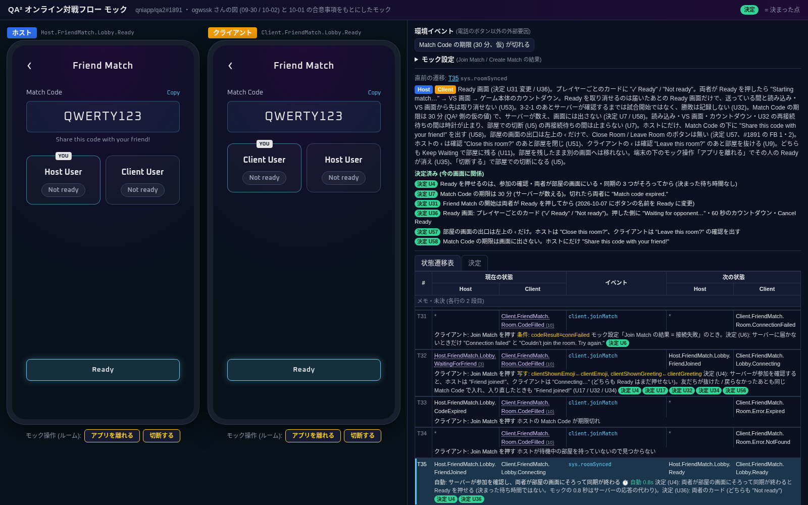

## 2026-10-09 の決定 (U57: 部屋の出口は ‹ だけ)

qniapp/qa2#1891 の YoshiyukiN さんの「FB意見まとめ」の 1・2 番目を反映しました (3 番目以降は未反映)。**未決は 0 件のまま** です。

- **1 番目**: Close ボタン (ホスト) と Leave ボタン (クライアント) は左上の Back (‹) と役割が重なり、位置的に押し間違えやすいので、Back に統一する。
  部屋を作ったまま他のモードを遊べるのは便利だが、バグの原因になり、今は仕様として重い。
- **2 番目**: Back でも下部のボタンと同じく確認ダイアログを出し、部屋を閉じる・抜けることをユーザーに示す。

モックでは次のようにしました。

| | ホスト | クライアント |
|---|---|---|
| 部屋の画面のボタン | Close Room は無い。出口は左上の ‹ だけ | Leave Room は無い。出口は左上の ‹ だけ |
| ‹ の確認の題名 | "Close this room?" (部屋を閉じる) | "Leave this room?" (部屋から抜ける) |
| 本文 | "No match has started. No win or loss will be recorded." (U34) | 同じ |
| ボタン | [Close Room] (赤) / [Keep Waiting] | [Leave Room] (赤) / [Keep Waiting] |
| Keep Waiting | 確認を閉じて部屋に残る (Ready もそのまま、U11) | 同じ |
| Close Room / Leave Room | 部屋を閉じて Friend Match トップへ。クライアントは "Room closed. The host left." で Friend Match トップへ (U34) | 部屋を抜けて、Match Code が残った Friend Match トップへ。ホストは "Your friend left. Waiting for another friend…" (U34) |

- 対象はすべての部屋の画面です: 友だちを待っている間、入った直後 (同期の前)、Ready 画面 (お知らせ付きを含む)、相手の切断を待っている間、"Could not reconnect." の画面。
  送っている間 ("Confirming…")・読み込み中・自分の再接続中は、これまでどおり ‹ を押せません (U53)。期限切れの画面の ‹ は、部屋がもう無いので確認なしで Friend Match トップへ戻ります。
- 部屋を残したまま別の画面へ移ることはできません。以前のホストの ‹ (確認なしで部屋を残し、行った先の画面の帯で部屋の様子を示す、U14) と、
  その帯 (U1 / U16 / U17 の "Your friend left." / U19 / U55)、離席中の Create Match / Join Match の確認 (U12)、クライアントのカードの "Away" (U36) は無くなりました。
  それぞれの決定の説明 (右パネルの「決定」タブ) に、U57 で変わったことを書き足しています。
- ダイアログの題名・本文・ボタンの文言は今のまま (U9 / U11 / U34 / U51) で、#1891 の 3 番目の FB (Match Code の期限の表示) は 2026-10-10 の U58 で反映し、4 番目以降 (名前、コピーボタンなど) はまだ反映していません。

状態・イベント:

| 変更 | 状態 / イベント |
|---|---|
| 削除 | 状態 `Host.Away.FriendMatchRoom.*` / `Host.Away.StageSelection.*` (7 種類 × 2 か所の 14 状態)、画面 `stage` (ステージ選択の例) |
| 削除 | グループ `Host.Away.Pending` / `Host.Away.WithFriend` / `Host.Away.*.Pending` / `Host.Away.*.Vacant` / `Host.Expired.Any` |
| 削除 | イベント `host.closeRoom` / `client.leaveRoom` / `host.leaveRoom` / `host.dialog.leaveRoom` / `host.joinMatch` / `host.dialog.createMatch` / `host.dialog.joinMatch` / `host.dialog.keepCurrent` / `sys.friendLeftShown`、ダイアログ `newMatch` / `joinAnother`、帯 7 種類、付属状態 `Failed` |
| 意味を変更 | `host.back`: 部屋の画面では確認 "Close this room?" を出す (`Host.FriendMatch.Lobby.Closable` に "Could not reconnect." を足した)。`client.back`: 部屋の画面では確認 "Leave this room?" を出す |

遷移表は 408 行から 325 行に、状態は 213 から 199 に、グループは 68 から 61 に、シナリオは 63 から 58 になりました。
シナリオ 2a〜2e / 3d / 14 (離席) は削除し、3e (ホストが戻らず "Could not reconnect." から ‹ で閉じる) と 4c (友だちを待っている間の ‹) を足しました。
3b / 4 / 4b / 5 / 5b / 19e は Close Room / Leave Room の代わりに ‹ を押す手順にしました (手順の数は同じ)。

- `index.html#s=4&step=6` - ホストの部屋の画面 (Ready 画面)。ボタンは Ready だけで、出口は左上の ‹
- `index.html#s=4&step=7` - ホストの ‹ の確認 "Close this room?"
- `index.html#s=4&step=8` - Close Room のあと: ホストは Friend Match トップ、クライアントは "Room closed. The host left."
- `index.html#s=4b&step=10` - Keep Waiting で部屋に残る (Ready もそのまま)
- `index.html#s=4c&step=3` - 友だちを待っている間のホストの ‹ の確認
- `index.html#s=5&step=7` - クライアントの ‹ の確認 "Leave this room?"
- `index.html#s=5&step=8` - Leave Room のあと: クライアントは Friend Match トップ、ホストは "Your friend left. Waiting for another friend…"
- `index.html#s=5b&step=7` - クライアントが Keep Waiting で部屋に残る

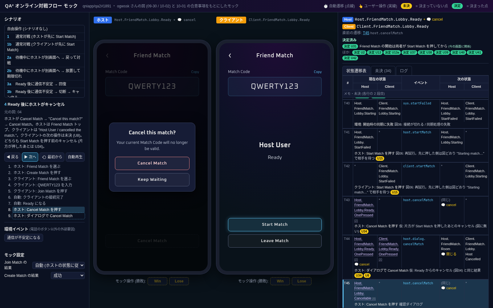

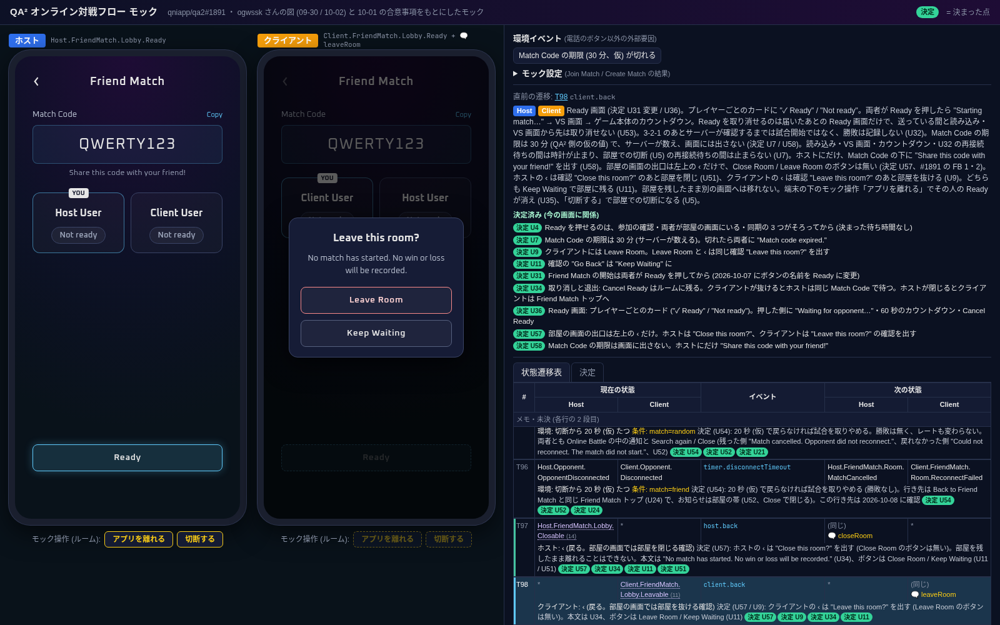

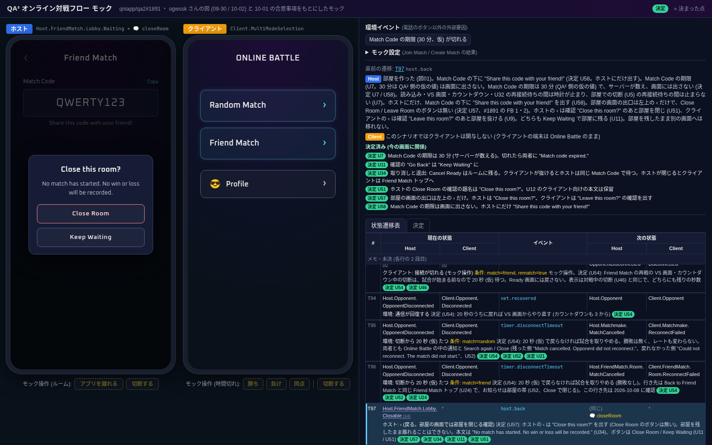

## Profile (絵文字とあいさつ)

高宮さんの決定 (2026-10-08、U56) で、相手に見せる絵文字とあいさつを選べるようにしました。**未決は 0 件のまま** です。

- **入口**: Online Battle の Profile (両端末)。Random Match / Friend Match の下に、保存した絵文字を添えて控えめに置いています (絵文字を添えるのは 2026-10-08 に決定)。
- **画面**: いちばん上に VS 画面のカードの見本 (名前・絵文字・あいさつ。レーティングは出さない)。絵文字かあいさつを選ぶたびに、見本がすぐ変わります。
  その下に絵文字 (5 x 2) とあいさつ (2 列 x 5)、画面のいちばん下に Save / Cancel。Save で保存して Online Battle へ、Cancel は選んだものを捨てて Online Battle へ戻ります。
  ‹ は Cancel と同じで、確認は出しません (2026-10-08 に決定)。
- **候補** (どちらも 1 つだけ選ぶ。この順):
  - 絵文字: 👋 🙂 😎 🤖 🧠 ⚛️ 🔬 🌟 🍀 🚀
  - あいさつ: "Hello!" / "Let’s go!" / "Have fun!" / "Good luck!" / "Let’s do this!" / "Bring it on!" / "Ready?" / "Here we go!" / "Happy puzzling!" / "May the best player win!"
  - 自由入力と二つ組みの称号はありません。名前は変えられません (見本に出すだけ)。
  - アポストロフィはどれも `’` (U+2019) で、まっすぐな `'` は使いません。相手のあいさつと VS 画面のあいさつも同じです。
  - 5 番目の "Let’s do this!"、6 番目の "Bring it on!"、7 番目の "Ready?"、10 番目の "May the best player win!" は、2026-10-08 に差し替えた候補です (前の候補は下の「決定済み」の U56)。
  - "Ready?" はあいさつです。Friend Match の Ready ボタンや Ready 画面とは関係ありません。
- **既定値**: 全員 👋 "Hello!"。モックのホスト (Yasuhito) はこの既定値から始まります。相手の役 (クライアントの ogwssk) は 😎 "Let’s go!" から始まります (すでに選んである人として扱う)。相手も Profile を変えられます (どちらも 2026-10-08 に決定)。
- **開ける場所**: 対戦の外だけ。Online Battle と、その中の "Search stopped…" などの通知を出している間に開けます (開くと通知は消える、U43)。
  "No opponent found." を出している間は開けません (2026-10-08 に決定)。相手を探している間・部屋 (Friend Match の部屋・Ready 画面など)・対戦中には、Profile の行もボタンもありません。
- **値を固定するとき**: 部屋を作る・部屋に入る・相手を探し始める (Random Match / Search again / Find Next Opponent) ときに、保存した値を相手に見せる値として固定します。
  変えたものが相手に見えるのは、次の部屋・次の検索からです。今いる部屋と同じ相手との再戦では固定し直しません。ホストの "Join another match" はモックが入室を省いているので、固定するときに含めません (2026-10-08 に決定。2026-10-09 の U57 で、この確認自体が無くなった)。遷移表では、固定する行のメモに「写す: hostShownEmoji←hostEmoji, …」と出します。
- **保存先**: ブラウザの localStorage だけ (キーは `qa2-match-mock.profile`、端末ごとに `host` / `client`)。読めない・候補に無い値は最初の値に戻します。
  モックでは自由操作のときだけ読み書きします。シナリオ (外れて操作したときも含む) は localStorage を読まず書かず、いつも最初の値から始まります (2026-10-08 に決定)。スクリーンショットとテストは保存した値に左右されません。
- **変わらないもの**: 結果画面のスタンプ (U27 の 3 種類) は変わりません。スタンプのミュート (U49) は VS 画面のあいさつを隠しません。
- **仮の値**: 10 個ずつの候補と既定値は QA² 側の仮の値です (変わりうる)。仮であることは右パネルの説明とこの README にだけ書き、端末の画面には出しません。

状態・イベント:

| 種類 | 名前 |
|---|---|
| 状態 | `Host.Profile` / `Client.Profile` |
| イベント | `*.profile` (開く)、`*.pickEmoji.<id>` (10 個)、`*.pickGreeting.<id>` (10 個)、`*.saveProfile`、`*.cancelProfile`、`*.back` |
| 付属状態 (`DEVICE_FIELDS`) | `Emoji` / `Greeting` (保存した値)、`DraftEmoji` / `DraftGreeting` (Profile 画面で選んでいるもの)、`ShownEmoji` / `ShownGreeting` (相手に見せる、固定した値) |
| 行 | 開く 1・絵文字 10・あいさつ 10・Save・Cancel・‹ で 1 端末 24 行、両端末で 48 行 (遷移表の最後)。ほかに、部屋を作る・入る・探し始める 34 行に「写す:」を足した |

遷移表は 360 行から 408 行に、状態は 211 から 213 に、グループは 66 から 68 に、シナリオは 61 から 63 (22 / 22b) になりました。

- `index.html#s=22&step=3` - Profile で 🚀 と "Bring it on!" を選んだところ (見本がすぐ変わる)
- `index.html#s=22&step=7` - Save したあと相手を探し始めて、VS 画面のホストのカードに 🚀 "Bring it on!"

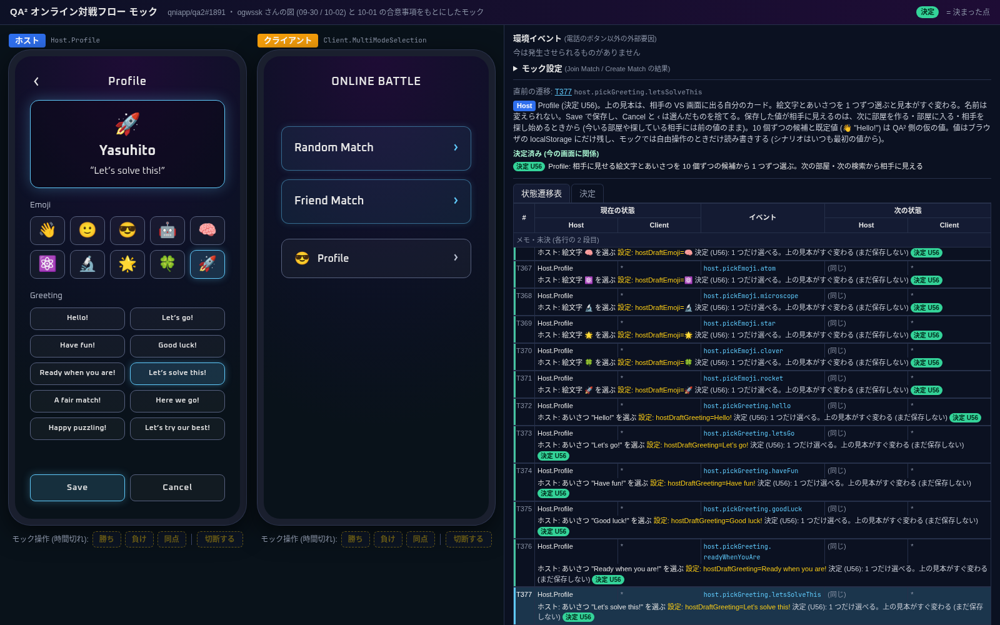

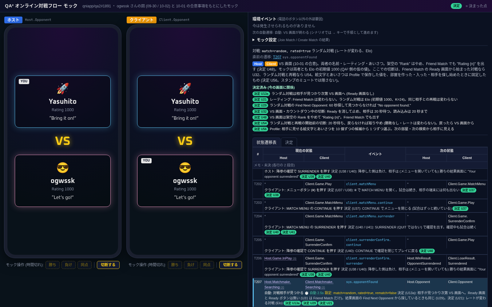

## 2026-10-08 の決定 (再戦取り消し文言の統一と仮定の確定)

高宮さんの決定 (2026-10-08) で、次のことが決まりました。**未決は 0 件のまま** です。

1. **再戦の申し込みを取り消したときの一行は、両者とも "Rematch request cancelled"** (取り消した側も、申し込まれた側も)。以前の申し込まれた側の文言 (U30) は "was" の有無だけ違っていましたが、取り消した側 (U50) の文言にそろえました。
2. **試合が終わるのは時間切れだけ** (U44 の今のモックのまま)。
3. **「2026-10-08 の決定 (U44〜U55)」で置いた仮定は、どれもそのまま確定** (下の表)。

| 確定した動き | よりどころ |
|---|---|
| Friend Match の再戦を開始前の切断で取りやめたら、両者とも Friend Match トップの帯へ。残った側は "Match cancelled. Opponent did not reconnect." | U54 / U24 / U32 / U52 |
| ランダム対戦を取りやめたあとの Search again / Close は、Online Battle の中の通知 (モーダルではない) | U54 / U43 |
| カウントダウン中に切断しても VS 画面の上で待ち、戻ったら VS 画面からやり直す | U54 / U46 |
| 部屋での切断 (U5) の残った側にも "20s" を出す | U52 / U32 |
| 部屋のお知らせの Friend Match トップは Match Code の入力欄を空にする。お知らせを出したまま Join Match を押すと、結果の画面がお知らせに取って代わる | U52 |
| 再戦の一行はスタンプでは消えない | U50 |
| 切断を待つ間の暗幕は実機のポーズと同じ濃さ | U46 / U37 |
| "Friend is in the room" の帯は "Waiting for your friend…" と同じ青 | U55 / U17 |
| VS 画面の "Rating" は、モックでは両者とも初期値 1000 | U48 / U21 |

モックの画面の動きは、取り消しの一行のほかは変わりません (遷移表 360 行・状態 211・シナリオ 61 のまま)。右パネルの説明・遷移表のメモの「モックの仮定」は「2026-10-08 に確認」に書き換えました。

- `index.html#s=15d&step=16` - 取り消し: 両者に "Rematch request cancelled"

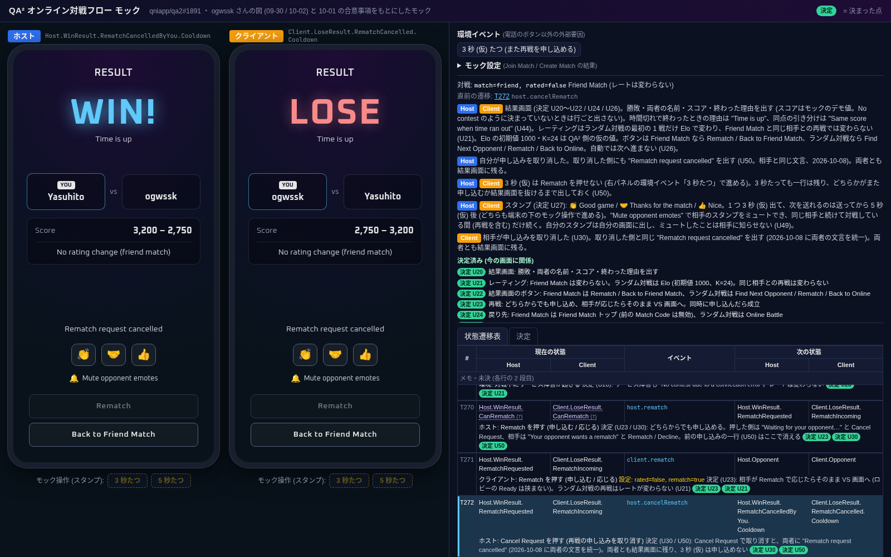

## 2026-10-08 の決定 (U44〜U55)

高宮さんの決定 (2026-10-08) で、最後に残っていた未決 **U44〜U55** がすべて決まり、前回 pi が置いた仮定 5 点も確認されました。これで **未決は 0 件** です。

**20 秒・5 秒・3 秒などの秒数は、どれも QA² 側の仮の値です** (変わりうる)。
電話の画面には決定どおり残りの秒数 ("20s") を出しますが、それが仮の値であることは右パネルの説明・遷移表のメモ・この README にだけ書きます。
モックの秒数は始まった直後のまま描き (実時間では減らさない)、時間切れは端末の下のモック操作か右パネルの環境イベントで起こします。

| ID | 決定 | モックでの見せ方 |
|---|---|---|
| U44 | 時間切れで得点の高いほうが勝ち、同点なら引き分け (DRAW)。終わった理由は "Time is up"、同点は "Same score when time ran out" | 結果画面の理由の行 (以前の仮の "Match finished" を置き換えた)。端末の下のモック操作は `時間切れ:` 勝ち / 負け / 同点 |
| U45 | 降参・切断の結果と NO CONTEST のあとは、どちらの側にも Rematch を出さない | 今のモックのまま |
| U46 | 対戦中に片方が切断したら、サーバーが両者のゲームと得点を 20 秒止める。両者の画面に残りの秒数。残った側 "Your opponent disconnected" / "Waiting for your opponent to reconnect…"、切断した側 "Connection lost" / "Reconnecting…"。MATCH MENU では試合は止まらない | MATCH MENU と同じパネルに、ボタンの代わりに "20s" (Ready 画面のカウントダウンと同じ円)。暗幕は実機のポーズと同じ濃さ (α 0.784) にして止まっていることを示す (MATCH MENU は止めないので薄いまま) |
| U47 | 次の相手を探している間にアプリを離れたときも U43 と同じ | Online Battle の中に "Search stopped while the app was in the background." と Search again / Close (`*.Matchmake.Stopped` を共用) |
| U48 | VS 画面は架空の Rank をやめて "Rating {n}"。Friend Match でも出す | 両者のカードに "Rating 1000" (モックは両者とも Elo の初期値) |
| U49 | ミュートは同じ相手と続けて対戦している間 (再戦を含む) だけ。自分のスタンプは自分に見え、相手には知らせない。ボタンは "Mute opponent emotes" / "Unmute opponent emotes" | スタンプの下に "🔔 Mute opponent emotes" / "🔕 Unmute opponent emotes" (以前の丸い 🔔 ボタンを文字のボタンに) |
| U50 | 再戦が取り消し・辞退・期限切れになったら、もう一方にも "Rematch request cancelled" / "Rematch declined" / "Rematch request expired"。一行は次の操作まで残る。Rematch を押せないのは 3 秒 (決定済み) | 下の「再戦の一行 (U30 / U50)」 |
| U51 | ホストの確認の題名は "Close this room?" のまま。U12 のクライアント向けの本文は出す場面が無いので **保留** | 今のモックのまま (クライアント向けの本文は `ROOM_SWITCH_BODY.client` に残すが、出す場面は無い) |
| U52 | 切断した側には "Connection lost. Reconnecting…" と残りの秒数。U32 で戻れなかった側には "Could not reconnect. The match did not start."。U5 でホストが戻らなかったとき、クライアントには "The room was closed." ("You left the room" とは出さない)。部屋のお知らせはモーダルではない帯で Close で閉じる。入力で消える動きはやめる | 下の「部屋のお知らせ (U52)」 |
| U53 | 今のモックのまま。Ready は送っている間と VS 画面から先は取り消せない (「VS 画面までは取り消せる」案は採らない) | 送っている間・読み込み ("Starting match…")・VS 画面・カウントダウンに Cancel Ready は無い (`tests/check.js` で確認) |
| U54 | ランダム対戦と再戦の開始前 (VS 画面・カウントダウン) の切断は 20 秒待ち、戻らなければ取りやめ (勝敗なし・レートは変わらない)。ランダム対戦はそのあと Search again / Close。再戦は Ready 画面に戻らず、戻ったら VS 画面から | 下の「ランダム対戦と再戦の開始前の切断 (U54)」 |
| U55 | 友だちがいて Ready していないときの帯は "Friend is in the room"。"Your friend left." は 5 秒 (以前は 3 秒) | 青い帯 "Friend is in the room"。自由操作では "Your friend left." が 5 秒で "Waiting for your friend…" に戻る |

確認された pi の仮定 5 点 (決定済みにした):

| # | 仮定 | 入れた先 |
|---|---|---|
| 1 | ホストの ‹ は確認なしで部屋を残す。確認を出すのはクライアントだけ | U14 / U9 の説明 |
| 2 | U32 は VS 画面とカウントダウンだけ。部屋と読み込み ("Starting match…") は U5 | U32 / U5 の説明 |
| 3 | U5 の再接続待ちの間は Match Code の期限の時計が止まらない。読み込み中に切れても、読み込みの間の分は U7 のとおり止まったまま | U7 の行。部屋の画面で再接続を待っている間にも期限が切れる行を足した (戻った側も "Match code expired.") |
| 4 | U9 の本文は "No match has started. No win or loss will be recorded." | U34 / U9 の説明 |
| 5 | Online Battle へ戻るボタンは、降参のあとも含めてすべて "Back to Online" | U22 の説明 (`tests/check.js` で "Back to Online Battle" が無いことを確認) |

### 部屋のお知らせ (U52)

Friend Match トップの部屋のお知らせは、画面の上の帯 (文言と Close) です。モーダルではなく、Create Match・Match Code の入力・Join Match・‹ はそのまま使えます。
**Close で閉じるまで残り、Match Code を入れても消えません** (以前のモックの「ほかの操作で消える」はやめた)。ほかの画面へ移る (‹・Create Match・Join Match の結果) と消えます。

| 状態 | 帯の文言 | 出るとき |
|---|---|---|
| `Client.FriendMatch.Room.HostLeft` | "Room closed. The host left." | ホストが部屋を閉じた (U34) |
| `Client.FriendMatch.Room.HostDisconnected` | "Room closed. The host disconnected." | VS 画面・カウントダウン中に切断したホストが戻らなかった (U32) |
| `Client.FriendMatch.Room.RoomClosed` | "The room was closed." | 部屋で切断したホストが戻らなかった (U5 / U52) |
| `*.FriendMatch.Room.ReconnectFailed` | "Could not reconnect. The match did not start." | 試合が始まる前に切断して 20 秒で戻れなかった (U32 / U52。Friend Match の再戦も、U54) |
| `*.FriendMatch.Room.MatchCancelled` | "Match cancelled. Opponent did not reconnect." | Friend Match の再戦の開始前に相手が戻らなかった (U54。2026-10-08 に確認) |

クライアントの帯付きの画面で Match Code を入れると `….CodeEntered` (帯はそのまま) になり、そのまま Join Match で入れます。Close で `Client.FriendMatch.Room` / `.CodeEntered` に戻ります。
ホストに出るのは `ReconnectFailed` と `MatchCancelled` だけです (ホストは Match Code を入れない)。

### 再戦の一行 (U30 / U50)

| きっかけ | 申し込んだ側 | 申し込まれた側 |
|---|---|---|
| 申し込んだ側が Cancel Request | "Rematch request cancelled" (U50) | "Rematch request cancelled" (U30。2026-10-08 に統一) |
| 申し込まれた側が Decline | "Your opponent declined the rematch" (U30) | "Rematch declined" (U50) |
| 20 秒応答がない | "No response to rematch request" (U30) | "Rematch request expired" (U50) |

- どの一行も、3 秒たって Rematch を押せるようになっても残り、どちらかがまた申し込むか、結果画面を抜けるまで出しておきます (スタンプでは消えない)。
- 状態は `*.Result.Rematch<結末>.Cooldown` (3 秒待ち、Rematch は無効表示) → `*.Result.Rematch<結末>` (一行は残り、Rematch を押せる) です。結末は `Cancelled` / `CancelledByYou` / `Declined` / `DeclinedByYou` / `Expired` / `ExpiredIncoming`。
  以前の、メッセージを出さない側の `.RematchCooldown` は無くなりました。
- 取り消しのときは、両者とも同じ "Rematch request cancelled" です (2026-10-08 に、"was" の有無だけ違っていた U30 の文言を U50 にそろえた)。

### 切断を待つ間 (U46) と、ランダム対戦と再戦の開始前の切断 (U54)

| 場面 | 切断した側 | 残った側 | 20 秒のうちに戻る | 20 秒たっても戻らない |
|---|---|---|---|---|
| 対戦中 (U28 / U46) | ゲーム画面の上に "Connection lost" / "Reconnecting…" / "20s" | "Your opponent disconnected" / "Waiting for your opponent to reconnect…" / "20s" | 止めたところから続ける | 切断した側の負け (U28) |
| Friend Match の Ready 画面から始まった対戦の VS 画面・カウントダウン (U32) | Ready 画面に "Connection lost. Reconnecting…" と "20s" (U52) | Ready 画面に "Opponent disconnected. Waiting for them to reconnect…" と "20s" | 両者もう一度 Ready | 戻れなかった側は Friend Match トップに "Could not reconnect. The match did not start." (U52)。残った側は U32 のとおり |
| ランダム対戦 (再戦を含む) の VS 画面・カウントダウン (U54) | VS 画面の上に対戦中と同じパネルと "20s" | 同じ | VS 画面からやり直す (カウントダウンも 3 から) | 取りやめ (勝敗なし・レートは変わらない)。Online Battle の中に、切断した側は "Could not reconnect. The match did not start."、残った側は "Match cancelled. Opponent did not reconnect." と Search again / Close |
| Friend Match の再戦の VS 画面・カウントダウン (U54) | 同じ | 同じ | 同じ | 取りやめ (勝敗なし)。Friend Match トップの帯に、切断した側は "Could not reconnect. The match did not start."、残った側は "Match cancelled. Opponent did not reconnect." (2026-10-08 に確認) |

部屋 (Ready 画面・読み込み) での切断 (U5) は、両者に "20s" を出すようにしたほかは変わりません (切れた側の "20s" は U52、残った側の "20s" は 2026-10-08 に確認)。

### モック操作 (端末の外)

| 場所 | 操作 | 出る場面 |
|---|---|---|
| 端末の下 `モック操作 (時間切れ)` (以前の `モック操作 (対戦)`) | 勝ち / 負け / 同点 (時間切れで押した側の得点が上・下・同じ、U44)、切断する | VS 画面・カウントダウン・対戦中 (勝ち / 負け / 同点は対戦中だけ) |
| 端末の下 `モック操作 (切断中)` (新) | 再接続する (相手側は「相手が戻る」)、20 秒たつ。右パネルの環境イベント「通信が回復する」「切断から 20 秒たつ」と同じ | 切断を待っている間 (U46 / U54) |
| 端末の下 `モック操作 (検索中)` | アプリを離れる、60 秒たつ | 相手を探している間 (Find Next Opponent から探しているときも「アプリを離れる」を押せるようにした、U47) |

### 状態・イベント

| 変更 | 状態 / イベント |
|---|---|
| 追加 | `*.Opponent.Disconnected` / `*.Opponent.OpponentDisconnected` (U54 の VS 画面での待ち)、`*.Matchmake.MatchCancelled` / `*.Matchmake.ReconnectFailed` (U54 の取りやめ、Online Battle の中の通知)、`*.FriendMatch.Room.ReconnectFailed` / `*.FriendMatch.Room.MatchCancelled`、`Client.FriendMatch.Room.RoomClosed` と、クライアントの帯付きの 5 状態の `.CodeEntered` (U52)、結果画面の再戦の一行 `.RematchCancelledByYou` / `.RematchDeclinedByYou` / `.RematchExpiredIncoming` と、6 つの結末それぞれの `.Cooldown` (U50) |
| 削除 | `*.Result.RematchCooldown` (メッセージを出さない 3 秒待ち、U50 で一行を出すことに) |
| 意味を変更 | `*.FriendMatch.Lobby.Reconnecting`: "Reconnecting…" → "Connection lost. Reconnecting…" と "20s" (U52)。`*.FriendMatch.Lobby.ConnectionLost` / `.FriendDisconnected`: "20s" を足した。`Host.Away.*.FriendInRoom`: 帯が "Friend is in the room" (U55)。`*.Game.Disconnected` / `.OpponentDisconnected`: "20s" と濃い暗幕 (U46)。部屋のお知らせ: 文字列から Close 付きの帯に (U52) |
| 追加 | セッション `rematch` (結果画面の Rematch で始まった対戦か。U32 と U54 を分ける)。イベントの追加は無く、`*.closeNotice` を部屋のお知らせにも、`*.leaveApp` を次の相手を探している間にも使う |
| 追加 | 遷移表の行: 部屋のお知らせ (入力・Close)、U54 の切断・回復・取りやめ、U47 の検索停止、U5 の再接続待ちの間の期限切れと戻った側の "Match code expired."、再戦の一行の 3 秒たつ (結末ごと) |

遷移表は 297 行から 360 行に、状態は 145 から 211 に (結果画面が 58 から 106)、グループは 55 から 66 になりました。シナリオは 57 から 61 です。

### 決定に書かれていないので置いた仮定 (2026-10-08 にすべて確定)

決定に書かれていないところは、次のように置きました。どれも既にある決定から自然に決まるものとして、新しい未決にはしていません。
2026-10-08 に高宮さんが、下の仮定をすべてそのまま確定しました (「2026-10-08 の決定 (再戦取り消し文言の統一と仮定の確定)」)。

| 仮定 (モックの動き) | よりどころ |
|---|---|
| 試合の決着は時間切れだけとして、端末の下のモック操作を時間切れの勝ち / 負け / 同点にした (時間切れより前に決着することがあるかは扱っていない) | U44 |
| Friend Match の再戦を開始前の切断で取りやめたあとは、両者とも Friend Match トップへ (Back to Friend Match と同じ、U24)。お知らせは部屋の帯で、残った側は U32 にそろえて "Match cancelled. Opponent did not reconnect." | U54 / U24 / U32 / U52 |
| ランダム対戦を取りやめたあとの Search again / Close は、U43 と同じく Online Battle の中の通知 (モーダルではない)。残った側の文言は U32 にそろえて "Match cancelled. Opponent did not reconnect." | U54 / U43 / U32 |
| ランダム対戦と再戦の開始前の切断を待つ間は、VS 画面の上に対戦中の切断 (U46) と同じパネルと "20s" を出す (カウントダウン中に切れても VS 画面に戻して待つ。戻ったら VS 画面からなので) | U54 / U46 |
| 部屋での切断 (U5) の残った側にも "20s" を出す (切れた側 (U52) と U32 の残った側にそろえた) | U52 / U32 |
| "The room was closed." の Friend Match トップは、HostLeft と同じく入力欄を空にした (以前の仮定では Match Code を残していた)。ホストが Retry で空の部屋に戻っていれば、同じ Match Code で入り直せる | U52 |
| U32 で戻れなかったクライアントの Friend Match トップも入力欄は空 (以前は Match Code を残していた)。帯付きの画面はどれも入力欄が空から始まる | U52 |
| 部屋のお知らせを出したまま Join Match を押すと、結果 (部屋・赤字・トースト) がお知らせに取って代わる (Join Match は「入力」ではなく別の画面へ進む操作として扱った) | U52 |
| 再戦の一行は、スタンプでは消えない。消えるのは、どちらかがまた申し込む・同時に申し込む・結果画面を抜けるとき | U50 |
| 切断を待つ間の暗幕は、実機のポーズと同じ濃さにして「止まっている」ことを示す (MATCH MENU は止まらないので薄いまま) | U46 / U37 |
| "Friend is in the room" の帯は、"Waiting for your friend…" と同じ青 (緑の "Friend joined!" は本当に入ったときだけ、U17) | U55 / U17 |
| VS 画面の "Rating" は、モックでは両者とも Elo の初期値 1000 | U48 / U21 |

### シナリオ

| ID | 手順 | 見られる画面 |
|---|---|---|
| 3c | 14 | 8: ホストが戻らず、クライアントは Friend Match トップに "The room was closed." → 11: Match Code を入れても帯は残る → 12: Close → 13: 入り直して "Friend joined!" |
| 3e | 10 | 8: ホストが戻らず "Could not reconnect." / クライアントは "The room was closed." → 9: ‹ で "Close this room?" (U57) → 10: Friend Match トップへ |
| 12 | 15 | 12: VS 画面中にクライアントが切断 (クライアント "Connection lost. Reconnecting…" と 20s) → 13: 戻らず、クライアントは "Could not reconnect. The match did not start." → 14: Match Code を入れる → 15: 入り直して "Friend joined!" |
| 15d | 19 | 16: 取り消し (両者に一行) → 17: 3 秒たっても一行は残る → 18: また申し込む |
| 17c | 12 | 8: 次の相手を探している間にアプリを離れて "Search stopped…" (U47) → 9: Search again → 12: 相手が見つかる |
| 18 | 16 | 14: 対戦中の切断で両者に "20s" (U46) → 15: 切断した側の負け |
| 21 | 7 | 4: ランダム対戦の VS 画面中に切断、VS 画面の上で "20s" (U54) → 5: 戻って VS 画面から → 7: プレイ開始 |
| 21b | 9 | 5: カウントダウン中に切断 → 6: 戻らず取りやめ (ホスト "Could not reconnect. The match did not start." / クライアント "Match cancelled. Opponent did not reconnect.") → 8: 両者 Search again → 9: 新しい VS 画面 |
| 21c | 20 | 16: Friend Match の再戦の VS 画面 → 17: クライアントが切断 (Ready 画面には戻らない) → 18: 取りやめ、両者 Friend Match トップの帯 → 20: 両者 Close |

- `index.html#s=18&step=14` - 対戦中の切断 (U46): 両者に "20s"、濃い暗幕
- `index.html#s=21&step=4` - ランダム対戦の VS 画面中の切断 (U54)
- `index.html#s=21b&step=6` - 取りやめ (U54): Online Battle の中の通知
- `index.html#s=21c&step=18` - Friend Match の再戦の取りやめ (U54): Friend Match トップの帯
- `index.html#s=3c&step=11` - "The room was closed." の帯 (U52): Match Code を入れても残る
- `index.html#s=15d&step=17` - 再戦の一行が 3 秒のあとも残る (U50)
- `index.html#s=17c&step=8` - 次の相手を探している間の検索停止 (U47)
- `index.html#s=1&step=11` - VS 画面の "Rating 1000" (U48)

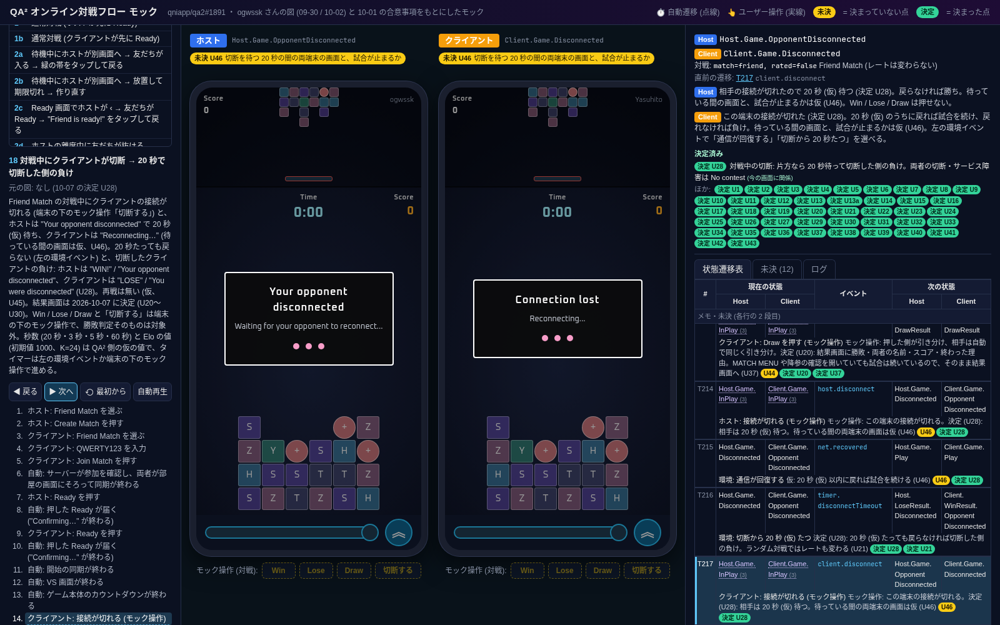

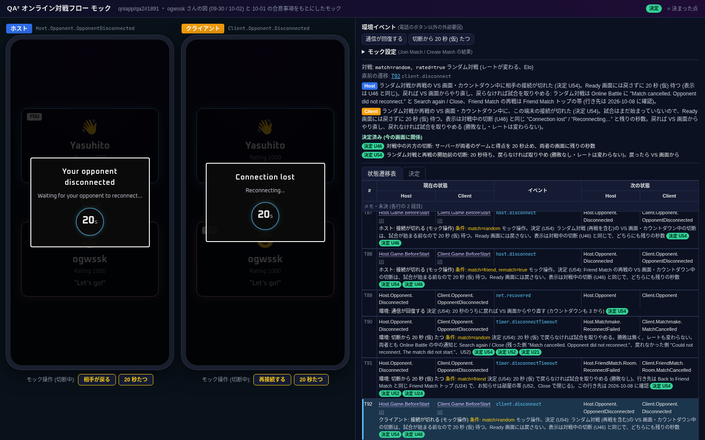

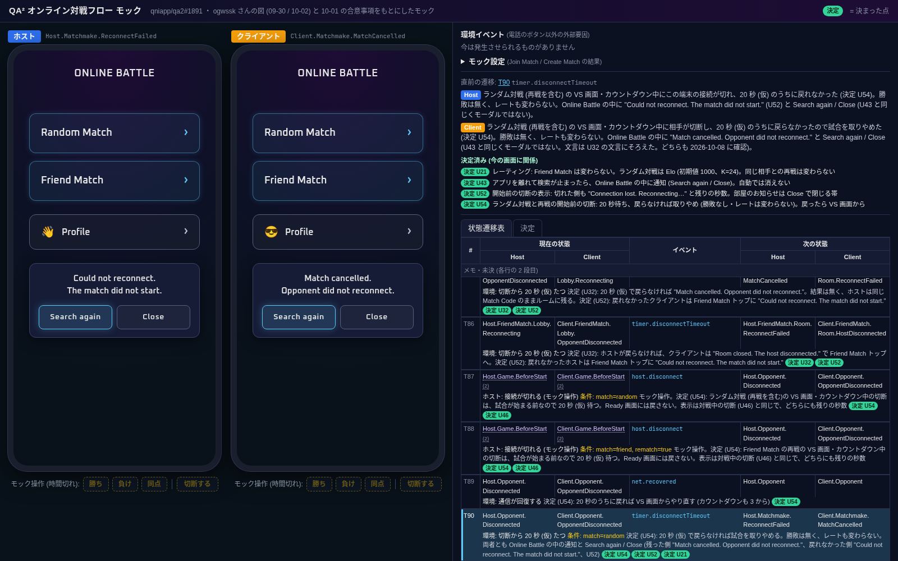

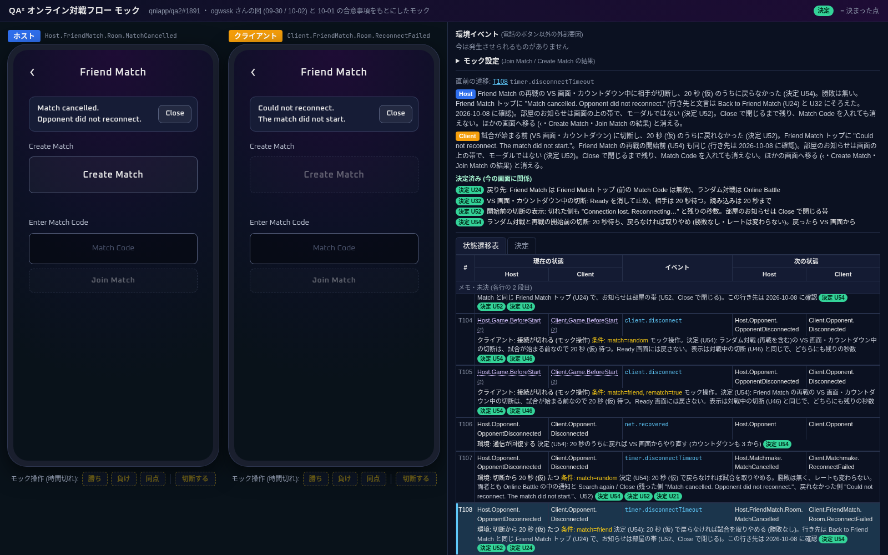

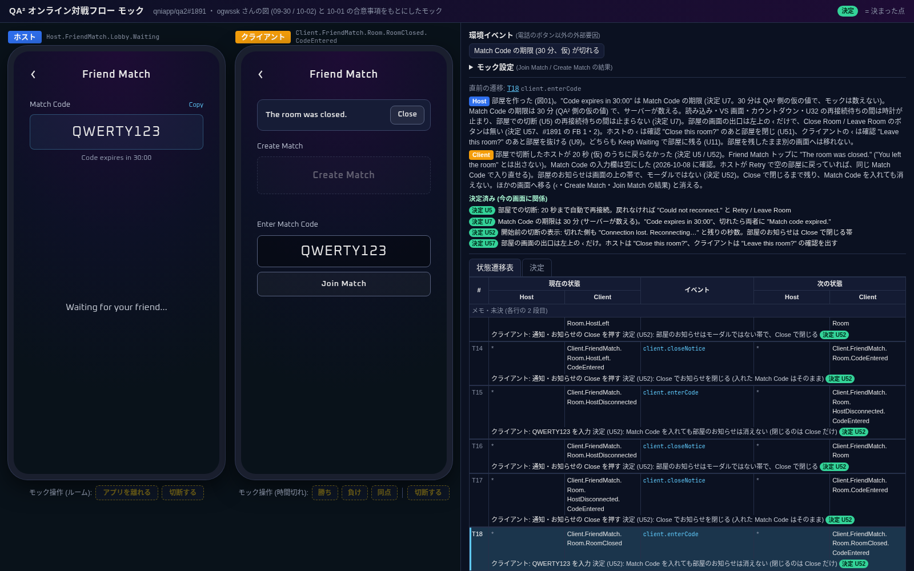

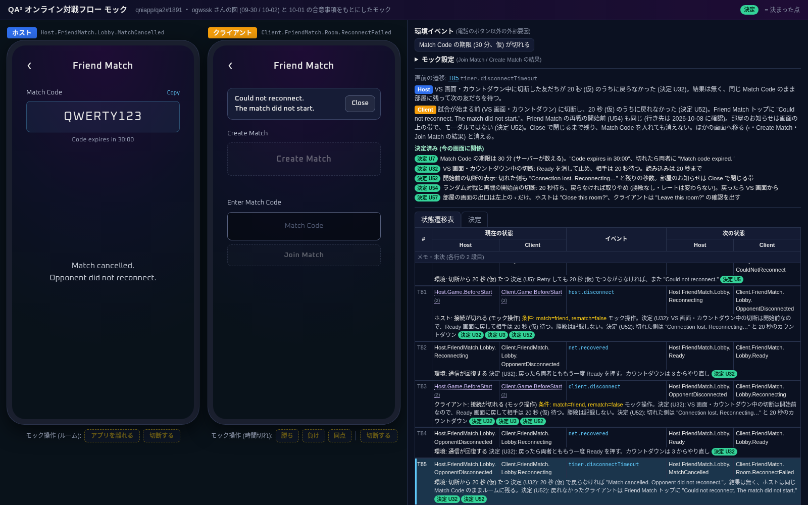

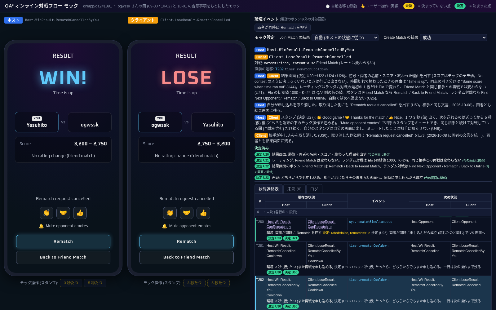

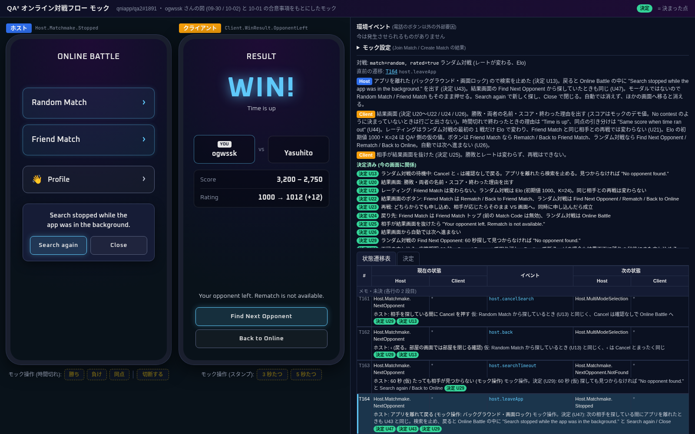

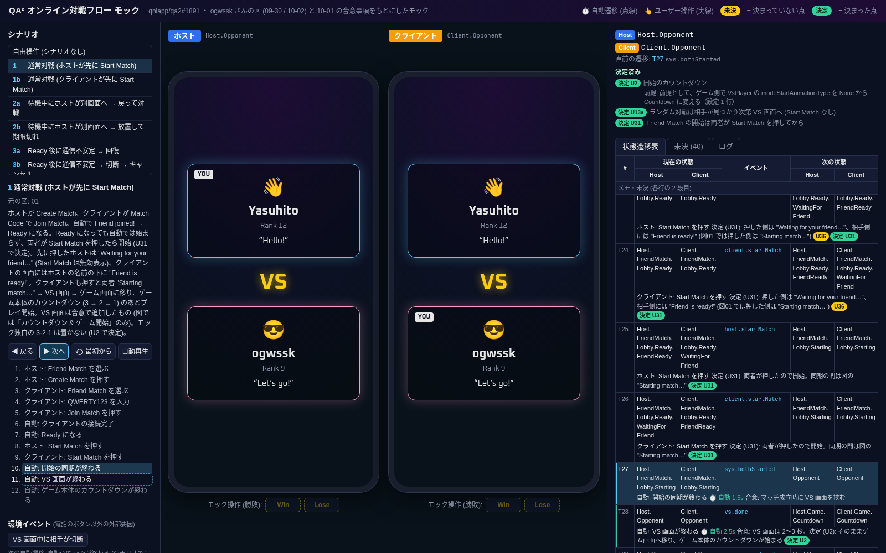

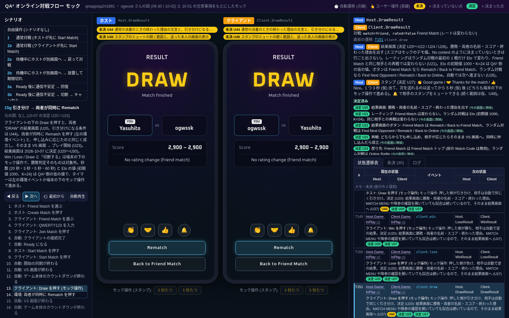

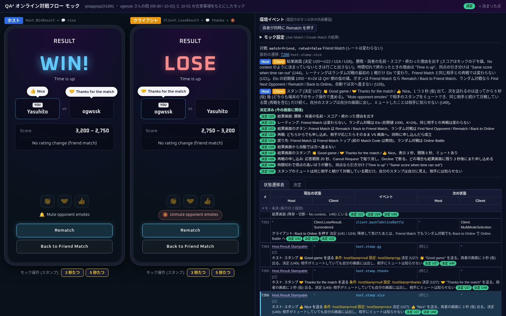

## フレンド対戦の部屋 (2026-10-07 決定、U1〜U19)

高宮さんの決定 (2026-10-07) で、Friend Match の部屋 (Match Code を作ってから試合が始まるまで) の未決 U1〜U19 がすべて決まりました。
U3 (VS 画面中の切断の戻り先) と U8 (ホストが閉じたあとのクライアントの出口) は、それぞれ以前の決定 U32 / U34 で決まっていたので決定済みにし、U13 はすでに決定済みです。
これで U1〜U19 と U32 / U43 に未決はありません。この節の「仮」(U51 / U52 / U53 / U55) は 2026-10-08 にすべて決まりました (「2026-10-08 の決定 (U44〜U55)」を参照。下の表には → で今の動きを書き足しています)。

> 2026-10-09 の U57 で、部屋の出口は左上の ‹ だけになりました (「2026-10-09 の決定 (U57)」を参照)。Close Room / Leave Room のボタン、ホストの離席と帯 (U1 / U14 / U16 / U19 / U55)、離席中の作り直しの確認 (U12) は無くなりました。
> 下の「部屋の画面」は今の動きに書き直し、離席の帯とシナリオ 2a〜2e / 3d / 14 は当時の記録として残しています。

**秒数 (再接続の 20 秒) と Match Code の期限 30 分は QA² 側の仮の値です** (変わりうる)。
電話の画面には Match Code の期限を出しません (2026-10-10 の U58。それまでは Match Code の下に残り時間を出していた)。仮の値であることは右パネルの説明・遷移表のメモ・この README にだけ書きます。
期限切れと再接続のタイムアウトは右パネルの環境イベントで起こします。

| ID | 決定 |
|---|---|
| U1 | 離席中のホストに、友だちが Ready を押したことを赤い帯 "Friend is ready!" で知らせる (以前の "Ready to start" から変更)。タップすると部屋の画面に戻るだけで、Ready は押さない。戻った画面のボタンは Ready / Cancel Ready |
| U4 | Ready を押せるのは、サーバーが参加を確認し、両者が部屋の画面にいて、同期が終わってから。以前の 1.5 秒の固定の待ち時間はやめた。同期の前は、ホストに "Friend joined!"、クライアントに "Connecting…" |
| U5 | 部屋 (Ready 画面・読み込み) で切断したら、20 秒まで自動で再接続し、その間は両者の Ready を消す。切れた側は "Connection lost. Reconnecting…"、残った側は "Your friend disconnected. Waiting for them to reconnect…"。20 秒で戻れなければ、切れた側に "Could not reconnect." と Retry / Leave Room。クライアントは Friend Match トップへ戻り、ホストは空の部屋を残す |
| U6 | "Connection failed" は Create / Join がサーバーに届かないときだけ。ホストは "Couldn’t create a room. Try again."、クライアントは "Couldn’t join the room. Try again."。Match Code の誤り・期限切れ・満員・閉じた部屋の表示とは別 |
| U7 | Match Code の期限は 30 分 (仮) で、サーバーが数える。開始の読み込み・VS 画面・カウントダウンと U32 の再接続待ちの間は時計が止まる。切れたら両者に "Match code expired."。部屋の画面に出していた残り時間は U58 (2026-10-10) で出さなくなった |
| U9 | クライアントには Leave Room を出す (以前ボタンの無かった待機中も)。Leave Room と ‹ (端末の戻る) は同じ確認: 題名 "Leave this room?"、本文は決定済みの "No match has started. No win or loss will be recorded." (U34)、ボタン Leave Room / Keep Waiting |
| U10 | 期限切れの画面に Ready を出さない。ホストは Create Match、クライアントは Join Match |
| U11 | 確認の "Go Back" は "Keep Waiting" に |
| U12 | "Create a new match?" / "Join another match?" の本文は役割で変える。ホスト: "This will close your current room. Your friend will return to Friend Match."、クライアント: "This will leave your current room. Your friend’s room will stay open."。古い部屋を閉じるのは、新しい部屋を作れた・入れたときだけ |
| U14 | ホストの ‹ は部屋を残し、行った先の画面の帯で示す。部屋を閉じるのは別のボタン Close Room。別の画面へ移ると自分の Ready は消える |
| U15 | 同期に失敗したら両者の Ready を消し、ふつうの Ready の流れ (60 秒の期限つき) からやり直す。Match Code が有効な間は何度でもやり直せる。文言は "Couldn’t start the match. Please ready up again." |
| U16 | 青 / 緑の帯もタップすると部屋の画面に戻る。どの帯のタップでも Ready にはならない |
| U17 | "Friend joined!" は本当に入った・入り直したときだけ。ホストの離席中にクライアントが抜けたら、ホストに "Your friend left." を一度だけ出す |
| U18 | 期限切れでもクライアントを今の画面から動かさない。その場で "Match code expired." と Join Match |
| U19 | 友だちの再接続を待っている間の帯は、青い "Waiting for your friend…" ではなく "Reconnecting…"。20 秒たつと "Waiting for your friend…" に戻る |
| U3 / U8 | 以前の決定で決まっていた: U3 は U32 (VS 画面・カウントダウン中の切断)、U8 は U34 ("Room closed. The host left.") |

### 部屋の画面

| 段階 | ホスト | クライアント |
|---|---|---|
| 友だちを待っている | "Waiting for your friend…" | - |
| 入った直後 (同期の前、U4) | カード 2 枚と "Friend joined!"、Ready (押せない表示) | カード 2 枚と "Connecting…"、Ready (押せない表示) |
| Ready 画面 (U36) | Ready (押すと Cancel Ready) | Ready (押すと Cancel Ready) |
| 部屋で切断 (U5、自分の接続が切れた) | "Connection lost. Reconnecting…" (ボタンなし、‹ も押せない) → 2026-10-08: と "20s" (U52) | 同じ |
| 部屋で切断 (U5、相手の接続が切れた) | "Your friend disconnected. Waiting for them to reconnect…" と "20s" (2026-10-08 に確認) | 同じ |
| 20 秒で再接続できなかった (U5) | "Could not reconnect."、Retry | 同じ |
| 期限切れ (U7 / U10 / U18) | "Match code expired."、Create Match | "Match code expired."、Join Match (今の画面のまま) |

- Match Code の期限は画面に出しません。ホストにだけ Match Code の下に "Share this code with your friend!" を出します (期限切れと "Could not reconnect." の画面は除く、U58、2026-10-10)。クライアントには出しません。
- 部屋を出るボタンはありません。出口はどの段階も左上の ‹ だけです (U57、2026-10-09)。以前はホストが Close Room (U14)、クライアントが Leave Room (U9) でした。
- 確認: クライアントの ‹ は "Leave this room?" / "No match has started. No win or loss will be recorded." / [Leave Room] [Keep Waiting] (U9 / U11 / U34 / U57)。
  ホストの ‹ は "Close this room?" / 同じ本文 / [Close Room] [Keep Waiting] (題名は 2026-10-08 に U51 で決定)。"Could not reconnect." の画面の ‹ も、ホストは "Close this room?"、クライアントは "Leave this room?" です。
- 送っている間 ("Confirming…")・読み込み中・自分の再接続中は ‹ を押せません (U53)。期限切れの画面の ‹ は、部屋がもう無いので確認なしで Friend Match トップへ戻ります。
- 以前は、ホストが部屋の画面を離れている間、クライアントのカードのホストを "Away" にしていました (図02)。U57 で離席が無くなったので、"Away" も無くなりました。

### ホストが ‹ で離れている間の帯 (U1 / U14 / U16 / U17 / U19、2026-10-09 の U57 で無くなった)

> この節は当時の記録です。U57 で、ホストは部屋を残したまま離れられなくなり、帯と離席中の作り直しの確認は無くなりました。

ホストが ‹ で部屋の画面を離れても部屋は残り、Friend Match トップ (とステージ選択) の下の帯で部屋の様子を示します (図02)。帯はどれもタップすると部屋の画面に戻るだけで、Ready は押しません。

| 帯 | 出るとき | タップで戻る画面 |
|---|---|---|
| 青 "Waiting for your friend…" | 友だちがいない。20 秒の再接続待ちが終わったときも (U19) | "Waiting for your friend…" |
| 緑 "Friend joined!" | 友だちが本当に入った・入り直した (U17)。ホストが部屋の画面にいないので同期は終わらず、クライアントは "Connecting…" のまま (U4) | 入った直後の画面 (戻ると同期して Ready 画面) |
| ~~青 "Waiting for your friend…" (友だちはいる)~~ → 青 "Friend is in the room" (2026-10-08、U55) | 友だちはいるが Ready していない。Ready 画面から離れたとき、友だちが Cancel Ready した・時間切れになった・再接続できたとき | Ready 画面 |
| 赤 "Friend is ready!" | 友だちが Ready を押した (U1) | Ready 画面 ("Opponent is ready. Are you?")。Ready はまだ押していない |
| 青 "Reconnecting…" | 友だちの再接続を待っている (U19。U5 と U32 の両方) | "Your friend disconnected…" (U5) / "Opponent disconnected…" (U32) |
| 青 "Your friend left." | 離席中に友だちが抜けた。一度だけ出し、5 秒 (2026-10-08 に U55 で決定。以前のモックは 3 秒) で青い "Waiting for your friend…" に戻る。別の画面へ移っても戻る | "Your friend left. Waiting for another friend…" |
| 濃い赤 "Match code expired." | 期限が切れた (U7) | "Match code expired." と Create Match |

- Ready を押していたホストが離れると、ホストの Ready は消え、クライアントには "Opponent is no longer ready." (U14。表示が Cancel Ready と同じなのは 2026-10-08 に U53 で決定)。
- 送っている間 ("Confirming…")・読み込み中・自分の再接続中は ‹ を押せません (U53、2026-10-08 に決定)。
- 離席中に Create Match / Join Match を押すと、"Create a new match?" / "Join another match?" (本文はホスト向け、U12)。新しい部屋を作れたときだけ古い部屋を閉じ、友だちは "Room closed. The host left."。
  作れなかったとき (モック設定「Create Match の結果 = 接続失敗」で試せる) は古い部屋も帯もそのままで、帯の代わりに "Connection failed" / "Couldn’t create a room. Try again." を出します (タップで閉じると帯が戻る)。
  別の部屋に入る流れはモックでは省略し、入れたものとして Friend Match トップに置きます。

### 部屋での切断 (U5) と VS 画面・カウントダウン中の切断 (U32)

| | 部屋 (Ready 画面・読み込み) で切断: U5 | VS 画面・カウントダウン中に切断: U32 |
|---|---|---|
| 切れた側 | "Connection lost. Reconnecting…" → 2026-10-08: と "20s" (U52) | ~~"Reconnecting…"~~ → "Connection lost. Reconnecting…" と "20s" (2026-10-08、U52) |
| 残った側 | "Your friend disconnected. Waiting for them to reconnect…" (カウントダウンなし) → 2026-10-08: と "20s" (2026-10-08 に確認) | "Opponent disconnected. Waiting for them to reconnect…" と "20s" |
| 20 秒のうちに戻る | 両者とも Ready していない Ready 画面 ("Friend joined!" は出さない、U17) | 同じ (カウントダウンは 3 から) |
| 20 秒たっても戻らない: クライアントが切れた | クライアント: "Could not reconnect." と Retry / Leave Room。ホスト: 空の部屋で "Waiting for your friend…" | ホスト: "Match cancelled. Opponent did not reconnect."。クライアント: Friend Match トップ → 2026-10-08: に "Could not reconnect. The match did not start." の帯 (U52) |
| 20 秒たっても戻らない: ホストが切れた | ホスト: "Could not reconnect." と Retry / Leave Room (Retry でつながると空の部屋に戻る)。クライアント: Friend Match トップ → 2026-10-08: に "The room was closed." の帯 (U52。入力欄は空) | クライアント: "Room closed. The host disconnected."。ホスト: Friend Match トップ → 2026-10-08: に "Could not reconnect. The match did not start." の帯 (U52) |
| Match Code の期限の時計 | 止まらない (2026-10-08 に確認。待っている間に切れると、戻った側も "Match code expired.") | 止まる (U7) |

- "Could not reconnect." の Retry は、もう一度 20 秒つなぎ直します ("Connection lost. Reconnecting…")。つながると、クライアントは空のまま残っていた部屋に入り直し (ホストには "Friend joined!"、U17)、ホストは空の部屋に戻ります。
  部屋がもう無いとき (ホストが閉じた・期限が切れた) は、モックでは Match Code が見つからないときと同じ表示にしています。
- 以前の図03 の流れ (両者が "Connecting…" → "Connection lost." → Cancel Match だけ、U5 / U19 のトグル) は、この決定で置き換えました。
- 読み込みの失敗は 2 つあります: 20 秒で終わらない (U32、"Match could not start. Please try again.") と、同期に失敗する (U15、"Couldn’t start the match. Please ready up again.")。どちらも両者の Ready を消して Ready 画面に戻ります。

### Match Code の期限 (U7 / U10 / U18) と接続失敗 (U6)

- 期限が切れると、両者に "Match code expired." を出します (以前のクライアント側の "Match expired." と、トーストの "Match code expired" をそろえた)。Ready は消え、Ready のボタンも出しません (U10)。
  ホストには Create Match (新しい部屋を作る)、クライアントには Join Match (新しい Match Code を入れる Friend Match トップへ)。クライアントは別の画面へ移さず、今の画面のまま出します (U18)。
- "Connection failed" のトーストは 2 行で、2 行目にホストは "Couldn’t create a room. Try again."、クライアントは "Couldn’t join the room. Try again." (U6)。
  モック設定の Create Match / Join Match の結果を「接続失敗」にしたときだけ出し、Match Code の誤り・期限切れ・満員 (図08〜10 の赤字) とは別です。

### モック操作 (端末の外)

| 場所 | 操作 | 出る場面 |
|---|---|---|
| 端末の下 `モック操作 (ルーム)` | アプリを離れる (その人の Ready が消える、U35)、切断する (部屋での切断、U5) | 部屋の画面 |
| 端末の下 `モック操作 (対戦)` → 2026-10-08 から `モック操作 (時間切れ)` | 切断する (VS 画面・カウントダウン中の切断、U32。2026-10-08 からはランダム対戦と再戦でも押せる、U54) | VS 画面・カウントダウン |
| 右パネルの環境イベント | 通信が回復する、切断から 20 秒たつ、Match Code の期限 (30 分、仮) が切れる、開始の同期に失敗する、読み込みが 20 秒で終わらない、片方が Ready のまま 60 秒たつ | 部屋・読み込み・再接続待ち |
| 右パネルのモック設定 | Create Match / Join Match の結果 = 接続失敗 (U6。当時は離席中の作り直しにも効いた。U57 で離席は無くなった) | Friend Match トップ |

参加の確認と同期 (`sys.roomSynced`) は自動遷移です。自由操作では 0.8 秒で進み、シナリオでは手順として 1 つずつ進みます (当時あった "Your friend left." を出し終わる `sys.friendLeftShown` (5 秒、U55) は U57 で無くなった)。

### 状態・イベント

| 変更 | 状態 / イベント |
|---|---|
| 追加 | 状態 `*.FriendMatch.Lobby.FriendDisconnected` / `*.FriendMatch.Lobby.CouldNotReconnect` (U5)、`*.FriendMatch.Lobby.Ready.SyncFailed` (U15)、`Client.FriendMatch.Lobby.CodeExpired` (U7 / U10 / U18)、`Host.Away.*.FriendInRoom` / `.Reconnecting` / `.FriendLeft` (U14 / U19 / U17) |
| 改名 | `Client.FriendMatch.Lobby.MatchExpired` → `Client.FriendMatch.Lobby.CodeExpired`、`Host.Away.*.Ready` ("Ready to start") → `Host.Away.*.FriendReady` ("Friend is ready!") |
| 意味を変更 | `*.FriendMatch.Lobby.ConnectionLost`: 図03 の "Connection lost." → U5 の切れた側 "Connection lost. Reconnecting…"。`Client.FriendMatch.Lobby.Connecting`: 図03 の "Connecting…" → 同期の前 (U4)。`Host.FriendMatch.Lobby.FriendJoined`: カード付きの同期の前 (U4)。`Host.FriendMatch.Lobby.CodeExpired`: Create Match を出す (U10) |
| 削除 | 状態 `Host.FriendMatch.Lobby.Connecting` (図03)、`Client.FriendMatch.Lobby.Waiting` / `.FriendJoined` / `.HostAway` (同期の前は `Connecting` 1 つに、Away はカードに)。イベント `sys.peerConnected` / `sys.readyScreen` (1.5 秒) → `sys.roomSynced`、`net.unstable` / `net.lost`、`host.cancelMatch` → `host.closeRoom`、`client.leaveMatch` → `client.leaveRoom`、`*.dialog.goBack` / `*.dialog.stay` → `*.dialog.keepWaiting`、ダイアログ `cancel` / `leave` → `closeRoom` / `leaveRoom`。U1 / U5 / U14 / U16 のトグル |
| 追加 | イベント `*.retry`、`host.closeRoom` / `host.dialog.closeRoom`、`sys.roomSynced` / `sys.friendLeftShown` (自動)、環境 `sys.syncFailed`。端末ごとの付属状態 `Failed` (離席中の作り直しの失敗、U12 / U6) |
| 追加・変更 | グループ `Host.Away.WithFriend`、`Host.Away.*.Pending` / `.Vacant`、`Host.FriendMatch.Lobby.Closable` / `.Expirable`、`Client.FriendMatch.Lobby.InRoom` / `.Expirable`、`*.FriendMatch.Lobby.Ready.Idle` / `.FriendGone` / `.SelfGone`。`Host.FriendMatch.Lobby.Cancelable` → `Host.FriendMatch.Lobby.Closable`、`Client.InMatch` → `Client.FriendMatch.Lobby.InRoom`、`*.FriendMatch.Lobby.RoomLeavable` は削除 |

遷移表は 258 行から 297 行に、状態は 137 から 145 に、グループは 44 から 55 になりました。シナリオは 50 から 57 です。

Friend Match のシナリオは、参加のあとの自動遷移が 2 つ (`sys.peerConnected` / `sys.readyScreen`) から 1 つ (`sys.roomSynced`) になったので、Ready 画面より後ろの手順が 1 つずつ前にずれました
(例: Ready 画面は `#s=1&step=6`、VS 画面は `step=11`、プレイ開始は `step=13`)。ランダム対戦のシナリオ (11〜11g、16d、17、17b、18d、18e) の手順は変わりません。

### 決定に書かれていないので置いた仮定

2026-10-08 に、下の未決 3 件 (U51 / U52 / U55) はすべて決まりました (右端の列)。

| 仮定 (モックの動き) | 未決 → 2026-10-08 の決定 |
|---|---|
| ホストの Close Room の確認の題名は "Close this room?" (クライアントの "Leave this room?" に合わせた)。U12 のクライアント向けの本文を出す場面がモックに無い (クライアントは ‹ でも退出の確認が出て、部屋に入ったまま別の画面へ移れない) | U51 → 題名は "Close this room?" のまま。U12 のクライアント向けの本文は保留 |
| U5 でホストが戻らなかったとき、Friend Match トップへ戻るクライアントにはお知らせを出さず、Match Code を入力欄に残す (ホストは空の部屋を残すので "Room closed…" は出さない) | U52 → "The room was closed." の帯 (Close で閉じる) |
| ホストが離れている間、友だちがいて Ready していないときの帯は青い "Waiting for your friend…"。"Your friend left." はモックで 3 秒出す | U55 → "Friend is in the room"。"Your friend left." は 5 秒 |
| 同期の前のホストの文言は "Friend joined!"、クライアントは "Connecting…" (決定の 2 つの文言を役割で分けた)。どちらも Ready のボタンは押せない表示で出す | (U4 の範囲) |
| 同期が終わったあとにホストが離れても、クライアントは Ready を押せる (U1 の "Friend is ready!" の場面)。ホストが戻ったときは同期し直さずに Ready 画面に戻る | (U4 / U1 の範囲) |
| U5 の残った側の画面には、U32 と違ってカウントダウン (20s) を出さない (決定に無い)。"Could not reconnect." の Leave Room も確認を出す (U9 にそろえた) | (U5 の範囲) → 2026-10-08: 切れた側に "20s" が決まった (U52) ので、残った側にも "20s" を出すようにした (これも 2026-10-08 に確認) |
| 部屋での切断 (U5) の間は Match Code の期限の時計が止まらない (止まるのは決定に書かれた読み込み・VS 画面・カウントダウン・U32 の再接続待ちだけ)。ホストが 1 人で待っている間の切断は行が無い | (U7 / U5 の範囲) → 2026-10-08 に確認 (pi の仮定 3)。部屋の画面で再接続を待っている間にも切れる行を足した |
| 別の部屋に入る流れ (Join another match?) はモックでは省略し、入れたものとして扱う | (U12 の範囲) |

### シナリオ

| ID | 手順 | 見られる画面 |
|---|---|---|
| 1 | 13 | 5: ホスト "Friend joined!" / クライアント "Connecting…" (Ready は押せない) → 6: 同期が終わって Ready 画面 (ホストにだけ "Share this code with your friend!") |
| ~~2a~~ | - | 2026-10-09 の U57 で削除 (当時: 4: ステージ選択に青い帯 → 7: 友だちが入って緑の "Friend joined!" (クライアントは "Connecting…"、カードのホストは "Away") → 8: タップで戻る → 9: 同期して Ready 画面) |
| ~~2b~~ | - | 2026-10-09 の U57 で削除 (当時: 8: 期限切れ。ホストの帯は "Match code expired."、クライアントはその場で "Match code expired." と Join Match → 9: ホストがタップして Create Match → 11: 新しい部屋 / クライアントは Friend Match トップ → 13: 入り直す) |
| ~~2c~~ | - | 2026-10-09 の U57 で削除 (当時: 9: Ready していたホストが ‹ で離れて Ready が消える (クライアントに "Opponent is no longer ready.") → 11: 友だちが Ready して赤い "Friend is ready!" → 12: タップで戻るだけ ("Opponent is ready. Are you?") → 14: ホストも Ready して "Starting match…") |
| ~~2d~~ | - | 2026-10-09 の U57 で削除 (当時: 9: 離席中に友だちが抜けて "Your friend left." → 10: 青い帯に戻る → 11: 入り直して緑の "Friend joined!") |
| ~~2e~~ | - | 2026-10-09 の U57 で削除 (当時: 8: 離席中に友だちが切断して "Reconnecting…" (クライアントは "Connection lost. Reconnecting…") → 10: 20 秒で "Waiting for your friend…" / "Could not reconnect." → 12: Retry でつながって "Friend joined!") |
| 3a | 17 | 9: ホストが切断 (ホスト "Connection lost. Reconnecting…" / クライアント "Your friend disconnected…") → 10: 戻って両者 Ready 画面 |
| 3b | 10 | 8: クライアントが戻らず "Could not reconnect." / ホストは空の部屋 → 9: ‹ で "Leave this room?" → 10: Friend Match トップへ |
| 3c | 14 | 8: ホストが戻らず "Could not reconnect." / クライアントは Friend Match トップに "The room was closed." (2026-10-08、U52) → 10: Retry でつながって空の部屋 → 11: Match Code を入れても帯は残る → 12: Close で閉じる → 13: 入り直して "Friend joined!" |
| ~~3d~~ | - | 2026-10-09 の U57 で削除 (当時: 8: 友だちの切断を待っている間に ‹ で離れて "Reconnecting…" → 9: 戻ってきて青い帯 → 10: タップで Ready 画面) |
| 4 | 8 | 7: ホストの ‹ で "Close this room?" (U57) → 8: クライアントは "Room closed. The host left." |
| 4b | 13 | 9: ホストの ‹ の確認 → 10: Keep Waiting で Ready のまま残る → 13: VS 画面 |
| 4c | 6 | 3: 友だちを待っている間の ‹ で "Close this room?" → 4: Keep Waiting → 6: 部屋を閉じて Friend Match トップ |
| 5 | 10 | 7: クライアントの ‹ で "Leave this room?" (U57) → 8: クライアントが抜けて "Your friend left. Waiting for another friend…" → 9: 入り直して "Friend joined!" → 10: 同期して Ready 画面 |
| 5b | 9 | 6: 同期の前のクライアントが ‹ → "Leave this room?" → 7: Keep Waiting → 8: もう一度 ‹ → 9: Leave Room で抜ける |
| 6b | 18 | 10: "Starting match…" → 11: 同期に失敗して "Couldn’t start the match. Please ready up again." → 16: もう一度 Ready して VS 画面 |
| 7a | 12 | 9: Ready のあとクライアントが ‹ → "Leave this room?" → 10: Keep Waiting → 12: ‹ → Leave Room |
| 13 | 7 | 5: ホスト "Couldn’t create a room. Try again." / クライアント "Couldn’t join the room. Try again." → 7: タップで閉じる |
| ~~14~~ | - | 2026-10-09 の U57 で削除 (当時: 8: 離席中の Create Match の確認 (ホスト向けの本文) → 9: Keep Current Match → 11: 作れたので古い部屋を閉じ、クライアントは "Room closed. The host left.") |
| 19e | 9 | 7: クライアントが切断 → 8: 待っている間にホストの ‹ で "Close this room?" → 9: 部屋を閉じる |
| 20 | 14 | 9: 両者が Ready 画面にいる間に期限切れ (ホスト Create Match / クライアント Join Match) → 10: ホストが作り直す → 13: クライアントが新しい Match Code で入る → 14: Ready 画面 |

- `index.html#s=1&step=5` - 同期の前: ホスト "Friend joined!" / クライアント "Connecting…"
- `index.html#s=3a&step=9` - 部屋での切断 (U5)
- `index.html#s=3b&step=8` - "Could not reconnect." と Retry (出口は ‹)
- `index.html#s=20&step=9` - 期限切れ (両者 "Match code expired.")

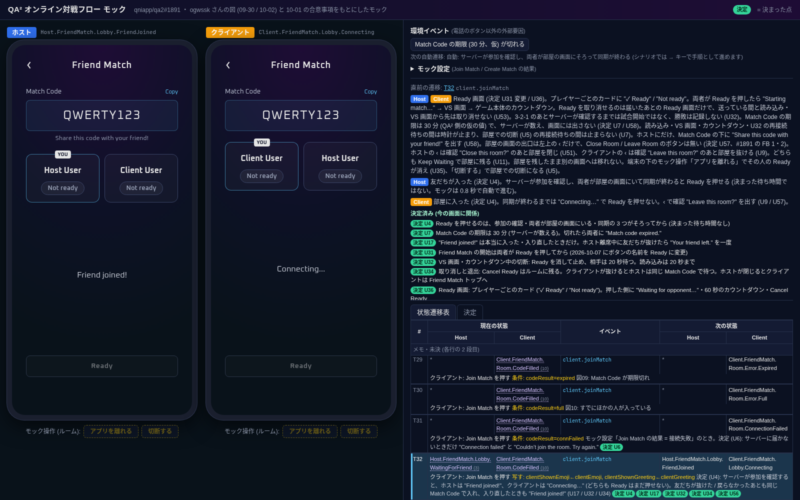

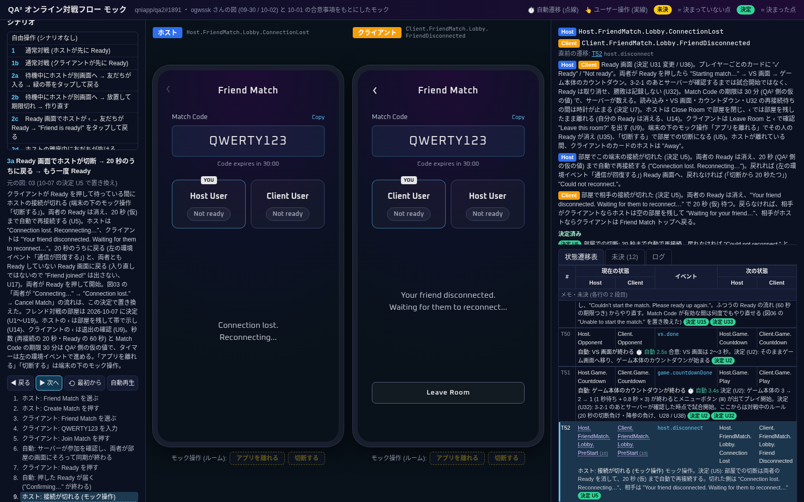

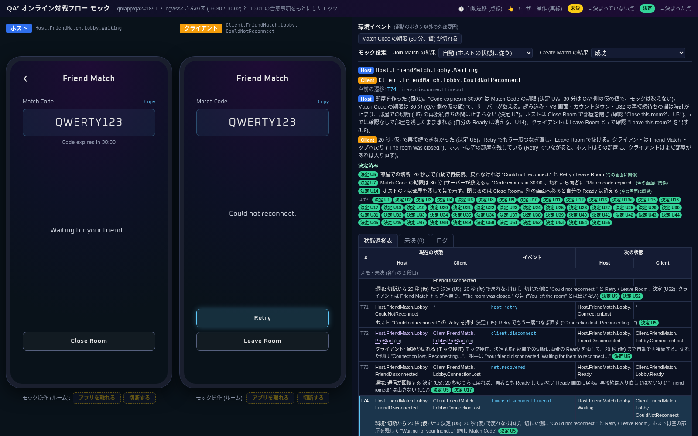

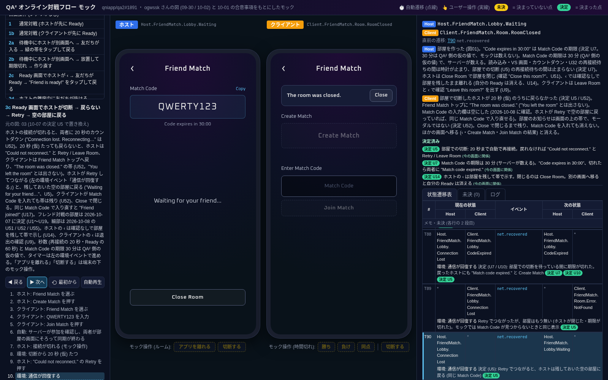

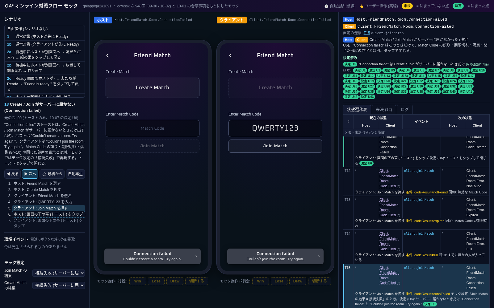

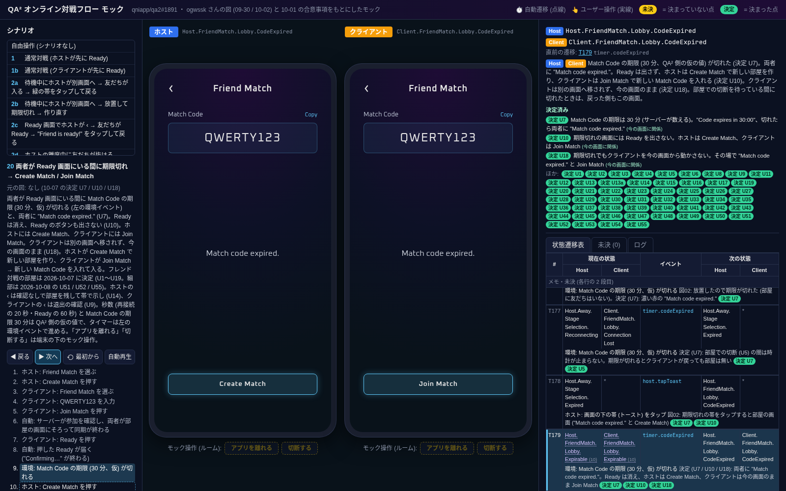

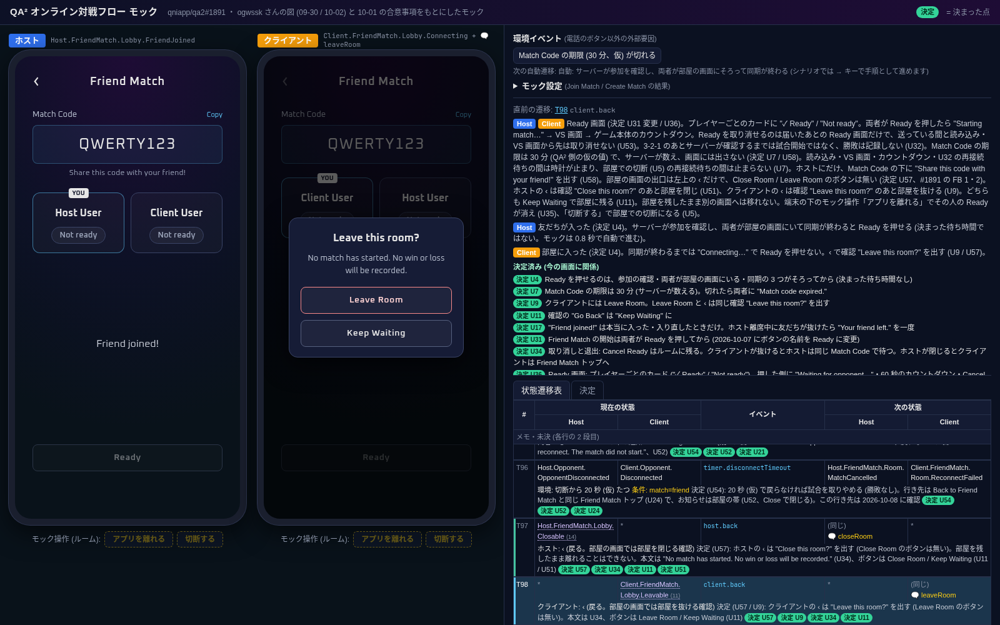

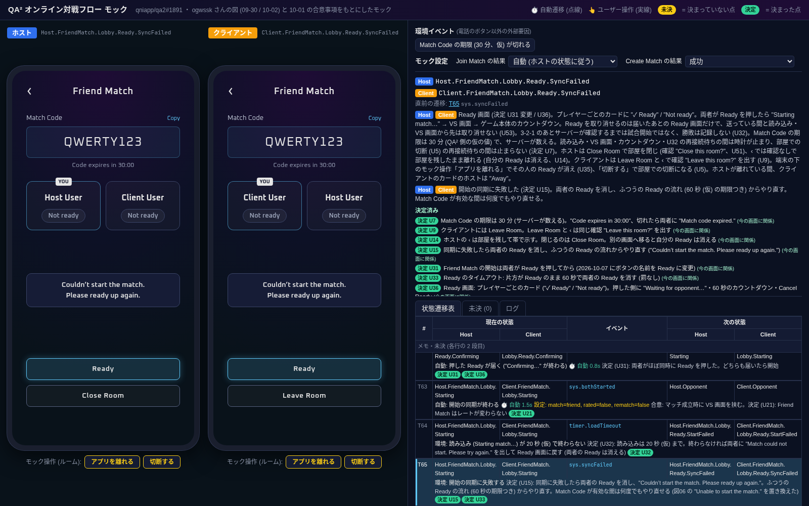

## Ready 画面と開始前の切断 (2026-10-07 決定、U31 変更 / U32〜U36、Friend Match だけ)

高宮さんの決定 (2026-10-07): Friend Match の開始のボタンの名前を **Ready** に変え (U31 の変更。以前の名前は図01 のもの)、試合が始まる前の Ready・切断・タイムアウト・退出・離席・表示が決まりました (U32〜U36)。
U31 そのもの (両者が押したら開始し、Ready 画面になっても自動では開始しない) は 2026-10-03 の決定のままです。ランダム対戦には Ready 画面が無く、相手が見つかり次第 VS 画面へ進みます (U13a)。

**全体のルール**: 試合が始まるまでは勝ち負けを記録しません。試合が始まるのは、3-2-1 (ゲーム本体のカウントダウン) のあとにサーバーが確認したときです。
Ready を取り消せるのは、届いたあとの Ready 画面だけです (送っている間と、読み込み・VS 画面から先は取り消せない。2026-10-08 に U53 で決定。「VS 画面までは取り消せる」案は採らない)。
そこから先は、これまでのルール (20 秒の切断負け U28、降参の負け U38) です。

| ID | 決定 |
|---|---|
| U31 (変更) | 開始ボタンの名前を Ready に (以前は図01 の名前)。画面・README・遷移表・テスト・イベント名・状態名もそろえた |
| U32 | VS 画面・カウントダウン中の切断: 止めて両者の Ready を消す。相手には "Opponent disconnected. Waiting for them to reconnect… 20s" と Leave Room (ホストは Close Room、U14)。戻ったら両者ともう一度 Ready を押し、カウントダウンは 3 から。戻らなければ "Match cancelled. Opponent did not reconnect." (結果なし、ホストは同じ Match Code のままルームに残る)。ホストが切断したときは、クライアントに "Room closed. The host disconnected." を出して Friend Match トップへ。読み込みは 20 秒までで、終わらなければ "Match could not start. Please try again." で両者とも Ready 画面へ |
| U33 | 片方が Ready を押し、相手が 60 秒のうちに押さなければ両者の Ready を消し、両者に "Ready check timed out. Press Ready when you’re ready."。罰はなく、どちらもメニューへは戻らない。切断は U5 / U32 |
| U34 | Cancel Ready してもルームに残り、相手には "Opponent is no longer ready."。クライアントが抜けるとホストに "Your friend left. Waiting for another friend…" (Match Code は同じ)。ホストがルームを閉じるとクライアントに "Room closed. The host left." を出して Friend Match トップへ。抜ける前に確認 "No match has started. No win or loss will be recorded." |
| U35 | ほかの画面へ移る・‹ は、抜けるときと同じ確認を出す。アプリをバックグラウンドへ移すと、その人の Ready は消える。**ホストの ‹ は U14 (2026-10-07) で変わった**: 部屋を残して帯で示し、ホストの Ready は消える (確認はクライアントだけ、U9) |
| U36 | プレイヤーごとにカードを出し、"✓ Ready" か "Not ready"。押した側には "Waiting for opponent…"・60 秒のカウントダウン・Cancel Ready、押していない側には "Opponent is ready. Are you?"。送っている間は "Confirming…" |

**秒数 (Ready の 60 秒・再接続を待つ 20 秒・読み込みの 20 秒) は QA² 側の仮の値です** (変わりうる)。
決定どおり、Ready の 60 秒と再接続の 20 秒は電話の画面にカウントダウン ("60s" / "20s") として出しますが、それが仮の値であることは右パネルの説明・遷移表のメモ・この README にだけ書きます。
モックのカウントダウンは始まった直後の秒数のまま描き (実時間では減らさない)、時間切れは右パネルの環境イベントで起こします。

### Ready 画面

| 段階 | 自分のカード / 相手のカード | 画面の中ほど | ボタン |
|---|---|---|---|
| どちらも押していない | Not ready / Not ready | (なし) | **Ready** |
| 自分が押して送っている | Not ready / Not ready | (なし) | Confirming… (無効表示、‹ も押せない) |
| 自分だけ Ready | ✓ Ready / Not ready | "Waiting for opponent…" と "60s" | Cancel Ready |
| 相手だけ Ready | Not ready / ✓ Ready | "Opponent is ready. Are you?" | **Ready** |
| 相手だけ Ready で、自分も押して送っている | Not ready / ✓ Ready | "Opponent is ready. Are you?" | Confirming… (無効表示、‹ も押せない) |
| 両者 Ready (読み込み) | ✓ Ready / ✓ Ready | "Starting match…" | (なし、‹ も押せない) |
| タイムアウト・相手が取り消した・読み込みの失敗・同期の失敗 | Not ready / Not ready | お知らせの枠 ("Ready check timed out…" / "Opponent is no longer ready." / "Match could not start. Please try again." / "Couldn’t start the match. Please ready up again.") | **Ready** |
| 相手が切断 (VS 画面・カウントダウン中、U32) | Not ready / Not ready | "Opponent disconnected." "Waiting for them to reconnect…" と "20s" | (なし) |
| 自分が切断 (VS 画面・カウントダウン中、U32) | Not ready / Not ready | ~~"Reconnecting…"~~ → "Connection lost. Reconnecting…" と "20s" (2026-10-08、U52) | (なし、‹ も押せない) |

部屋 (Ready 画面・読み込み) での切断の画面 (U5) は「フレンド対戦の部屋」にあります。
2026-10-09 の U57 で、どの段階にも Close Room / Leave Room のボタンは無く、部屋の出口は左上の ‹ だけです (上の表のボタンの列は今の動き)。

- カードは自分が左 (`YOU` 付き)、相手が右です。名前はロビーの "Host User" / "Client User" (架空) のままです。
- クライアントの ‹ は確認 "Leave this room?" / "No match has started. No win or loss will be recorded." / [Leave Room] [Keep Waiting] を出します (U9 / U11 / U34 / U57)。
  ホストの ‹ は "Close this room?" / 同じ本文 / [Close Room] [Keep Waiting] (U57。題名は 2026-10-08 に U51 で決定)。確認を開いても Ready はそのままで、Keep Waiting で閉じるとそのまま待てます。
- 部屋を出るボタンは、SPEC14 では Ready 画面でホスト・クライアントとも Leave Room (仮) にしていましたが、2026-10-07 の決定でホストは Close Room (U14)、クライアントは Leave Room (U9) になり、2026-10-09 の U57 でどちらのボタンも無くなりました (出口は ‹ だけ)。
- 2026-10-03 の U31 のときの "Friend is ready!" (相手の名前の下の緑の帯) と、押したあとの開始ボタンの無効表示は、カードの "✓ Ready" に置き換えました
  ("Friend is ready!" の文言は、U1 で離席中のホストへの赤い帯として使っています)。

### VS 画面・カウントダウン中の切断 (U32)

| 場面 | 切断した側 | 残った側 |
|---|---|---|
| VS 画面・カウントダウン中に切断 (端末の下の「切断する」) | Ready 画面に ~~"Reconnecting…"~~ → "Connection lost. Reconnecting…" と "20s" (2026-10-08、U52) | Ready 画面に "Opponent disconnected. Waiting for them to reconnect…" と "20s" (出口は ‹)。両者の Ready は消える |
| 20 秒のうちに戻る (右パネルの環境イベント「通信が回復する」) | Ready 画面 (Not ready) | Ready 画面 (Not ready)。両者ともう一度 Ready を押し、カウントダウンは 3 から |
| 20 秒たっても戻らない: クライアントが切断していた | Friend Match トップに "Could not reconnect. The match did not start." の帯 (2026-10-08、U52。入力欄は空で、Match Code を入れ直せば同じ部屋に入れる) | ホスト: "Match cancelled. Opponent did not reconnect."。結果なし、同じ Match Code のまま次の友だちを待つ |
| 20 秒たっても戻らない: ホストが切断していた | Friend Match トップに "Could not reconnect. The match did not start." の帯 (2026-10-08、U52) | クライアント: Friend Match トップに "Room closed. The host disconnected." |
| 待っている間に ‹ → 確認 → Close Room / Leave Room | 戻ったとき、ホストなら "Your friend left…"、クライアントなら "Room closed. The host left." (モックの仮定。お知らせは Close で閉じる帯、U52) | 確認のあと、抜ける (ホストなら部屋を閉じる) |
| 読み込み ("Starting match…") が 20 秒で終わらない (右パネルの環境イベント) | - | 両者に "Match could not start. Please try again."、Ready 画面に戻る (両者の Ready は消える) |

- VS 画面とカウントダウン中の切断のこの扱い (Ready 画面に戻す) は、Friend Match の Ready 画面から始まった対戦だけです。
  ランダム対戦と再戦 (Friend Match の再戦も) は 2026-10-08 に U54 で決まり、Ready 画面には戻さずに VS 画面で 20 秒待ちます (「2026-10-08 の決定 (U44〜U55)」)。
- 開始前の切断からは、どの操作でも結果画面 (勝ち負け) へは行きません (`tests/check.js` で確認)。プレイが始まったあとの切断は、これまでどおり U28 (20 秒で切断した側の負け) です。
- 以前の U3 (VS 画面中の切断の戻り先、トグル付き) と、図06 の "Unable to start the match." と開始ボタンでの再試行は、この決定 (と U15) で置き換えました。
- SPEC14 では Ready 画面・読み込み中の切断も U32 に含めていましたが、2026-10-07 に U5 で部屋での切断が決まったので、U32 は VS 画面・カウントダウン中だけにしました (「フレンド対戦の部屋」)。

### 取り消し・退出・離席 (U33 / U34 / U35)

| 操作 | 操作した側 | 相手 |
|---|---|---|
| Cancel Ready | Ready 画面 (Not ready)、ルームに残る | "Opponent is no longer ready." |
| アプリを離れる (端末の下の「アプリを離れる」) | Ready が消える (Ready していなければ何も変わらない)、ルームに残る | Ready していたなら "Opponent is no longer ready." (2026-10-08 に U53 で決定) |
| 片方が Ready のまま 60 秒 (右パネルの環境イベント) | "Ready check timed out. Press Ready when you’re ready." | 同じ |
| クライアントの ‹ → 確認 "Leave this room?" → Leave Room | Match Code が入力欄に残った Friend Match トップ | ホスト: "Your friend left. Waiting for another friend…" (同じ Match Code。自動では進まない) |
| ホストの ‹ → 確認 "Close this room?" → Close Room (U57) | Friend Match トップ | クライアント: Friend Match トップに "Room closed. The host left." |
| ~~ホストの ‹ (U14)~~ | ~~部屋を残して Friend Match トップへ。帯で部屋の様子を示し、ホストの Ready は消える~~ → 2026-10-09 の U57 で無くなった (ホストの ‹ は上の確認) | ~~Ready していたホストが離れたら "Opponent is no longer ready."、カードのホストは "Away"~~ |

U35 で、Ready 画面から別の画面へ移るときは確認を出して部屋を抜けることになったので (2026-10-07 の U14 からはクライアントだけ。ホストは部屋を残して帯)、図07 の「クライアントが別画面へ移ってもマッチを残し、赤い "Ready to start" トーストで戻る」流れと、
そのあとの期限切れ ("Match expired." の画面の開始ボタン、U10 / クライアント側の表示、U18) は無くなりました (U10 / U18 は 2026-10-07 にあらためて決定)。
同じく、図04 の "Host User / cancelled the match." の画面 (U8) と、図05 の "left the match." → 自動で待機に戻る流れは、U34 の表示に置き換えました。
Ready 画面より前の部屋の画面のボタンも、2026-10-07 にホストは Close Room、クライアントは Leave Room になりました (U9 / U14。SPEC14 では図どおり Cancel Match / Leave Match でした)。2026-10-09 の U57 で、どちらも左上の ‹ にまとめました。

### モック操作 (端末の外)

| 場所 | 操作 | 出る場面 |
|---|---|---|
| 端末の下 `モック操作 (ルーム)` | アプリを離れる (その人の Ready が消える、U35)、切断する (部屋での切断、U5) | 部屋の画面 (Ready 画面など) |
| 端末の下 `モック操作 (対戦)` (2026-10-08 から `モック操作 (時間切れ)`) | 切断する (U32 / U54) | VS 画面・カウントダウン (時間切れの勝ち / 負け / 同点はまだ押せない) |
| 右パネルの環境イベント | 片方が Ready のまま 60 秒たつ、読み込みが 20 秒で終わらない、通信が回復する、切断から 20 秒たつ | Ready 画面・読み込み・切断を待っている間 |

Ready を送っている間の "Confirming…" は、自由操作では 0.8 秒で自動で届きます (シナリオでは手順として 1 つずつ進みます)。

### 状態・イベント

| 変更 | 状態 / イベント |
|---|---|
| 改名 | イベント `*.startMatch` → `*.ready`、`sys.ready` (自動で Ready 画面になる) → `sys.readyScreen`。状態 `*.FriendMatch.Lobby.Ready.WaitingForFriend` → `*.Ready.WaitingForOpponent`、`*.Ready.FriendReady` → `*.Ready.OpponentReady`、`*.FriendMatch.Lobby.StartFailed` → `*.Ready.StartFailed` |
| 追加 | 状態 `*.Ready.Confirming` / `*.Ready.OpponentReady.Confirming` (送っている)、`*.Ready.TimedOut` / `*.Ready.OpponentNotReady` (お知らせ)、`*.FriendMatch.Lobby.Reconnecting` / `*.FriendMatch.Lobby.OpponentDisconnected` (開始前の切断)、`Host.FriendMatch.Lobby.MatchCancelled`、`Client.FriendMatch.Room.HostLeft` / `Client.FriendMatch.Room.HostDisconnected` |
| 追加 | イベント `*.cancelReady`、`*.leaveRoom`、`*.dialog.leaveRoom` / `*.dialog.stay`、`sys.readyConfirmed` (自動)、環境 `timer.readyTimeout` / `timer.loadTimeout`。`*.leaveApp` と `*.disconnect` をロビーでも使い、`net.recovered` と `timer.disconnectTimeout` を開始前の切断でも使う |
| 意味を変更 | `Host.FriendMatch.Lobby.ClientLeft`: "left the match." → 自動で待機、をやめ、"Your friend left. Waiting for another friend…" のまま次の友だちを待つ |
| 削除 | 状態 `Host.FriendMatch.Lobby.ClientAway` / `Client.Away.StageSelection.Ready` / `Client.Away.StageSelection.Expired` / `Host.FriendMatch.Lobby.MatchExpired` (図07)、`Client.FriendMatch.Lobby.HostCancelled` (図04)。イベント `sys.startFailed`、`sys.resetWaiting`、`net.lostDuringVs` と U3 のトグル |
| 追加 | グループ `*.FriendMatch.Lobby.Ready.NoneReady` / `.Ready.Any` / `.PreStart` / `.RoomLeavable`、`*.Game.BeforeStart`、`Host.FriendMatch.Lobby.WaitingForFriend`、`Client.FriendMatch.Room.Empty` |

遷移表は 239 行から 258 行に、状態は 127 から 137 に、グループは 34 から 44 になりました (この表は SPEC14 のときの変更。2026-10-07 の U1〜U19 の決定でさらに変わったものは「フレンド対戦の部屋」の「状態・イベント」)。

Friend Match のシナリオは、両者の Ready に "Confirming…" の手順が 1 つずつ増えたので、Ready より後ろの手順が 2 つずつ後ろにずれました (例: 通常対戦の VS 画面は `#s=1&step=12`、プレイ開始は `step=14`)。
ランダム対戦のシナリオ (11〜11g、16d、17、17b、18d、18e) の手順は変わりません。その後の U1〜U19 の決定で、Friend Match のシナリオは 1 つずつ前にずれました (今の手順は下の表のとおり)。

### 決定に書かれていないので置いた仮定 (新しい未決)

2026-10-08 に、下の未決 4 件 (U51〜U54) はすべて決まりました (右端の列)。

| 仮定 (モックの動き) | 未決 → 2026-10-08 の決定 |
|---|---|
| ~~Ready 画面と切断を待つ画面のボタンは、ホストもクライアントも Leave Room。確認の題名は "Leave this room?"、残るボタンは "Stay in Room"~~ → 2026-10-07 に U9 / U11 / U14 で決まった (ホストは Close Room、クライアントは Leave Room、残るボタンは Keep Waiting)。残りはホストの確認の題名 | U51 → "Close this room?" のまま |
| VS 画面・カウントダウン中に切断した側には "Reconnecting…" (ボタンなし)。20 秒で戻れなければ Friend Match トップへ (クライアントは Match Code を残す)。切断中に相手が抜けたら、戻ったときに "Room closed. The host left." / "Your friend left…"。Friend Match トップの "Room closed…" はほかの操作で消える (部屋での切断の切れた側は 2026-10-07 に U5 で決まった) | U52 → 切れた側は "Connection lost. Reconnecting…" と残りの秒数、戻れなかった側は "Could not reconnect. The match did not start."、部屋のお知らせは Close で閉じる帯 (入力では消えない) |
| 送っている間 ("Confirming…") は Leave Room / ‹ を押せず、読み込み中は Cancel Ready / Leave Room / ‹ を出さない。アプリを離れて Ready が消えたとき、相手には Cancel Ready と同じ "Opponent is no longer ready."。相手が送っている途中で取り消すと、相手の Ready が届いて相手が待つ側になる。戻った・再接続したあとはお知らせを出さない | U53 → 今のモックのまま。Ready は送っている間と VS 画面から先は取り消せない |
| ランダム対戦の VS 画面・カウントダウン中の切断は行なし。Friend Match の再戦の VS 画面・カウントダウン中の切断は U32 と同じ | U54 → 20 秒待ち、戻らなければ取りやめ (勝敗なし・レートは変わらない)。ランダム対戦は Search again / Close。再戦は Ready 画面に戻らず、戻ったら VS 画面から |
| ~~Ready 画面で何も押していないとき・読み込み中の切断も U32 と同じ扱い~~ → 2026-10-07 に U5 で決まった (部屋での切断は U5 の文言と流れ) | (U5) |
| 戻ってきたあとも VS 画面を挟む (カウントダウンは 3 から) | (U32 の範囲) |

### シナリオ

| ID | 手順 | 見られる画面 |
|---|---|---|
| 1 | 13 | 6: Ready 画面 (両者 Not ready) → 7: ホストが Ready、"Confirming…" → 8: ホスト "Waiting for opponent…" と 60s / クライアント "Opponent is ready. Are you?" → 9: クライアントも押して "Confirming…" → 10: "Starting match…" → 11: VS 画面 |
| 1b | 13 | 8: クライアントが先に Ready (クライアント "Waiting for opponent…" / ホスト "Opponent is ready. Are you?") → 11: VS 画面 |
| 4 | 8 | 7: ホストの ‹ で "Close this room?" → 8: ホストは Friend Match トップ、クライアントは "Room closed. The host left." |
| 4b | 13 | 9: ホストの ‹ の確認 → 10: Keep Waiting で Ready のまま残る → 13: VS 画面 |
| 5 | 10 | 7: クライアントの ‹ で "Leave this room?" → 8: クライアントが抜け、ホストは "Your friend left. Waiting for another friend…" → 9: 同じ Match Code で入り直す |
| 6 | 18 | 10: "Starting match…" → 11: 20 秒で終わらず "Match could not start. Please try again." → 16: もう一度 Ready して VS 画面 |
| 7a | 12 | 9: クライアントが Ready のあと ‹ → "Leave this room?" → 10: Keep Waiting → 12: もう一度 ‹ → Leave Room、ホストは "Your friend left…" |
| 7b | 16 | 9: ホストがアプリを離れて Ready が消え、クライアントに "Opponent is no longer ready." |
| 12 | 14 | 12: VS 画面中にクライアントが切断 (ホスト "Opponent disconnected…" と 20s / クライアント "Reconnecting…") → 13: 20 秒たって "Match cancelled. Opponent did not reconnect." → 14: 同じ Match Code で入り直す |
| 19 | 11 | 9: クライアントが Cancel Ready、ホストに "Opponent is no longer ready." → 11: 今度はホストが Ready |
| 19b | 16 | 9: 60 秒たって両者に "Ready check timed out. Press Ready when you’re ready." → 14: もう一度両者が Ready して VS 画面 |
| 19c | 21 | 12: カウントダウン → 13: ホストが切断 (クライアントは "Opponent disconnected…" と 20s) → 14: 戻って両者 Ready 画面 → 20: カウントダウンを 3 から |
| 19d | 13 | 12: VS 画面中にホストが切断 → 13: 戻らず、クライアントに "Room closed. The host disconnected." |

- `index.html#s=1&step=7` - ホストが Ready を押して送っている ("Confirming…")
- `index.html#s=1&step=8` - ホストだけ Ready: カード、"Waiting for opponent…"、60s、Cancel Ready / クライアントは "Opponent is ready. Are you?"
- `index.html#s=19c&step=13` - カウントダウン中にホストが切断: クライアントは "Opponent disconnected. Waiting for them to reconnect…" と 20s
- `index.html#s=12&step=13` - クライアントが戻らず、ホストは "Match cancelled. Opponent did not reconnect."
- `index.html#s=19d&step=13` - ホストが戻らず、クライアントは "Room closed. The host disconnected."

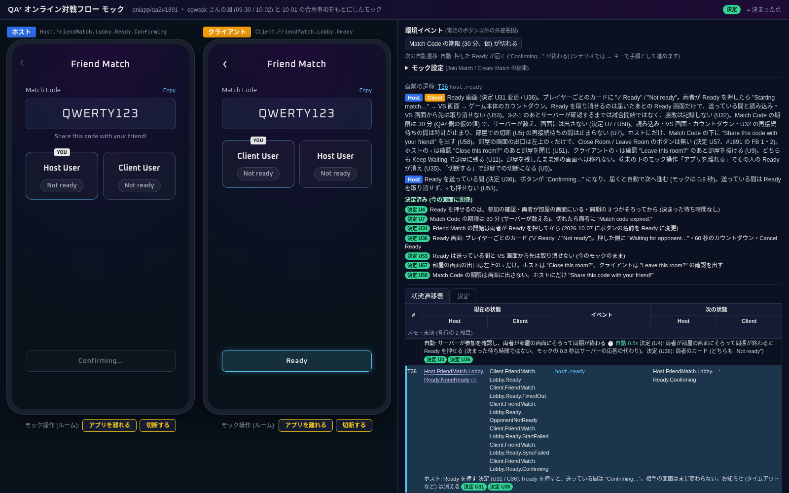


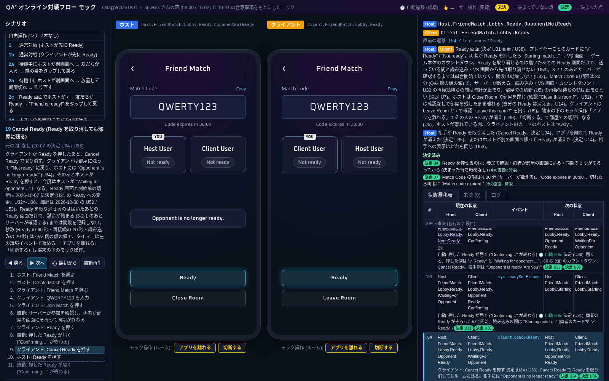

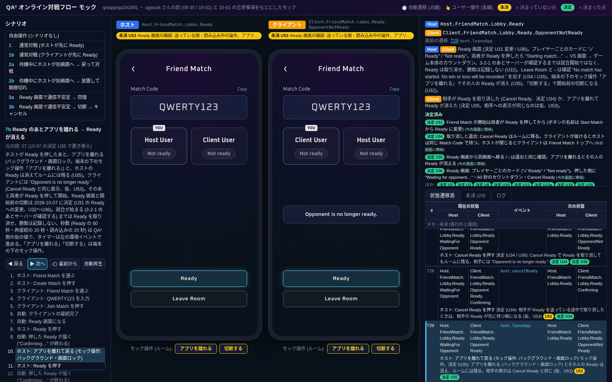

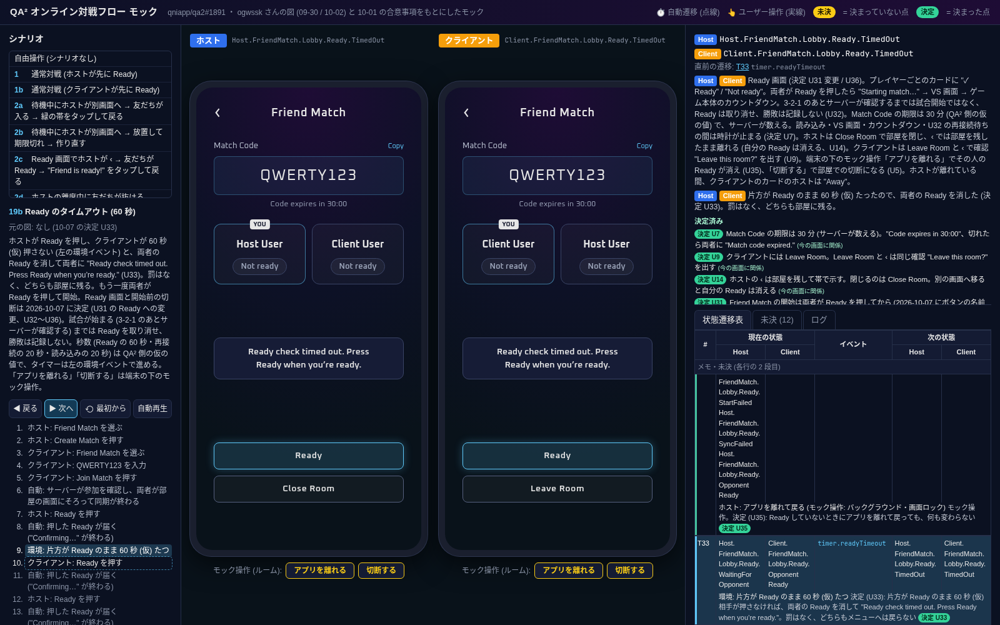


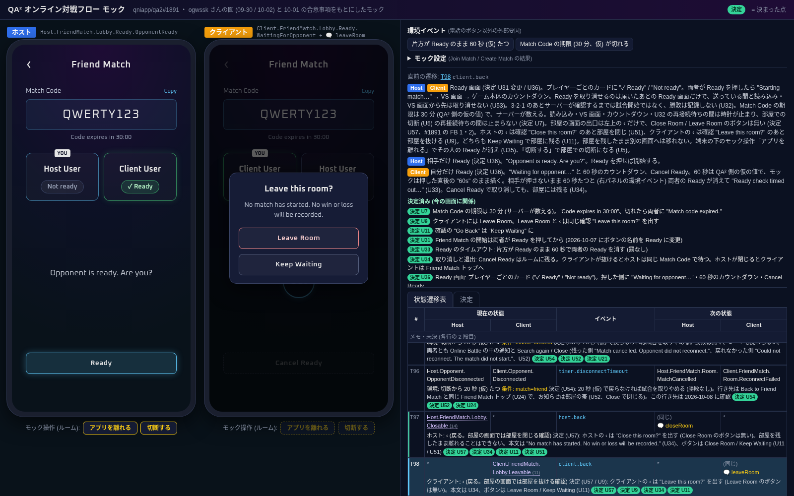

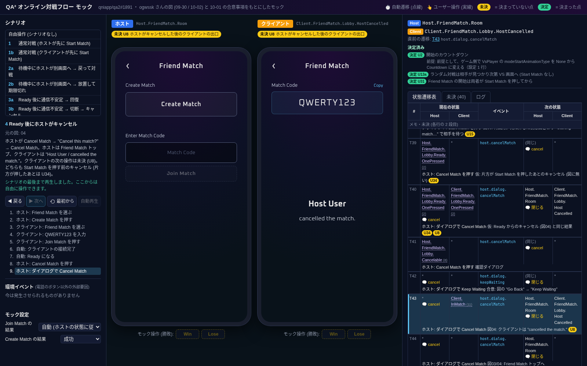

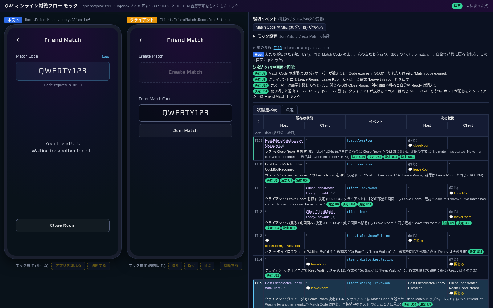

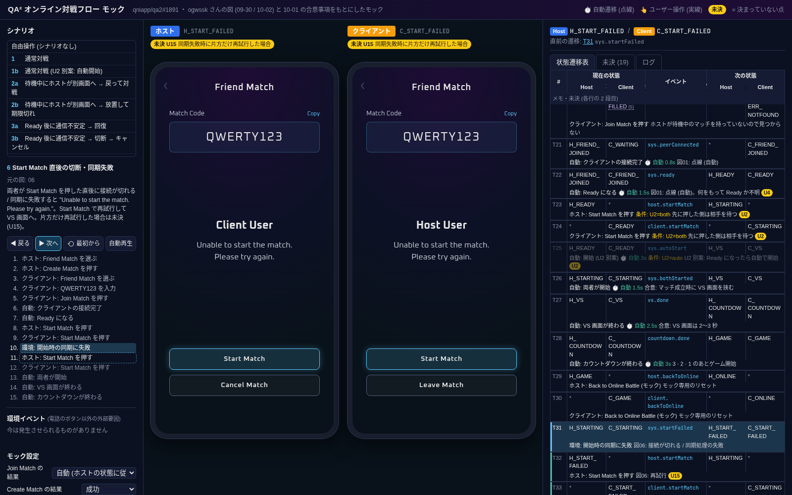

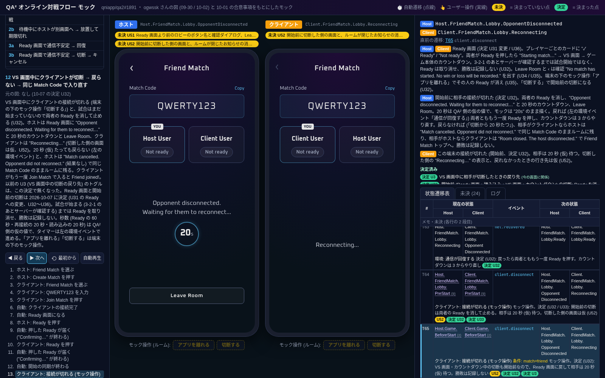

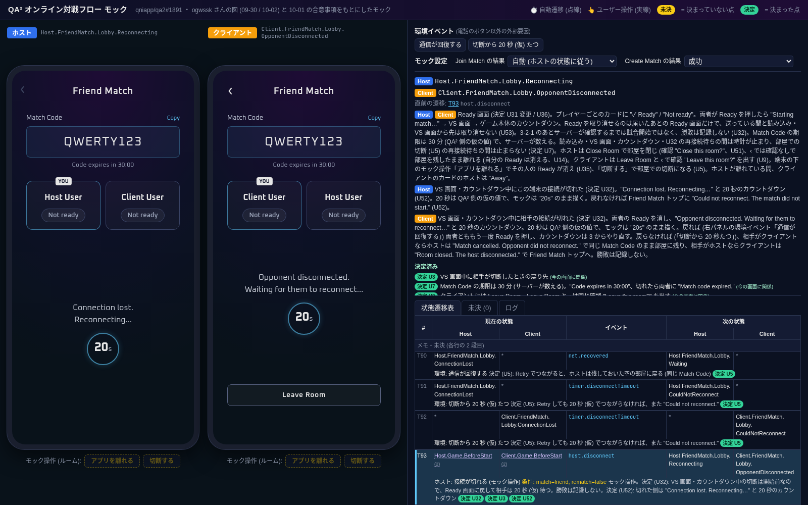


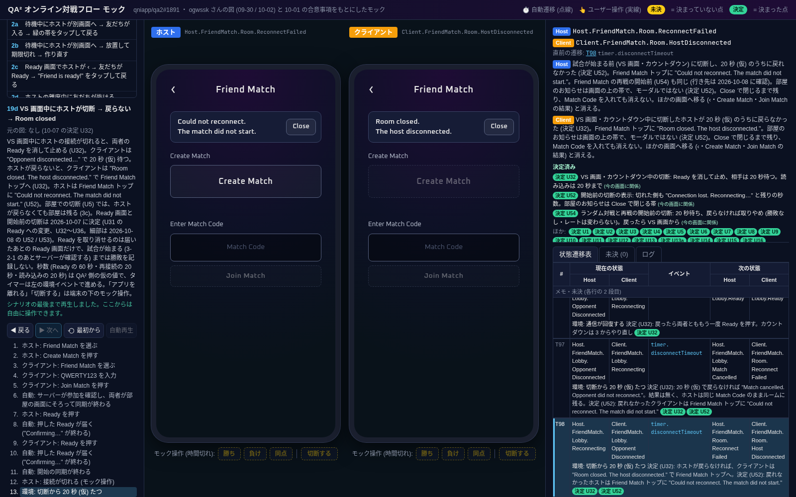

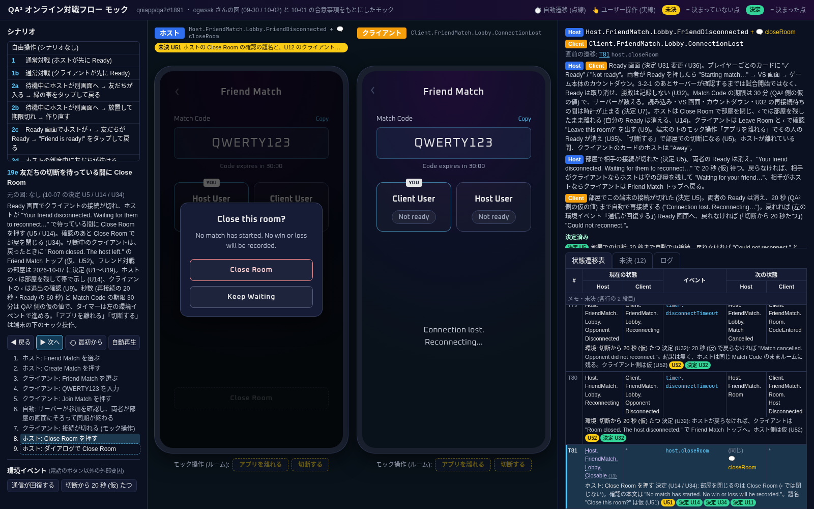

### 以前の U31 (2026-10-03) からの変更

2026-10-03 の U31 の決定のときは、ボタンは図01 の名前のままで、片方が押すと押した側に "Waiting for your friend…" (ボタンは無効表示)、相手側の名前の下に緑の "Friend is ready!" を出していました
(図01 で先に押した側の "Starting match…" を置き換えたもの)。片方だけ押した状態の切断・放置 (U33)、キャンセル・退出 (U34)、離席 (U35)、表示の細部 (U36) は未決でした。
2026-10-07 にこれらがすべて決まったので、表示はカードに、文言は決定のものに置き換えました。"Starting match…" は、両者の Ready がそろったあとの読み込みの表示として残しています。

## ゲーム画面とゲーム本体のカウントダウン (2026-10-03 決定)

高宮さんの決定 (2026-10-03、未決 U2 のカウントダウンの部分): VS 画面のあとにモック独自の 3·2·1 は出しません (ランダム対戦・Friend Match・再戦とも)。
VS 画面が終わるとゲーム画面に移り、ゲーム本体の開始カウントダウンがそこで再生されます。
理由は、ゲーム本体にゲーム開始時のカウントダウンがあり、モック側の 3·2·1 は要らないためです。

**前提として、ゲーム側で VsPlayer の modeStartAnimationType を None から Countdown に変える（設定 1 行）。**
今のゲームで 3-2-1 の `CountdownTimer` を使うのは VsAI (AI 対戦) だけで、VsPlayer (オンライン対戦) は `None` になっています。

### モックでの再現 (実機の VsAI の画面と同じ見た目・タイミング)

- 自分のフィールドの上の中央に、細い水色 (`#D3F7FB`) の数字と、同じ色の細い円のリング。3 → 2 → 1 だけで、"GO" / "START" の文字は出ません (ゲームでは開始は効果音だけ)。
- タイミング: ゲーム画面が出てから 1 秒待ち、数字 1 つにつき 0.8 秒 (合計 3.4 秒)。数字は 0.5 → 0.66 倍に拡大しながら 0.15 秒で現れ、0.55 秒まで少しずつ大きくなり、
  最後の 0.25 秒で 1.6 倍に広がりながら消えます。リングも同じタイミングで 0.2 → 0.34 → 1.6 倍。
- カウントダウン中はメニューボタンが無く、端末の下の Win / Lose も押せません (遷移表に行が無い)。"1" が消えるとメニューボタン (右上の ☰、U37) が出てプレイ開始になり、Win / Lose が押せるようになります。
- ゲーム画面は実機にならったプレースホルダーです: 上に相手の小さなフィールド、その下に "Time 0:00" と "Score 0"、自分のフィールド、下のバー。
- 決定 U2 とその前提 (「前提として、ゲーム側で VsPlayer の modeStartAnimationType を None から Countdown に変える（設定 1 行）」) は、
  右パネルの「決定済み」に出しています。以前はカウントダウンの画面の中に注記を出していましたが、端末の画面にはゲームが出すものだけを描くことにしたので、右パネルへ移しました。

### 状態・イベント

| 変更 | 状態 / イベント |
|---|---|
| 削除 | 状態 `H_COUNTDOWN` / `C_COUNTDOWN` (旧名、案 C への改名より前に削除したので対応表には無い。モック独自の 3·2·1 の画面)、イベント `countdown.done` |
| 追加 | 状態 `Host.Game.Countdown` / `Client.Game.Countdown` (ゲーム画面 + ゲーム本体のカウントダウン、メニューボタンなし)、イベント `game.countdownDone` (自動、3.4 秒) |
| 変更なし | `Host.Game.Play` / `Client.Game.Play` (プレイ中、メニューボタン ☰ あり、Win / Lose を押せる) |

流れ: `Host.Opponent` / `Client.Opponent` → `vs.done` → `Host.Game.Countdown` / `Client.Game.Countdown` → `game.countdownDone` → `Host.Game.Play` / `Client.Game.Play`。
このときの遷移表の行数は 126 行のままでした (`vs.done` の行き先を変え、`countdown.done` の行を `game.countdownDone` に置き換えた)。
手順の数も変わらなかったので、既存の `#s=..&step=..` はそのまま使えました (2026-10-07 の Ready の決定で "Confirming…" が 2 手順増え、同じ日の U4 の決定で参加のあとの自動遷移が 1 つ減ったので、今は通常対戦の手順 12 がカウントダウン、手順 13 がプレイ開始)。

### 手順で止めて見る (`cd`)

シナリオを手順で進めている間は、カウントダウンを 1 つの数字で止めて表示します。表示する数字は URL の `&cd=3` / `&cd=2` / `&cd=1`、
で選べます (省略時は 3)。自由操作中は実時間でアニメーションします。

- `index.html#s=1&step=12&cd=3` - 両端末に "3" とリング
- `index.html#s=1&step=12&cd=1` - 両端末に "1" とリング
- `index.html#s=1&step=13` - カウントダウンが終わってプレイ開始 (メニューボタン ☰ あり、Win / Lose が押せる)

カウントダウン中に相手が切断した場合は、2026-10-07 に U32 で決まりました: 試合はまだ始まっていない (3-2-1 のあとサーバーが確認した時点で開始) ので、両者の Ready を消して Ready 画面に戻し、相手は 20 秒待ちます (「Ready 画面と開始前の切断」を参照。部屋での切断は U5、「フレンド対戦の部屋」)。


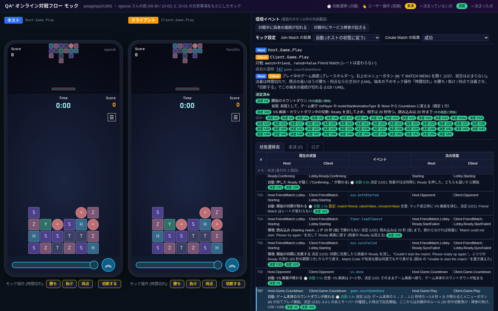

## 対戦中の MATCH MENU (2026-10-07 決定、案A / U37〜U42)

高宮さんの決定 (2026-10-07、案A): オンライン対戦では、VsAI のポーズポップアップの代わりに **MATCH MENU (☰)** を出します。**試合は止まりません。**
以前のモック (2026-10-03) は「オンラインでも VsAI と同じポーズポップアップ (CONTINUE / REMATCH / QUIT) を出す」仮の案でしたが、それを置き換えました。

| ID | 決定 |
|---|---|
| U37 | ☰ MATCH MENU。開いても試合は止まらない (オンラインでは `Time.timeScale = 0` にしない)。メニューに "The match continues while the menu is open." と出す |
| U38 | メニューを開いただけでは相手には何も見えない。降参すると自分は負け、相手は勝ちの結果画面に "Your opponent surrendered" |
| U39 | 対戦中に REMATCH / RETRY は出さない。再戦は結果画面だけ |
| U40 | 降参の前に確認「降参しますか？ 負けになります」("Surrender?" / "You will lose.")。ボタンは CONTINUE (続ける) / SURRENDER (降参する)。確認中も試合は続く |
| U41 | ボタンは QUIT ではなく SURRENDER。負けの結果画面のあとは Online Battle (`Host.MultiModeSelection` / `Client.MultiModeSelection`) へ戻る |
| U42 | MATCH MENU 中も BGM を下げない (ダッキングしない)。モックには音が無いので記録だけ |

以前のゲーム画面にあったモック専用の "Game in progress (mock)" の文字は 2026-10-03 に削除したままです (端末の下の Win / Lose はそのまま)。

### 見た目

パネルとボタンは実機のポーズポップアップ (`Menu_Pause`) の値を、電話の画面幅 360px に合わせて × 0.3077 で縮めたものです
(パネル 271px 幅、塗り `#0B0B0B` α 0.9、白い枠線。ボタン 246 x 40px、間隔 9.2px、文字は Oxanium Regular、文字間隔 0.05em)。ポーズと違うのは次の点です。

- HUD の右上のボタンは ‖ ではなく ☰ (同じ枠に横線 3 本)。プレイ中だけ出て、メニュー・確認を開いている間は消える
- 暗幕は実機のポーズの α 0.784 より薄い α 0.35。試合が続いていることが分かるように、フィールドや HUD が見えたまま
- パネルの上にタイトル (`MATCH MENU` / `Surrender?`) と一文 ("The match continues while the menu is open." / "You will lose.") がある
- ボタンは 2 つだけ: `CONTINUE` (塗り `#020202`) と `SURRENDER` (実機の QUIT と同じ `#EF2B2B` α 0.51 の塗りと薄い走査線)

### 動き

| 操作 | 自分の端末 | 相手の端末 | 決定 |
|---|---|---|---|
| ☰ | MATCH MENU を開く (試合は続く) | 変わらない | U37, U38 |
| MATCH MENU の CONTINUE | メニューを閉じてプレイの画面に戻る | 変わらない | U37 |
| MATCH MENU の SURRENDER | 降参の確認 "Surrender?" / "You will lose." を開く (試合は続く) | 変わらない | U40, U41 |
| 確認の CONTINUE | 確認を閉じてプレイの画面に戻る | 変わらない | U40 |
| 確認の SURRENDER | 負けの結果画面 ("LOSE"、"You surrendered"、Back to Online) | 勝ちの結果画面 ("WIN!"、"Your opponent surrendered"、Back to Friend Match。ランダム対戦なら Find Next Opponent / Back to Online)。メニューや確認を開いていても同じ | U38, U40 |
| 負けの結果画面の Back to Online | Online Battle に戻る | 結果画面のまま | U41 |

- 試合は止まらないので、メニューや確認を開いていても端末の下の Win / Lose (試合の決着。2026-10-08 から「時間切れ」の勝ち / 負け、U44) は押せます。そのときは開いていたメニューが閉じて、通常の結果画面になります (シナリオ 16c)。
- 降参の結果画面には Rematch はありません (降参した側は再戦を申し込めない、U28。勝った側からも申し込めないことが 2026-10-08 に U45 で決まった)。勝った側の戻り先は、通常の結果画面と同じです (U24)。
- 降参の結果画面のボタンの文言は、2026-10-07 の結果画面の決定 (U22) で "Back to Online Battle" から "Back to Online" になりました。Score と Rating の表示も通常の結果画面と同じです (U20 / U21)。
- 引き分けと対戦中の切断も 2026-10-07 に決まりました (U20 / U28、「対戦後の結果画面」を参照)。

### 状態・イベント

| 変更 | 状態 / イベント |
|---|---|
| 改名 | 状態 `Host.Game.Pause` / `Client.Game.Pause` → `Host.Game.MatchMenu` / `Client.Game.MatchMenu` |
| 追加 | 状態 `Host.Game.SurrenderConfirm` / `Client.Game.SurrenderConfirm` (降参の確認)、`Host.LoseResult.Surrendered` / `Client.LoseResult.Surrendered` (降参した側)、`Host.WinResult.OpponentSurrendered` / `Client.WinResult.OpponentSurrendered` (相手が降参した側) |
| 追加 | イベント `*.matchMenu` (☰)、`*.matchMenu.continue`、`*.matchMenu.surrender`、`*.surrenderConfirm.continue`、`*.surrenderConfirm.surrender`、`*.backToOnlineBattle` (`*` は `host` / `client`) |
| 削除 | イベント `*.pause` / `*.continue` / `*.quit` / `*.pauseRematch` |
| 変更 | Win / Lose の 4 行 (T124〜T127) の `from` を `Host.Game.InPlay` / `Client.Game.InPlay` (プレイ中・メニュー中・確認中) に広げた |

遷移表は 135 行から 141 行になりました (ポーズの 6 行 T30〜T35 を MATCH MENU の 10 行 T30〜T39 に置き換え、末尾に降参した側の Back to Online Battle の 2 行 T140 / T141 を追加)。
そのため、対戦後の行は T124〜T139 になりました。シナリオ 16 / 16b は書き直し、16c を足しました。ほかのシナリオの手順の数は変わらないので、既存の `#s=..&step=..` はそのまま使えました (下の番号は、2026-10-07 の Ready の決定で 2 手順増え、U4 の決定で 1 手順減ったあとの今のもの)。

- `index.html#s=16&step=14` - ホストだけ MATCH MENU (クライアントはプレイ中のまま)
- `index.html#s=16&step=15` - 両者が MATCH MENU
- `index.html#s=16b&step=15` - ホストの降参の確認 "Surrender?" / "You will lose."
- `index.html#s=16b&step=19` - ホストは負け "You surrendered"、クライアントは勝ち "Your opponent surrendered"
- `index.html#s=16b&step=20` - ホストが Back to Online で Online Battle に戻った
- `index.html#s=16c&step=15` - ホストが MATCH MENU を開いている間にクライアントが勝った

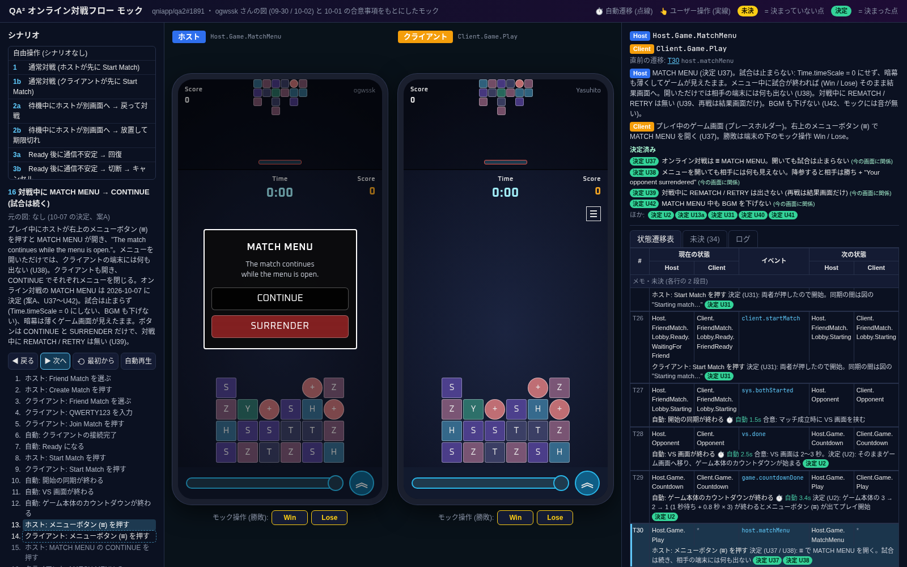

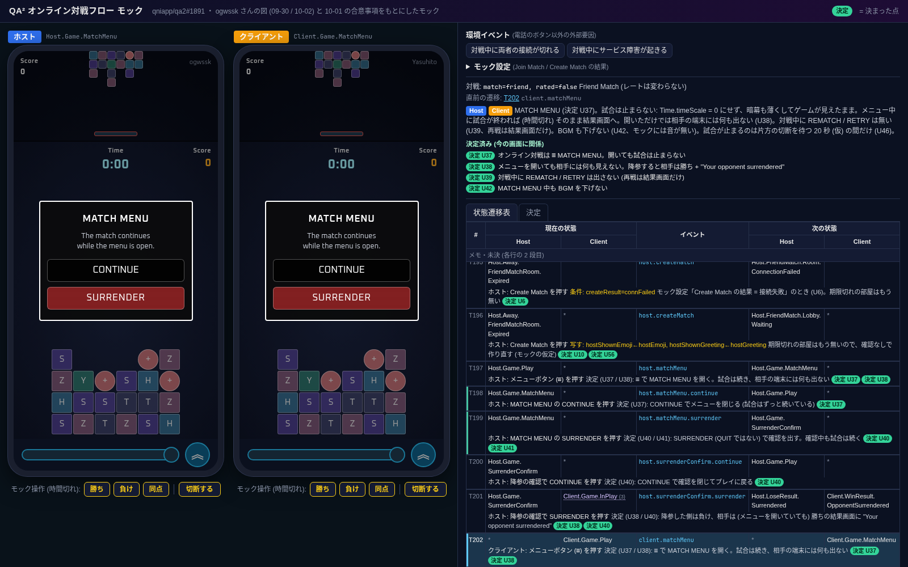

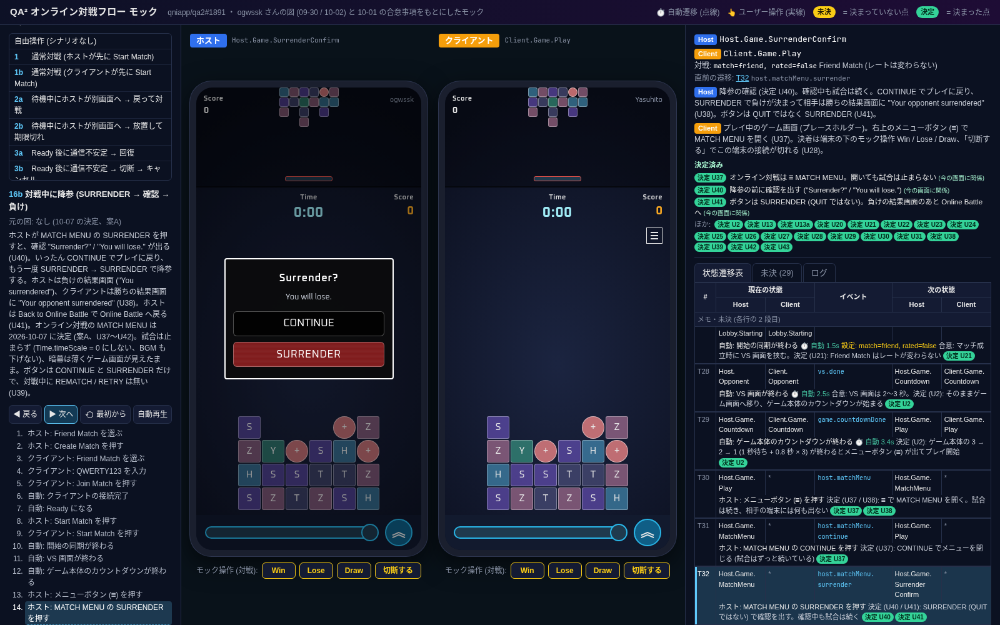

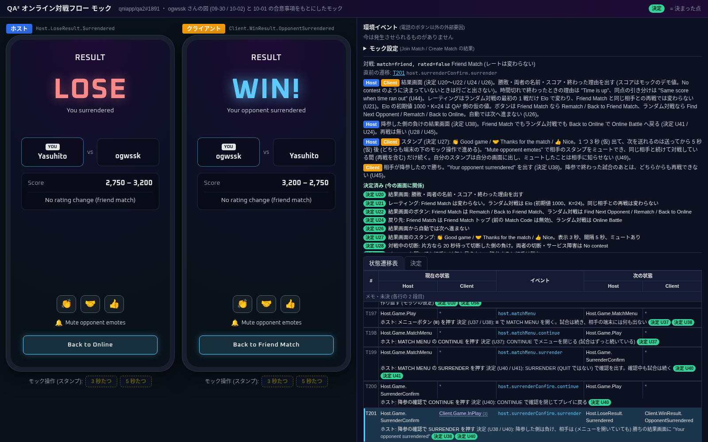

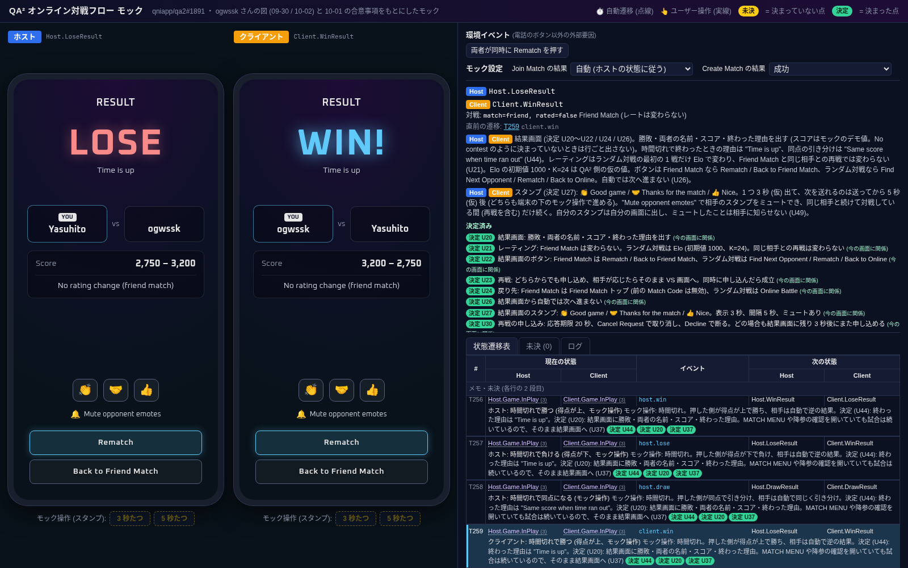

## 端末の画面にはゲームが出すものだけ (2026-10-03)

高宮さんの指摘を受けて、電話の画面の中には、ゲームが実際に出すものだけを描くことにしました。

- カウントダウンの画面にあった決定 U2 の注記 (前提の説明と `決定 U2` バッジ) を削除し、右パネルの「決定済み」に移しました。
- 端末の上の帯には `未決` バッジだけを出し、`決定` バッジ (U2, U31) は右パネルの「決定済み」に移しました。今の画面や直前の遷移に関係する決定は、そこで明るく表示します。
- 画面の説明 (ゲーム本体のカウントダウン、MATCH MENU の決定、結果画面の仮の点など) も、右パネルの現在の状態の下に出します。
- 続けて、電話の画面の中に残っていた未決・仮の印とモックの注記も外へ出しました (2026-10-03)。

| 状態 | 以前は画面の中にあったもの | 移した先 |
|---|---|---|
| `Host.WinResult*` / `Host.LoseResult*` / `Client.WinResult*` / `Client.LoseResult*` (結果画面、ホスト・クライアントで 6 状態ずつ) | Rank の横の `仮` と `未決 U21`、Score の `仮`、Rematch の `未決 U23` (自分が申し込んで待っている `.RematchWaiting` では `未決 U30`)、Back to Friend Match の `未決 U24` | 端末の上の帯に `未決` U21 / U23 / U24 (`.RematchWaiting` では U30 も)。右パネルの説明に「Rank の変化と Score はどちらも仮の表示で、Score の ---- は値が決まっていないため (U21)」と U23 / U24 / U30 の説明。Score の表示は `----` のまま |
| シナリオ 8 / 9 / 10 のホスト (`Host.MultiModeSelection`) | 注記「このシナリオではホストは関与しない」 | 右パネルの現在の状態の下 (`Host` 付きの 1 行)。ホストの端末はその時点の画面 (Online Battle) だけ |

2026-10-07 に結果画面が決まったので (U20〜U30)、結果画面の帯には U21 / U23 / U24 / U30 ではなく、決まっていない点 (U44 / U45 / U49 / U50) だけを出し、Score の `----` はやめました (決まっていないスコアは行ごと出さない、U20)。
2026-10-08 にその 4 件も決まり (未決が 0 件)、同じ日に端末の上の帯そのものを消しました。

これで電話の画面の中には、決定・未決・仮の印もモックの注記もありません (`node tests/scan-screens.mjs` で全シナリオの全手順を確認)。
モックの仮置きとして画面の中に残しているのは次のものだけです。

| 状態 | 画面の中にあるもの | 場所 |
|---|---|---|
| すべての状態 | 遷移表に行が無いボタンの破線・半透明 (例: Friend Match トップのクライアントの Create Match) | `css/style.css` `.screen [data-norow]` |
| `Host.Game.*` / `Client.Game.*`、`Host.Away.StageSelection.*` / `Client.Away.StageSelection.*` | ゲーム画面 (フィールド・HUD) とステージ選択の画面そのものがプレースホルダー | `js/app.js` `VIEWS.game` / `VIEWS.stage` |

## ランダム対戦は相手が見つかり次第 VS へ (2026-10-03 決定、U13a)

高宮さんの決定 (2026-10-03、U13 の一部を U13a として分けた): ランダム対戦では、相手が見つかり次第 VS 画面へ進みます。
Ready 画面・"Starting match…" は挟みません。両者が Ready を押す U31 は Friend Match だけの決定です。
相手を探している画面には、相手を探していることが分かる表示と、席を外す人のための目立つ Cancel を出します。

### モックでの表示

| 段階 | 端末の画面 |
|---|---|
| Random Match を選ぶ | 見出し "Random Match"、中央に "Searching for an opponent…" と順に光る 3 つの点、下に大きな [Cancel] |
| 相手が見つかる (自動、約 2.5 秒) | すぐ VS 画面 → ゲーム画面でゲーム本体のカウントダウン → プレイ開始 (Friend Match と同じ) |
| Cancel を押す | 確認なしで Online Battle の画面 (Random Match / Friend Match を選ぶ画面) に戻る (確認を出さないことは U13 で決定) |

- 09-30 の旧案 (図00) にあったピンクのトースト "Waiting for opponent" と、待機画面の "Waiting for opponent…" はやめ、"Searching for an opponent…" にしました (「表記の修正」)。
- 端末の画面には決定の印を出さず、右パネルの「決定済み」に `決定 U13a` を出します。画面の説明も右パネルの現在の状態の下に出します。

### U13 の分け方

| ID | 状態 | 内容 |
|---|---|---|
| U13a | 決定 (高宮さん 2026-10-03) | ランダム対戦は相手が見つかり次第 VS 画面へ (Ready 画面なし)。相手を探す画面に "Searching for an opponent…" と Cancel。Cancel で Online Battle へ |
| U13 | 決定 (高宮さん 2026-10-07) | 残りの論点 (Cancel の確認、‹、アプリを離れたとき、タイムアウト)。下の「ランダム対戦の待機中の操作」を参照 |

### 状態・イベント

| 変更 | 状態 / イベント |
|---|---|
| 追加 | イベント `host.cancelSearch` / `client.cancelSearch` (相手を探している間の Cancel → Online Battle、決定 U13a、確認の有無は U13) |
| 削除 | イベント `client.cancelMatch` (ランダム対戦でだけ使っていた)、トースト `random` (ピンクの "Waiting for opponent") |
| 意味を明確化 | `sys.opponentFound` (相手を探す 2 端末 → VS 画面) に決定 U13a を付けた。ランダム対戦の状態から Ready 画面 / "Starting match…" へ進む行は無い (`tests/check.js` で確認) |

遷移表は 135 行のままです (ランダム対戦の 5 行を、相手が見つかる 1 行・Cancel の 2 行・‹ の 2 行に書き直した)。
シナリオ 11 を「ランダム対戦 (相手が見つかり次第 VS)」に書き直し、11b「ランダム対戦 → Cancel で Online Battle へ」を追加しました。
11 の手順の数は変わらない (5 手順) ので、既存の `#s=11&step=..` はそのまま使えます。

- `index.html#s=11&step=2` - 両者が相手を探している ("Searching for an opponent…" と Cancel)
- `index.html#s=11&step=3` - 相手が見つかり、すぐ VS 画面
- `index.html#s=11b&step=1` - ホストだけ相手を探している
- `index.html#s=11b&step=2` - ホストが Cancel で Online Battle に戻った

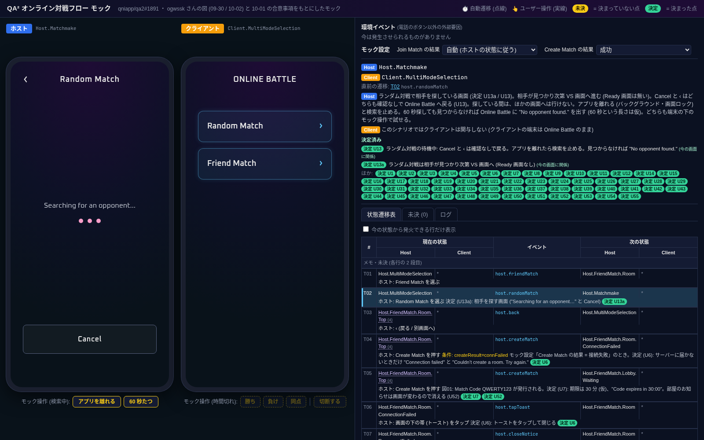

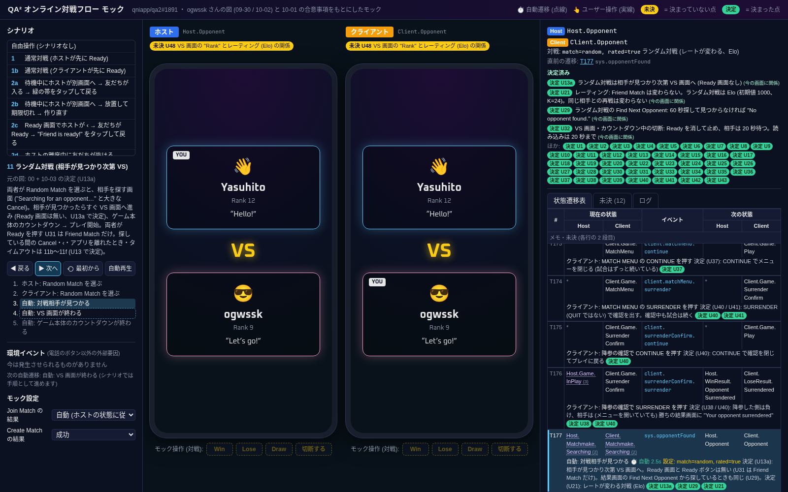

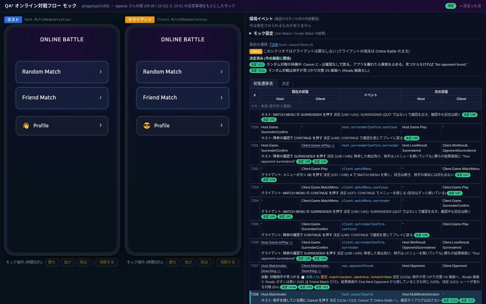

## ランダム対戦の待機中の操作 (2026-10-07 決定、U13)

高宮さんの決定 (2026-10-07、U13 の残り): 相手を探している間 ("Searching for an opponent…") の操作が決まりました。相手が見つかり次第 VS 画面へ進むこと (U13a) は変わりません。

| 場面 | 決定 | モックの状態 |
|---|---|---|
| Cancel を押す | 確認ダイアログを出さずに Online Battle へ戻る | `*.Matchmake` → `*.MultiModeSelection` |
| ‹ を押す | Cancel とまったく同じ (確認なしで Online Battle へ)。探している間は、ほかの画面へは行けない (出口は Cancel と ‹ だけ) | `*.Matchmake` → `*.MultiModeSelection` |
| アプリを離れる (バックグラウンドへ移る・画面ロック) | 検索を止める。戻ると通知を出す (文言・出す場所・ボタンは U43 で決定。「検索停止のお知らせ」を参照) | `*.Matchmake` → `*.Matchmake.Stopped` |
| 60 秒探しても相手が見つからない | 元の画面 (Online Battle) に戻り、"No opponent found." と Search again / Close | `*.Matchmake` → `*.Matchmake.NotFound` |

**60 秒という長さは仮です** (変わりうる)。そのため、60 秒は右パネルの説明・遷移表のメモ・この README にだけ書き、端末の画面には出しません (`tests/scan-screens.mjs` で確認)。

### Search again と Close

| ボタン | 動き | モックの状態 |
|---|---|---|
| Search again | もう一度相手を探す ("Searching for an opponent…" の画面に戻る)。相手も探していれば、すぐ VS 画面へ (U13a) | `*.Matchmake.NotFound` / `*.Matchmake.Stopped` → `*.Matchmake` |
| Close | 通知を閉じる。画面は元の Online Battle のまま (もう一度 Random Match / Friend Match を選べる) | `*.Matchmake.NotFound` / `*.Matchmake.Stopped` → `*.MultiModeSelection` |

- "No opponent found." は、確認ダイアログ (Cancel this match? など) と同じ見た目で、Online Battle の上に出します。Search again を主なボタン (青い枠) にしました。
- U13 の決定のときは "Search stopped because you left the app." の出す場所とボタンが決まっておらず、未決 U43 にしていました。
  U43 も 2026-10-07 に決まり、Online Battle の中のモーダルではない通知になりました (下の「検索停止のお知らせ」を参照)。

### モック操作 (端末の外)

アプリを離れることと 60 秒たつことは、電話の画面のボタンではないので、Win / Lose と同じく端末の下のモック操作にしました。
相手を探している間 (`*.Matchmake`) だけ、`モック操作 (検索中): [アプリを離れる] [60 秒たつ]` が出ます (ほかの画面ではふだんどおり Win / Lose)。

- **アプリを離れる**: アプリを離れて戻ってきたところを 1 回の操作で再現します (離れている間の画面はゲームの画面ではないので描きません)。
- **60 秒たつ**: 実際に 60 秒待たずに、タイムアウトしたところへ進めます。自由操作中に実時間で 60 秒待つ自動遷移にはしませんでした
  (モックの自動遷移は、どちらかの端末でイベントが起きるたびにタイマーをかけ直すので、もう一方の端末を操作すると 60 秒が最初からになってしまうため)。

### 状態・イベント

| 変更 | 状態 / イベント |
|---|---|
| 追加 | 状態 `Host.Matchmake.Stopped` / `Client.Matchmake.Stopped` (アプリを離れて検索が止まった。当時は Online Battle の上に "Search stopped because you left the app."、今は U43 の通知)、`Host.Matchmake.NotFound` / `Client.Matchmake.NotFound` (見つからなかった。Online Battle の上に "No opponent found.") |
| 追加 | イベント `*.leaveApp` (モック操作: アプリを離れて戻る)、`*.searchTimeout` (モック操作: 60 秒たっても見つからない)、`*.searchAgain` (Search again)、`*.closeNotice` (Close) (`*` は `host` / `client`) |
| 未決 → 決定 | `*.cancelSearch` と、相手を探している間の `*.back` の行から未決 U13 を外し、決定 U13 を付けた (動きは前と同じ: 確認なしで Online Battle へ) |

遷移表は 141 行から 153 行になりました (相手を探している間の Cancel と ‹ の 4 行を、端末ごとに 8 行ずつの 16 行に書き直した: Cancel、‹、アプリを離れる、60 秒たつ、通知 2 つ × Search again / Close)。
そのため、ランダム対戦より後ろの行 (対戦後) は T136〜T153 になりました。

シナリオ 11b に ‹ の手順を足し (「ランダム対戦 → Cancel / ‹ で Online Battle へ」、2 手順 → 4 手順。前の 2 手順は同じなので `#s=11b&step=1` / `step=2` はそのまま使えます)、11c〜11f を足しました。

- `index.html#s=11b&step=4` - もう一度探して ‹ を押し、Online Battle に戻った
- `index.html#s=11c&step=2` - ホストがアプリを離れて戻った: Online Battle の中に "Search stopped while the app was in the background." (U43)
- `index.html#s=11c&step=5` - Search again のあと、クライアントも探して VS 画面
- `index.html#s=11d&step=3` - クライアントが通知を Close して Online Battle
- `index.html#s=11e&step=2` - ホストが 60 秒たっても見つからない: "No opponent found."
- `index.html#s=11f&step=3` - Close して Online Battle

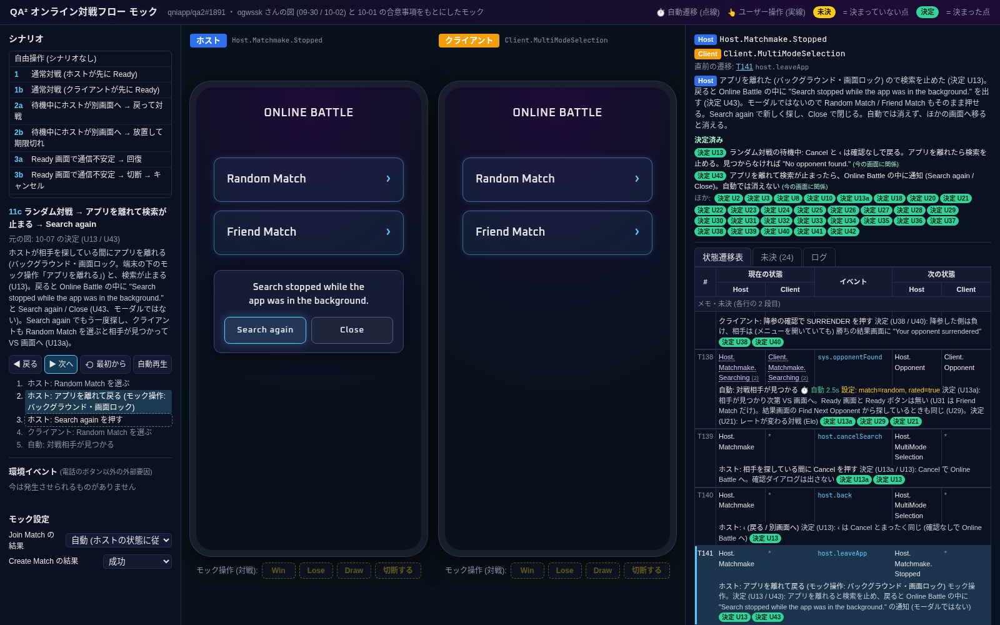

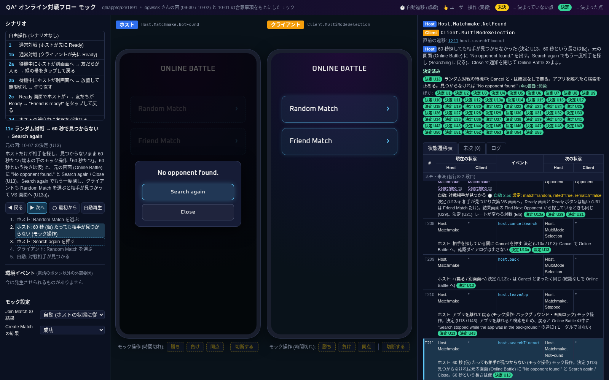

## 検索停止のお知らせ (2026-10-07 決定、U43)

高宮さんの決定 (2026-10-07): 相手を探している間にアプリを離れて (バックグラウンドへ移る・画面ロック) 検索が止まったとき、戻ったプレイヤーに出す通知が決まりました。

| 項目 | 決定 |
|---|---|
| 出す場所 | Online Battle の画面 (`Host.MultiModeSelection` / `Client.MultiModeSelection`) の **中** に、通知のボックスとして出す。**モーダルではなく**、操作をさまたげない |
| 文言 | "Search stopped while the app was in the background." (以前の "Search stopped because you left the app." から変更) |
| ボタン | Search again (新しく相手を探す) と Close |
| 消えるとき | **自動では消えない**。Close を押すか、ほかの画面へ移ると消える (Online Battle のほかの操作もそのまま使える) |

60 秒探しても見つからなかったときの "No opponent found." (U13) は、これまでどおり Online Battle の上のダイアログ (Search again / Close) です。

### モックでの見せ方

- 通知のボックスは、Random Match / Friend Match のメニュー (2026-10-08 から Profile も) の **下** に置きました。上に置くとメニューの位置がずれて、押そうとした場所が変わるためです。
  見た目は確認ダイアログと同じ紺の枠で、暗幕は重ねません。ボタンは横並びで、Search again を主なボタン (青い枠) にしました。
- 通知を出したまま、Random Match (新しく探す) と Friend Match (Friend Match トップへ) を押せます。行き先はどちらも、通知を出していない Online Battle から押したときと同じです。
- ほかの画面へ移ると通知は消え、‹ で Online Battle に戻っても出ません。通知を出している状態からの自動遷移は無く、相手の端末の操作や環境イベントでも消えません。

| 操作 | 動き | モックの状態 |
|---|---|---|
| Search again | 新しく相手を探す ("Searching for an opponent…") | `*.Matchmake.Stopped` → `*.Matchmake` |
| Close | 通知を閉じる。Online Battle のまま | `*.Matchmake.Stopped` → `*.MultiModeSelection` |
| Random Match (通知の上のメニュー) | 新しく相手を探す (Search again と同じ行き先)。通知は消える | `*.Matchmake.Stopped` → `*.Matchmake` |
| Friend Match (通知の上のメニュー) | Friend Match トップへ。通知は消える | `*.Matchmake.Stopped` → `*.FriendMatch.Room` |

### 状態・イベント

| 変更 | 状態 / イベント |
|---|---|
| 意味を変更 | `Host.Matchmake.Stopped` / `Client.Matchmake.Stopped` の画面: Online Battle の上のダイアログ → Online Battle の中の通知 (モーダルではない)。画面の仕様は `notice` ではなく `inlineNotice` |
| 追加 | 行 `*.Matchmake.Stopped` + `*.randomMatch` → `*.Matchmake`、`*.Matchmake.Stopped` + `*.friendMatch` → `*.FriendMatch.Room` (両端末で 4 行) |
| 未決 → 決定 | アプリを離れる行と、通知の Search again / Close の行から未決 U43 を外し、決定 U43 を付けた |

遷移表は 235 行から 239 行になりました (状態は 127 のまま)。新しい 4 行はランダム対戦の待機中の行の中に入るので、それより後ろの行 (次の相手を探す・対戦中・対戦後) の番号は 4 つずつずれました。
シナリオ 11c / 11d の説明を新しい文言にし、11g を足しました (ほかのシナリオの手順の数は変わらないので、既存の `#s=..&step=..` はそのまま使えます)。

- `index.html#s=11c&step=2` - ホストがアプリを離れて戻った: Online Battle の中に通知
- `index.html#s=11d&step=2` - クライアントがアプリを離れて戻った: Online Battle の中に通知
- `index.html#s=11g&step=3` - 通知を出したまま Friend Match を押した (Friend Match トップ)
- `index.html#s=11g&step=4` - ‹ で Online Battle に戻った (通知は出ない)


## 対戦後の結果画面 (2026-10-07 決定、U20〜U30)

高宮さんの決定 (2026-10-07、推奨案): 以前は図が無く仮のプレースホルダーだった対戦後の画面 (未決 U20〜U30) が、すべて決まりました。
このとき置いた仮定 (U44〜U50) も 2026-10-08 にすべて決まりました (下の表には → で今の動きを書き足しています。「2026-10-08 の決定 (U44〜U55)」も参照)。

| ID | 決定 |
|---|---|
| U20 | 結果画面に Win / Lose / Draw / No contest、両者の名前、スコア、終わった理由を出す。スコアが決まっていなければ行ごと出さない ("----" は出さない) |
| U21 | Friend Match は "No rating change (friend match)"。ランダム対戦は Elo (初期値 1000、K=24) で、例えば "1000 → 1012 (+12)"。ランダム対戦で同じ相手と続けて再戦したときは変わらない |
| U22 | Friend Match: Rematch / Back to Friend Match。ランダム対戦: Find Next Opponent / Rematch / Back to Online |
| U23 | どちらからでも再戦を申し込める。相手が応じたらそのまま VS 画面へ。同時に申し込んだら成立 |
| U24 | Friend Match は Friend Match トップ (Match Code を作る・入れる画面) へ戻り、前の Match Code は使えなくなる。ランダム対戦は Online Battle へ。降参した側は Online Battle へ (U41 で決定済み) |
| U25 | 相手が抜けたら結果画面はそのままで "Your opponent left. Rematch is not available."。勝敗とレートは変わらない |
| U26 | 自動では次へ進まない |
| U27 | スタンプ 3 種類: 👏 "Good game" / 🤝 "Thanks for the match" / 👍 "Nice"。1 つ 3 秒表示、送る間隔は 5 秒、ミュートできる |
| U28 | 片方が切断したら 20 秒待ち、戻らなければ切断した側の負け。両者の切断・サービス障害は "No contest due to a connection error" でレートは変わらない。降参した側は再戦を申し込めない |
| U29 | 次の相手は 60 秒探す。見つからなければ "No opponent found." と Search again / Back to Online |
| U30 | 再戦の申し込みの応答期限は 20 秒。申し込んだ側に Cancel Request。取り消されたら相手に "Rematch request cancelled" (2026-10-08 に取り消した側と同じ文言に統一)、断られたら申し込んだ側に "Your opponent declined the rematch"、期限切れなら "No response to rematch request"。どの場合も両者とも結果画面に残り、3 秒後にまた申し込める |

**秒数 (20 秒・3 秒・5 秒・60 秒) と Elo の値 (初期値 1000、K=24) は QA² 側の仮の値です** (変わりうる)。
そのため、秒数と「仮の値」であることは右パネルの説明・遷移表のメモ・この README にだけ書き、電話の画面には出しません (`tests/scan-screens.mjs` で確認)。
Elo の結果 (例: "1000 → 1012 (+12)") は決定どおり電話の画面に出します。

### 結果画面

上から順に次のものを出します。ゲームの UI キット ("RESULT" の見出しと大きな "WIN!" / "LOSE") にならった、これまでの結果画面を作り直しました。

| 部分 | 内容 |
|---|---|
| 見出し | "WIN!" (青) / "LOSE" (赤) / "DRAW" (黄) / "NO CONTEST" (灰、小さめ) |
| 終わった理由 | ~~"Match finished"~~ → 時間切れの勝ち負けは "Time is up"、同点の引き分けは "Same score when time ran out" (2026-10-08、U44) / "You surrendered" / "Your opponent surrendered" / "You were disconnected" / "Your opponent disconnected" / "No contest due to a connection error" |
| 両者の名前 | 左に自分 (`YOU` 付き)、右に相手。送ったスタンプはその人の名前の上に吹き出しで出る |
| スコア | "3,200 – 2,750" (自分 - 相手、モックのデモ値)。No contest は決まっていないので行ごと出さない |
| レーティング | Friend Match は "No rating change (friend match)"。ランダム対戦は "Rating 1000 → 1012 (+12)" (負けは "1000 → 988 (-12)"、引き分けは "1000 → 1000 (±0)")、再戦は "No rating change (rematch)"、No contest は "No rating change (no contest)" |
| 再戦の一行 | 下の「再戦」を参照 |
| スタンプ | 👏 🤝 👍 と、相手のスタンプのミュート (🔔 / ミュート中は 🔕) → 2026-10-08: その下の "🔔 Mute opponent emotes" / "🔕 Unmute opponent emotes" (U49) |
| ボタン | 下の表 |

モックでは両者とも初期値の 1000 から Elo を計算します (同じレート同士なので、勝ちは +12、負けは -12、引き分けは ±0)。

| 結果画面 | Friend Match | ランダム対戦 |
|---|---|---|
| ふつう (勝ち・負け・引き分け) | **Rematch** / Back to Friend Match | **Find Next Opponent** / Rematch / Back to Online |
| 自分が申し込んだ | Cancel Request / Back to Friend Match | Find Next Opponent / Cancel Request / Back to Online |
| 相手から申し込まれた | **Rematch** \| Decline / Back to Friend Match | Find Next Opponent / **Rematch** \| Decline / Back to Online |
| 取り消し・辞退・期限切れのあと 3 秒 | Rematch (無効表示) / Back to Friend Match | Find Next Opponent / Rematch (無効表示) / Back to Online |
| その 3 秒のあと (一行は残る、2026-10-08、U50) | **Rematch** / Back to Friend Match | **Find Next Opponent** / Rematch / Back to Online |
| 相手が抜けた | **Back to Friend Match** | **Find Next Opponent** / Back to Online |
| 降参した側 | **Back to Online** | **Back to Online** |
| 相手が降参した・切断の勝ち負け・No contest | **Back to Friend Match** | **Find Next Opponent** / Back to Online |

太字は主なボタン (青い枠)、`|` は横に並べた 2 つです。Online Battle に戻るボタンは、降参後のもの (以前の "Back to Online Battle") も含めて "Back to Online" にそろえました。

### 再戦 (U23 / U30)

| 段階 | 申し込んだ側 | 申し込まれた側 |
|---|---|---|
| Rematch を押した | "Waiting for your opponent…"、Cancel Request | "Your opponent wants a rematch"、Rematch / Decline |
| 申し込まれた側が Rematch (応じる) / 両者が同時に Rematch | VS 画面 → ゲーム本体のカウントダウン → プレイ (ロビーの Ready は挟まない) | 同じ |
| Cancel Request (取り消す) | ~~(何も出さない)~~ → "Rematch request cancelled" (2026-10-08、U50)、3 秒は Rematch を押せない | ~~("was" の付いた文言)~~ → "Rematch request cancelled" (2026-10-08 に統一)、3 秒は押せない |
| Decline (断る) | "Your opponent declined the rematch"、3 秒は押せない | ~~(何も出さない)~~ → "Rematch declined" (2026-10-08、U50)、3 秒は押せない |
| 20 秒応答がない | "No response to rematch request"、3 秒は押せない | ~~申し込みの表示が消える~~ → "Rematch request expired" (2026-10-08、U50)、3 秒は押せない |
| 3 秒たつ | どちらからでもまた申し込める (~~メッセージは消える~~ → 一行は次の操作まで残る、2026-10-08、U50) | 同じ |
| 相手が結果画面を抜けた | "Your opponent left. Rematch is not available." (Rematch のボタンは消える) | - |

- 以前の仮の流れで使っていた "Waiting for your friend…" / "Your friend wants a rematch" は、ランダム対戦でも使うので "Waiting for your opponent…" / "Your opponent wants a rematch" にしました (決定の文言 "Your opponent declined the rematch" などにそろえた)。
- 「申し込まれた側」が応じるボタンは、申し込むボタンと同じ Rematch です (両者が Rematch を押したら成立、という U23 の決定と同じ形)。
- 両者が同時に押すことは 1 台ずつの操作では起こせないので、右パネルの環境イベント「両者が同時に Rematch を押す」にしました。
- ランダム対戦の再戦の試合はレートが変わりません (再戦を続けても同じ)。Find Next Opponent で次に見つかった相手との試合は、またレートが変わります。

### スタンプ (U27)

- 3 つのボタン (👏 / 🤝 / 👍) で送ると、両者の画面で送った人の名前の上に吹き出し ("👏 Good game" など) が出ます。
- 送ってから 5 秒は、送った人のスタンプのボタンが無効表示になります。吹き出しは 3 秒で消えます (相手のボタンは押せるので、両者の吹き出しが同時に出ることもある)。
- 🔔 を押すとミュートになり (🔕)、相手のスタンプが自分の画面に出なくなります。自分が送ったスタンプは自分の画面には出ます。相手にはミュートしたことは伝えません。
  2026-10-08 に U49 で決まり、ボタンはスタンプの下の "Mute opponent emotes" / "Unmute opponent emotes" になりました。ミュートは同じ相手と続けて対戦している間 (再戦を含む) だけ続きます。
- 相手が抜けた結果画面、切断で決まった結果画面、No contest ではスタンプを送れません (相手に届かないため)。降参の結果画面では送れます。

### 対戦中の切断 (U28)

| 場面 | 切断した側 | 相手 |
|---|---|---|
| 対戦中に片方の接続が切れる | ゲーム画面の上に "Connection lost" / "Reconnecting…" (→ 2026-10-08: と "20s"、U46) | ゲーム画面の上に "Your opponent disconnected" / "Waiting for your opponent to reconnect…" (→ 2026-10-08: と "20s"、U46) |
| 20 秒のうちに通信が回復する | プレイに戻る (止めていたところから、U46) | プレイに戻る |
| 20 秒たっても戻らない | "LOSE" / "You were disconnected" (ランダム対戦ではレートも変わる) | "WIN!" / "Your opponent disconnected" |
| 両者の接続が切れる / サービス障害 | "NO CONTEST" / "No contest due to a connection error"、レートは変わらない | 同じ |

待っている間の画面 (パネルの文言・試合が止まるか・待ち時間を出すか) は決定に無いので、MATCH MENU と同じパネルを使った仮の表示にし、未決 U46 にしました。モックでは待っている間は Win / Lose / Draw を押せません。
→ 2026-10-08 に U46 で決まりました: サーバーが両者のゲームと得点を 20 秒止め、両者の画面に残りの秒数を出します。モックでは同じパネルに "20s" を出し、暗幕を実機のポーズと同じ濃さにして止まっていることを示します (MATCH MENU では試合は止まらないので薄いまま)。

### 次の相手を探す (U29)

Find Next Opponent を押すと、Random Match から探すときと同じ "Searching for an opponent…" と Cancel の画面になります (Cancel と ‹ は確認なしで Online Battle へ、U13 と同じ)。
もう一方の端末が Random Match か Find Next Opponent で探していれば、相手が見つかって VS 画面へ進みます。
60 秒探しても見つからなければ、Random Match の画面の上に "No opponent found." と Search again / Back to Online を出します (Random Match から探したときは Online Battle の上に出すので Close)。

### モック操作 (端末の外)

電話の画面のボタンではないものは、端末の下のモック操作か、右パネルの「環境イベント」で起こします。

| 場所 | 操作 | 出る場面 |
|---|---|---|
| 端末の下 `モック操作 (対戦)` → 2026-10-08 から `モック操作 (時間切れ)` | Win / Lose / Draw (押した側が勝ち / 負け / 引き分け) → 時間切れの勝ち / 負け / 同点 (U44)、切断する (この端末の接続が切れる) | 対戦中 |
| 端末の下 `モック操作 (切断中)` (2026-10-08 から) | 再接続する (相手側は「相手が戻る」)、20 秒たつ (右パネルの環境イベントと同じ) | 切断を待っている間 (U46 / U54) |
| 端末の下 `モック操作 (スタンプ)` | 3 秒たつ (送ったスタンプが消える)、5 秒たつ (また送れる) | 結果画面 |
| 端末の下 `モック操作 (検索中)` | アプリを離れる、60 秒たつ | 相手を探している間 (Find Next Opponent から探しているときの「アプリを離れる」も 2026-10-08 から押せる、U47) |
| 右パネルの環境イベント | 両者の接続が切れる、サービス障害が起きる、通信が回復する、切断から 20 秒たつ | 対戦中・切断を待っている間 |
| 右パネルの環境イベント | 両者が同時に Rematch を押す、再戦の申し込みから 20 秒たつ、3 秒たつ | 結果画面 |

どのタイマーも、U13 の「60 秒たつ」と同じ理由で自由操作中の自動遷移にはしていません (モックの自動遷移は、どちらかの端末でイベントが起きるたびにタイマーをかけ直すため)。

### 状態・イベント・遷移表

結果画面は `役割.勝敗Result.段階` です (例: `Host.WinResult.RematchIncoming`)。Friend Match かランダム対戦か、レートが変わる対戦かは状態名に入れず、
両端末で共通の **セッション** (`match` = `friend` / `random`、`rated` = `true` / `false`) に持たせました。
状態名に入れると、VS 画面・ゲーム画面・MATCH MENU まで Friend Match 用とランダム対戦用に分ける必要があり、遷移表がほぼ 2 倍になるためです。
セッションは VS 画面へ進む行 (`sys.bothStarted` / `sys.opponentFound` / 再戦の成立) が `set` で書き、結果画面の行は `when: { match: 'friend' }` などで分けます。右パネルの「対戦:」の行に今のセッションを出します。

スタンプとミュートは再戦の段階と独立しているので、状態名には入れず、確認ダイアログ (`hostDialog`) と同じ **端末ごとの付属状態** (`hostStamp` / `hostMute` など) にしました。
端末の上の状態名の後ろに `+ 💬 gg` (送ったスタンプ)、`+ 💬 sent` (消えたが次を送れるまでの待ち)、`+ 🔕` (ミュート) と出ます。
付属状態は `js/transitions.js` の `DEVICE_FIELDS` で決まり、その状態で続かない画面へ移ると初期値に戻ります (スタンプは結果画面を出ると、ミュートは同じ相手と対戦している間 (VS 画面・ゲーム画面・結果画面) を出ると戻る)。

| 変更 | 状態 / イベント |
|---|---|
| 改名 | `*.WinResult.RematchWaiting` / `*.LoseResult.RematchWaiting` (自分が申し込んだ) → `*.RematchRequested`、以前の `*.RematchRequested` (相手から申し込まれた) → `*.RematchIncoming` |
| 追加 | 状態 `*.DrawResult*`、再戦の段階 `.RematchCancelled` / `.RematchDeclined` / `.RematchExpired` / `.RematchCooldown` / `.OpponentLeft` (勝ち・負け・引き分けそれぞれ)、`*.LoseResult.Disconnected` / `*.WinResult.OpponentDisconnected` / `*.NoContestResult`、`*.Game.Disconnected` / `*.Game.OpponentDisconnected` (切断を待つ)、`*.Matchmake.NextOpponent` / `*.Matchmake.NextOpponent.NotFound` (次の相手を探す) |
| 追加 | イベント `*.draw` / `*.disconnect` (モック操作)、`*.cancelRematch` / `*.declineRematch`、`*.findNextOpponent`、`*.stamp.gg` / `*.stamp.thanks` / `*.stamp.nice`、`*.stampShown` / `*.stampInterval` (モック操作)、`*.muteStamps` / `*.unmuteStamps`、環境 `net.bothDisconnected` / `net.serviceFailure` / `timer.disconnectTimeout` / `timer.rematchTimeout` / `timer.rematchCooldown` / `sys.rematchSimultaneous` |
| 変更 | `*.backToOnlineBattle` のボタンの文言を "Back to Online" に。ランダム対戦の結果画面と次の相手が見つからないときにも使う。`net.recovered` を切断を待つ間にも使う |
| 追加 | 行の `set` (セッションと付属状態を書き換える) と、`from` の付属状態の条件 (例: `hostStamp: null`)。遷移表のメモに「条件:」「設定:」として出す |

遷移表は 153 行から 235 行になりました (対戦後の 18 行を書き直して 100 行に)。状態は 77 から 127、グループは 14 から 34 です。
下の行番号は、そのあと U43 (検索停止のお知らせ) でランダム対戦の待機中に 4 行、Ready の決定 (U31 の変更・U32〜U36) で Ready 画面と開始前の切断に 19 行足したあとの、今の番号です (U20〜U30 の決定のときより 23 後ろ)。

| 行 | 内容 |
|---|---|
| T159〜T168 | 次の相手を探す (Cancel・‹・60 秒たつ・Search again・Back to Online) |
| T169〜T174 | 決着 (Win / Lose / Draw のモック操作) |
| T175〜T182 | 対戦中の切断・回復・20 秒たつ・両者の切断・サービス障害 |
| T183〜T218 | 再戦 (申し込む・応じる・取り消す・断る・期限切れ・同時・3 秒たつ。勝ち / 負け / 引き分けそれぞれ) |
| T219〜T244 | 結果画面から抜ける (Back to Friend Match / Find Next Opponent / Back to Online。相手には "Your opponent left…") |
| T245〜T258 | スタンプ (送る・3 秒たつ・5 秒たつ・ミュート) |

### 決定に書かれていないので置いた仮定 (新しい未決)

2026-10-08 に、下の未決 7 件 (U44〜U50) はすべて決まりました (右端の列)。

| 仮定 (モックの動き) | 未決 → 2026-10-08 の決定 |
|---|---|
| ゲームの決着のときの終わった理由は "Match finished"。引き分けは端末の下の Draw で起こす | U44 → 時間切れで得点の高いほうが勝ち ("Time is up")、同点は引き分け ("Same score when time ran out") |
| 降参で勝った側からも再戦を申し込めない。切断で決まった試合と No contest のあとも再戦は無い。そのため、これらの結果画面では相手が抜けても "Your opponent left…" を出さない | U45 → このまま |
| 切断を待つ間は、ゲーム画面の上にパネルを出し、Win / Lose / Draw を押せない。20 秒のうちに戻れば試合を続ける | U46 → 両者のゲームと得点を 20 秒止め、両者に残りの秒数 |
| Find Next Opponent から探している間にアプリを離れたときの行は無い | U47 → U43 と同じ (Online Battle の中に "Search stopped…") |
| VS 画面の "Rank 12" / "Rank 9" はそのまま (レーティングとは別のものとして扱う) | U48 → Rank をやめて "Rating {n}" (Friend Match でも) |
| ミュートは同じ相手と対戦している間 (再戦を含む) だけ続く。送ったスタンプは本人の画面にも出し、ミュートしたことは相手に伝えない | U49 → このまま。ボタンは "Mute opponent emotes" / "Unmute opponent emotes" |
| 取り消した側・断った側・申し込まれたまま期限が切れた側には何も出さない。メッセージは 3 秒たつと消える | U50 → もう一方にも一行を出し、次の操作まで残す |
| スコアはデモ値 (勝ち 3,200 / 負け 2,750 / 引き分け 2,900)。決まっていないのは No contest だけとした | (U20 の範囲) |
| Online Battle に戻るボタンは、降参後も含めて "Back to Online" にそろえた | (U22 の範囲) |
| Friend Match トップに戻ると Match Code の入力欄は空。前の Match Code (QWERTY123) で Join Match すると "Match not found." | (U24 の範囲) |

### シナリオ

| ID | 手順 | 見られる画面 |
|---|---|---|
| 15 | 16 | 14: ホスト WIN! / クライアント LOSE (Friend Match) → 15: ホストが Back to Friend Match、クライアントに "Your opponent left…" → 16: 両者 Friend Match トップ |
| 15b | 15 | 14: ホスト LOSE / クライアント WIN! → 15: クライアントが先に抜け、ホストに "Your opponent left…" |
| 15c | 19 | 15: クライアントが申し込んだ ("Waiting for your opponent…" / "Your opponent wants a rematch") → 16: ホストが応じて VS 画面 → 19: 再戦の結果 |
| 15d | 19 | 15: ホストが申し込む → 16: Cancel Request (両者に "Rematch request cancelled"、U30 / U50。2026-10-08 に統一) → 17: 3 秒たつ (一行は残る) → 19: クライアントが申し込み、ホストが応じて VS 画面 |
| 15e | 18 | 16: ホストが Decline (クライアントに "Your opponent declined the rematch") → 18: クライアントが抜け、ホストに "Your opponent left…" |
| 15f | 19 | 16: 20 秒たつ (ホストに "No response to rematch request") → 17: 3 秒たつ → 19: 申し込み直して VS 画面 |
| 15g | 17 | 14: 両者 DRAW → 15: 両者が同時に Rematch で VS 画面 |
| 15h | 21 | 15〜16: 両者がスタンプを送る → 17: ホストのスタンプが消える → 18: クライアントがミュート → 20: ホストの 👍 はクライアントに出ない → 21: ミュートを解くと出る |
| 16d | 10 | 8: ランダム対戦で降参 (降参した側 1000 → 988 (-12)、Back to Online だけ) → 9: ホストは次の相手を探す → 10: クライアントは Online Battle |
| 17 | 15 | 6: ランダム対戦の結果 (1000 → 1012 (+12) / 1000 → 988 (-12)) → 8: 再戦の VS 画面 → 11: 再戦の結果 ("No rating change (rematch)") → 12: ホストが Find Next Opponent、クライアントに "Your opponent left…" → 15: 新しい相手と VS 画面 |
| 17b | 11 | 7: ホストが次の相手を探す → 8: "No opponent found." (Search again / Back to Online) → 11: Online Battle |
| 18 | 16 | 14: クライアントの切断 (ホストは "Your opponent disconnected"、クライアントは "Reconnecting…") → 15: 20 秒たつ (ホスト WIN! / クライアント LOSE) |
| 18b | 16 | 14: ホストの切断 → 15: 通信が回復してプレイに戻る → 16: ホストの勝ち |
| 18c | 15 | 15: 両者の切断で NO CONTEST |
| 18d | 8 | 6: ランダム対戦でサービス障害 → NO CONTEST ("No rating change (no contest)") |
| 18e | 7 | 7: ランダム対戦の切断負け (1000 → 988 (-12) / 1000 → 1012 (+12)) |

15〜15h と 18〜18c は、2026-10-07 の Ready の決定で手順が 2 つ増え (両者の "Confirming…")、同じ日の U4 の決定で 1 つ減りました (参加のあとの自動遷移が 1 つに)。上の手順の番号は今のものです (例: `#s=15&step=14`、`#s=15c&step=15`)。


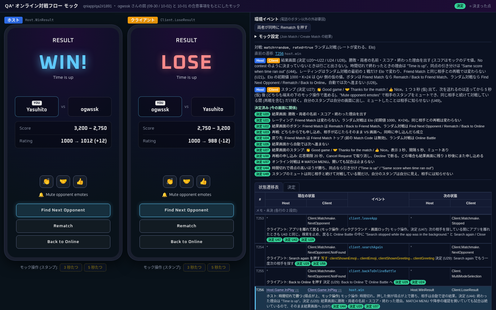

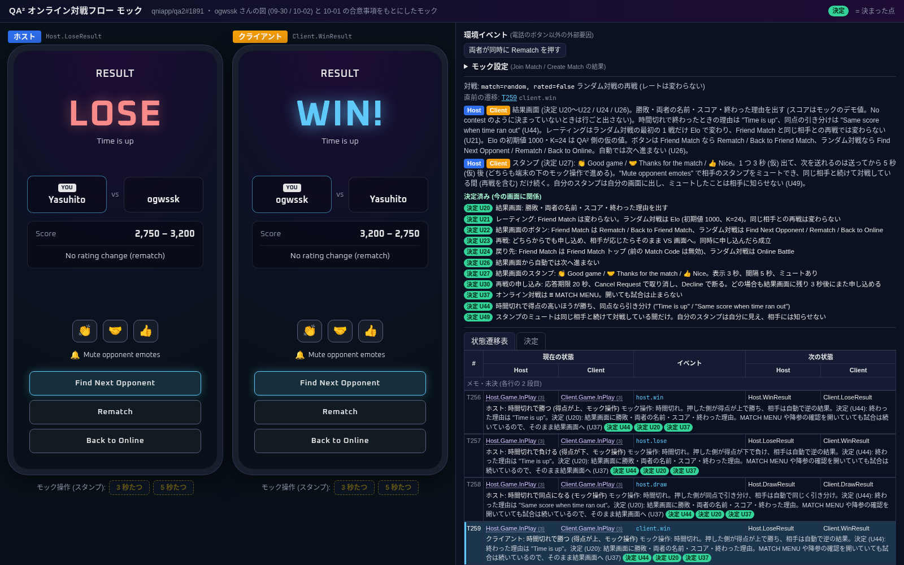


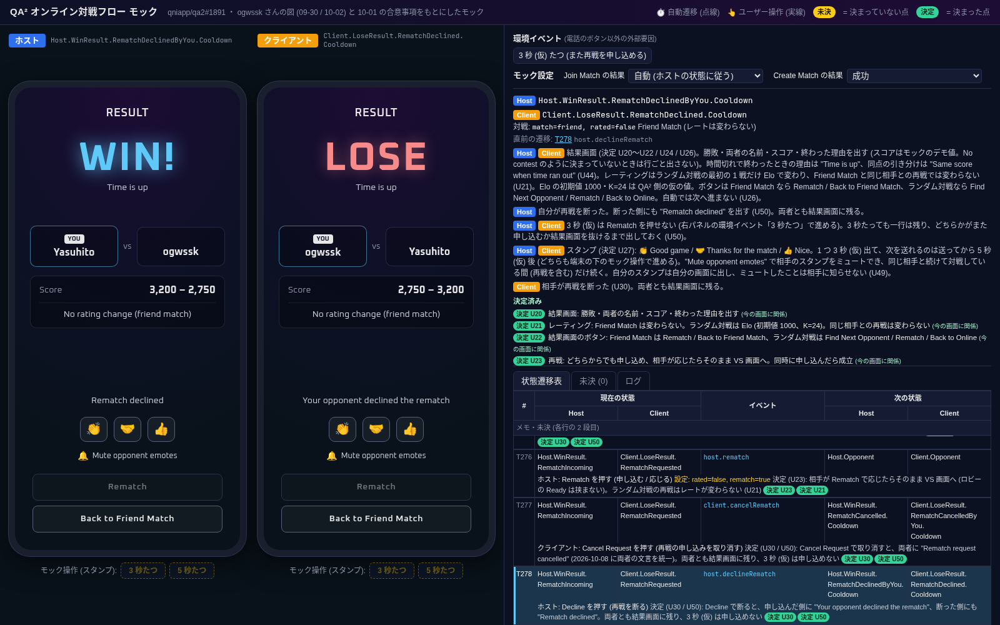

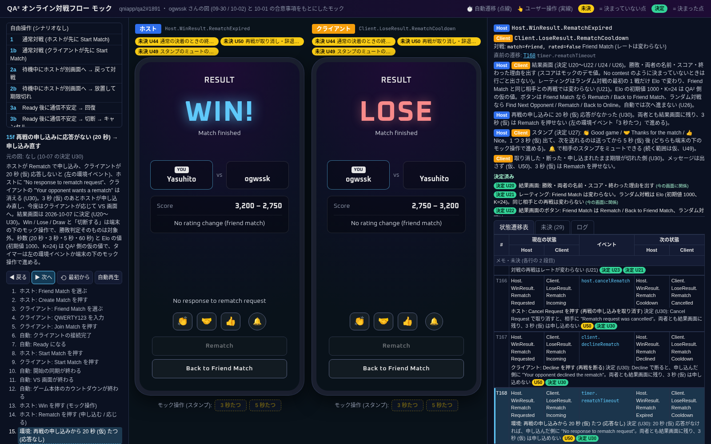

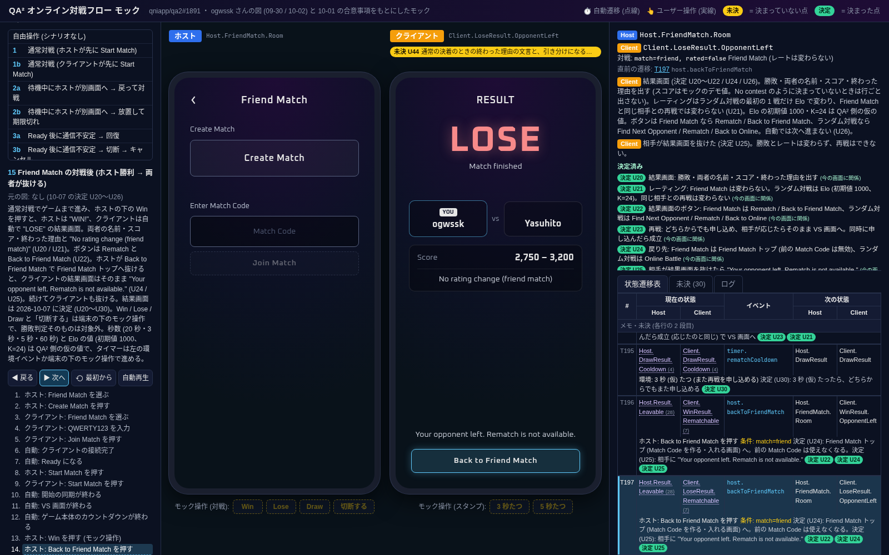

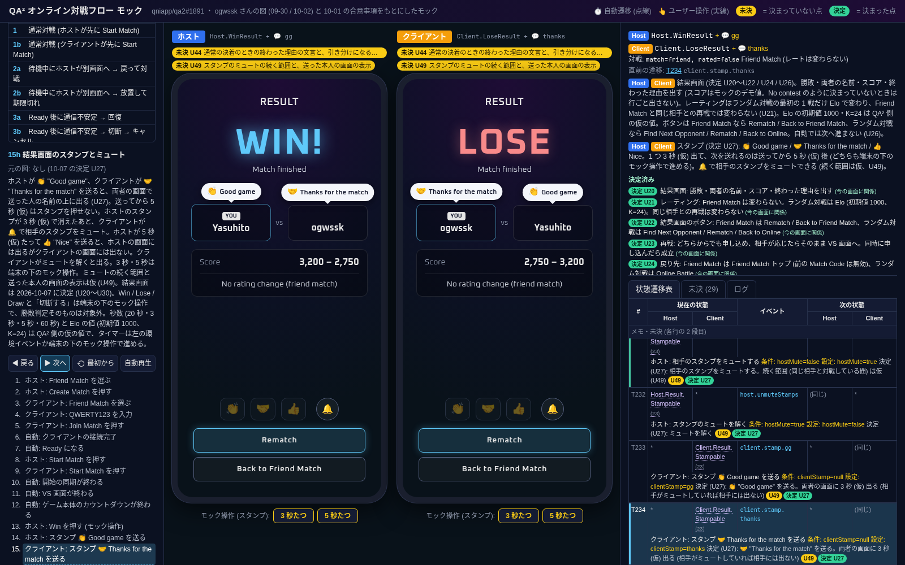


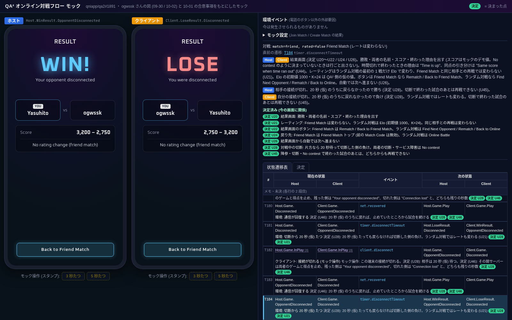

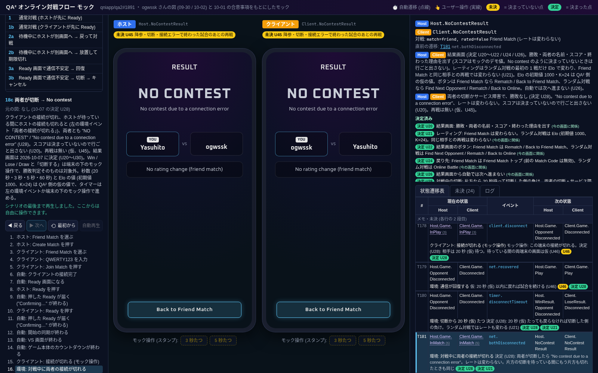

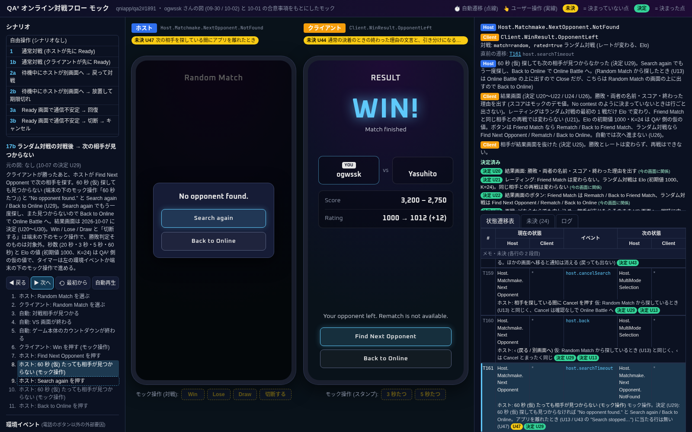

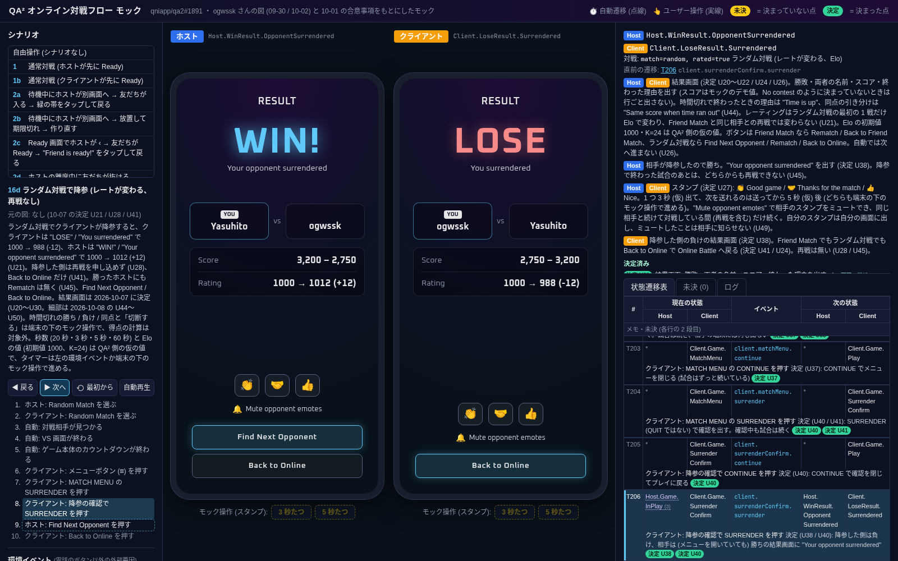

## 合意事項の反映 (10-01 の yasuhito のコメントで合意)

1. 用語は **Match Code** に統一 (図の Friend Match トップの "Enter Match ID" は "Enter Match Code" にした)
2. トーストは sentence case: "Waiting for your friend…" / "Friend joined!" / "Ready to start" / "Match code expired" / "Connection failed" / "Connection lost"
   → 変更 (2026-10-07): "Ready to start" は "Friend is ready!" (U1)、"Match code expired" は "Match code expired." (U7)、"Connection failed" は 2 行目に説明 (U6)、"Connection lost" のトーストは無くなり部屋の画面に "Connection lost. Reconnecting…" (U5)。"Reconnecting…" / "Your friend left." の帯を足した (U19 / U17)
3. ボタンは何が起きるかを書く: "Create a new match?" / "Join another match?" は **Keep Current Match**、"Cancel this match?" は **Keep Waiting** / **Cancel Match**
   → 変更 (2026-10-07): Cancel Match は **Close Room** (確認は "Close this room?"、U14)、クライアントは **Leave Room** (確認は "Leave this room?"、U9)。残るボタンはどちらも **Keep Waiting** (U11)
4. フレンド待機の文言は **"Waiting for your friend…"** (三点リーダー 1 文字)
5. マッチ成立時に **VS 画面** (両者の名前・ランク・あいさつ + 絵文字、約 2.5 秒) → ~~**3 · 2 · 1**~~ → ゲーム開始 (プレースホルダー)。
   VS 画面のプレイヤー情報はモック用の架空データです。
   → 変更 (2026-10-03、U2 で決定): VS 画面のあとのモック独自の 3·2·1 はやめ、ゲーム画面でゲーム本体のカウントダウン (3 → 2 → 1) を使います。

## 表記の修正 (図との差分)

| 図の表記 | モックの表記 | 理由 |
|---|---|---|
| Enter Match ID | Enter Match Code | 合意 1 (用語の統一) |
| ONLINE BATTE | ONLINE BATTLE | 誤字 |
| Match not found. check the Match Code and try again | Match not found. Check the Match Code and try again. | 文頭の大文字・句点 |
| Connection was lost. | Connection lost. Reconnecting… | 合意 2 のトースト文言に合わせた。2026-10-07 に U5 の決定の文言 |
| Connecting... / Connectinng... | Connecting… | 誤字・三点リーダー。2026-10-07 から同期の前のクライアントの文言 (U4) |
| "Cancel this match?" の Go Back | Keep Waiting | 合意 3 (10-02 の図は Go Back のまま。未決ではなく表記差分) |
| Starting match.... (点 4 つ) | Starting match… | 三点リーダーに統一 |
| Connection Failed (09-30 のトースト) | Connection failed | 合意 2 (sentence case) |
| Waiting for opponent... (09-30 の旧案のピンクのトーストと待機画面) | "Searching for an opponent…" (待機画面の文言、トーストは無し) | U13a の決定 (相手を探す画面に Searching と Cancel を出す)。三点リーダー |
| 図01 などの開始ボタン | Ready | U31 の変更 (2026-10-07)。画面・イベント名・状態名もそろえた |
| 図01 で先に開始ボタンを押した側の "Starting match…" | "Waiting for opponent…" と 60 秒のカウントダウン (相手側には "Opponent is ready. Are you?") | U36 の決定。"Starting match…" は両者の Ready がそろったあとの読み込みに残した (2026-10-03 の U31 のときは "Waiting for your friend…" / "Friend is ready!" にしていた) |
| 図04 の "Host User / cancelled the match." | Friend Match トップに "Room closed. The host left." | U34 の決定 |
| 図05 の "Client User / left the match." → 自動で "Waiting for your friend…" | "Your friend left. Waiting for another friend…" (自動では進まない) | U34 の決定 |
| 図06 の "Unable to start the match. Please try again." と開始ボタン | 読み込みが 20 秒で終わらなければ "Match could not start. Please try again."、同期に失敗したら "Couldn’t start the match. Please ready up again." で Ready 画面に戻る | U32 / U15 の決定 |
| 図02 の赤いトースト "Ready to start" | 赤い帯 "Friend is ready!" (友だちが Ready を押したとき) | U1 の決定 |
| Cancel Match (ホスト) / Leave Match (クライアント) | Close Room / Leave Room | U14 / U9 の決定 |
| "Cancel this match?" / "Leave this match?" と "Go Back" | "Close this room?" (題名は 2026-10-08 に U51 で決定) / "Leave this room?" と Keep Waiting | U9 / U11 / U14 / U51 の決定 |
| クライアントの "Match expired." / トーストの "Match code expired" | "Match code expired." | U7 の決定 |
| 決定の文言の "..." ("Waiting for opponent..." など) | "…" (三点リーダー 1 文字) | 合意 4 の表記にそろえた ("Waiting for opponent…" / "Waiting for them to reconnect…" / "Confirming…" / "Your friend left. Waiting for another friend…") |

"Leave this match?" の "Go Back" は合意の対象外だったので未決 U11 にしていましたが、2026-10-07 に "Keep Waiting" に決まりました (確認は "Leave this room?" にまとめた)。

## 未決一覧

2026-10-08 の時点で未決は 0 件です。決まった項目は ID を変えずに下の「決定済み」に移し、右パネルの「決定済み」と「決定」タブに緑の `決定` で表示します (端末の上や画面の中には出しません)。
以前あった未決トグル (選択肢の切り替え) と未決タブは、未決が 0 件になったので 2026-10-08 に消し、タブの名前を「決定」にしました。

### 決定済み

- **U58 Match Code の期限を出さず、ホストにだけ "Share this code with your friend!"** - 決定 (YoshiyukiN さんの FB、#1891 の 3 番目、2026-10-10)  
  - 部屋の画面の Match Code の下の期限の表示をやめる (固い表現のため)。期限そのもの (30 分 (仮)、U7) は変えない。
  - 代わりにホストにだけ "Share this code with your friend!" を出す。クライアントには出さない。
  詳しくは「2026-10-10 の決定 (U58: Match Code の期限を出さず、ホストに一行)」を見てください。
- **U57 部屋の出口は左上の ‹ だけ** - 決定 (YoshiyukiN さんの FB、#1891 の 1・2 番目、2026-10-09)  
  - 部屋の画面の Close Room (ホスト) と Leave Room (クライアント) のボタンを無くし、左上の ‹ に統一する。ホストの ‹ は部屋を閉じ、クライアントの ‹ は部屋を抜ける。
  - ‹ でも確認を出す: ホストは "Close this room?" ([Close Room] / [Keep Waiting])、クライアントは "Leave this room?" ([Leave Room] / [Keep Waiting])。本文は U34。Keep Waiting で部屋に残る。
  - 部屋を残したまま別の画面へは移れない (U14 の離席と帯、U12 の確認は無くなった)。
  詳しくは「2026-10-09 の決定 (U57: 部屋の出口は ‹ だけ)」を見てください。
- **U56 Profile (絵文字とあいさつ)** - 決定 (高宮さん 2026-10-08)  
  - Online Battle の Profile で、相手に見せる絵文字 (10 個) とあいさつ (10 個) を 1 つずつ選ぶ。既定値は 👋 "Hello!"。名前は変えられない。
  - 開けるのは対戦の外だけ。値は部屋を作る・入る・探し始めるときに固定し、次の部屋・次の検索から相手に見える。保存はブラウザ (localStorage) だけ。
  - あいさつのアポストロフィはどれも `’`。10-08 に候補を 4 つ同じ位置で入れ替えた (うち 2 つは協力しているように聞こえたため)。
  - 相手 (ogwssk) も Profile を変えられ、最初の値は 😎 "Let’s go!"。
  - 次の 5 点も決定 (高宮さん 2026-10-08): (a) ‹ は Cancel と同じで確認なし。(b) Online Battle の中の "Search stopped…" などの通知の間も開ける (開くと消える、U43)。"No opponent found." の間は開けない。
    (c) localStorage は自由操作のときだけ読み書きし、シナリオはいつも最初の値から始まって読みも書きもしない。(d) 同じ相手との再戦では固定し直さず、ホストの "Join another match" はモックでは固定するときに含めない。(e) Online Battle の Profile のボタンに保存した絵文字を添える。
  詳しくは「Profile (絵文字とあいさつ)」を見てください。
- **再戦取り消し文言の統一と仮定の確定** - 決定 (高宮さん 2026-10-08)  
  - 再戦の申し込みを取り消したら、両者とも "Rematch request cancelled" (U30 の申し込まれた側の文言を U50 にそろえた)。
  - 試合が終わるのは時間切れだけ (U44 のまま)。
  - 「2026-10-08 の決定 (U44〜U55)」で置いた仮定は、すべてそのまま確定。
  詳しくは「2026-10-08 の決定 (再戦取り消し文言の統一と仮定の確定)」を見てください。
- **U44〜U55 と pi の仮定 5 点** - 決定 (高宮さん 2026-10-08)  
  - **U44** 時間切れで得点の高いほうが勝ち、同点なら引き分け (DRAW)。終わった理由は "Time is up"、同点は "Same score when time ran out"。
  - **U45** 降参・切断の結果と NO CONTEST のあとは、どちらの側にも Rematch を出さない (今のモックのまま)。
  - **U46** 対戦中に片方が切断したら、サーバーが両者のゲームと得点を 20 秒止める。両者の画面に残りの秒数。残った側 "Your opponent disconnected" / "Waiting for your opponent to reconnect…"、切断した側 "Connection lost" / "Reconnecting…"。MATCH MENU では試合は止まらない。
  - **U47** 次の相手を探している間にアプリを離れたときも U43 と同じ: Online Battle の中に "Search stopped while the app was in the background." と Search again / Close。
  - **U48** VS 画面は架空の Rank をやめて "Rating {n}"。Friend Match でも出す。
  - **U49** スタンプのミュートは同じ相手と続けて対戦している間 (再戦を含む) だけ。自分のスタンプは自分に見え、相手には知らせない。ボタンは "Mute opponent emotes" / "Unmute opponent emotes"。
  - **U50** 再戦が取り消し・辞退・期限切れになったら、もう一方にも "Rematch request cancelled" / "Rematch declined" / "Rematch request expired"。一行は次の操作まで残り、Rematch を押せないのは 3 秒。
  - **U51** ホストの確認の題名は "Close this room?" のまま。**U12 のクライアント向けの本文 ("This will leave your current room. Your friend’s room will stay open.") は、出す場面が無いので保留**。
  - **U52** 切断した側には "Connection lost. Reconnecting…" と残りの秒数。U32 で戻れなかった側には "Could not reconnect. The match did not start."。U5 でホストが戻らなかったとき、クライアントには "The room was closed." ("You left the room" とは出さない)。部屋のお知らせはモーダルではない帯で、Close で閉じる (Match Code を入れても消えない)。
  - **U53** 今のモックのまま。Ready は送っている間と VS 画面から先は取り消せない (「VS 画面までは取り消せる」案は採らない)。
  - **U54** ランダム対戦と再戦の開始前 (VS 画面・カウントダウン) の切断は 20 秒待ち、戻らなければ取りやめ (勝敗なし・レートは変わらない)。ランダム対戦は Search again / Close。再戦は Ready 画面に戻らず、戻ったら VS 画面から。
  - **U55** 友だちがいて Ready していないときの帯は "Friend is in the room"。"Your friend left." は 5 秒 (以前のモックは 3 秒)。
  - **pi の仮定 5 点** (どれも確認され、決定済みにした): (1) ホストの ‹ は確認なしで部屋を残し、確認を出すのはクライアントだけ (U14 / U9)。(2) U32 は VS 画面とカウントダウンだけで、部屋と読み込み ("Starting match…") は U5。
    (3) U5 の再接続待ちの間は Match Code の期限の時計が止まらない。読み込み中に切れても、読み込みの間の分は U7 のとおり止まったまま。(4) U9 の本文は "No match has started. No win or loss will be recorded."。(5) Online Battle へ戻るボタンは、降参のあとも含めてすべて "Back to Online"。
  - **20 秒・5 秒・3 秒などの秒数は、どれも QA² 側の仮の値です。** 電話の画面には決定どおり残りの秒数 ("20s") を出しますが、仮の値であることは右パネルの説明とこの README にだけ書きます。
  詳しくは「2026-10-08 の決定 (U44〜U55)」を見てください。
- **U1〜U19 フレンド対戦の部屋** - 決定 (高宮さん 2026-10-07。U2 は 2026-10-03、U13 は同じ日の先の決定、U3 / U8 は以前の決定で解消)  
  - **U1** "Friend is ready!" の帯をタップしても部屋の画面に戻るだけ (Ready は押さない)。離席中のホストに、友だちが Ready を押したことを赤い帯 "Friend is ready!" で知らせる (以前の "Ready to start")。戻った画面のボタンは Ready / Cancel Ready。
  - **U3** VS 画面中の切断は U32 で決まった (Ready 画面に戻して相手は 20 秒待つ。トグルは削除)。
  - **U4** Ready を押せるのは、サーバーが参加を確認し、両者が部屋の画面にいて、同期が終わってから。1.5 秒の固定の待ち時間はやめた。同期の前は、ホストに "Friend joined!"、クライアントに "Connecting…"。
  - **U5** 部屋での切断は 20 秒まで自動で再接続し、その間は両者の Ready を消す。切れた側 "Connection lost. Reconnecting…"、残った側 "Your friend disconnected. Waiting for them to reconnect…"。
    20 秒で戻れなければ、切れた側に "Could not reconnect." と Retry / Leave Room。クライアントは Friend Match トップへ戻り、ホストは空の部屋を残す。**20 秒は QA² 側の仮の値**。
  - **U6** "Connection failed" は Create / Join がサーバーに届かないときだけ。ホスト "Couldn’t create a room. Try again."、クライアント "Couldn’t join the room. Try again."。Match Code の誤り・期限切れ・満員・閉じた部屋の表示とは別。
  - **U7** Match Code の期限は 30 分で、サーバーが数える。読み込み・VS 画面・カウントダウンと U32 の再接続待ちの間は時計が止まる。切れたら両者に "Match code expired."。**30 分は QA² 側の仮の値**。部屋の画面の残り時間の表示は U58 (2026-10-10) で無くなった。
  - **U8** ホストが閉じたあとのクライアントは U34 で決まった ("Room closed. The host left." で Friend Match トップへ)。
  - **U9** クライアントには Leave Room。Leave Room と ‹ は同じ確認: "Leave this room?" / "No match has started. No win or loss will be recorded." / Leave Room・Keep Waiting。
  - **U10** 期限切れの画面に Ready を出さない。ホストは Create Match、クライアントは Join Match。
  - **U11** 確認の "Go Back" は "Keep Waiting" に。
  - **U12** "Create a new match?" / "Join another match?" の本文は役割で変える (ホスト: "This will close your current room. Your friend will return to Friend Match."、クライアント: "This will leave your current room. Your friend’s room will stay open.")。古い部屋は新しい部屋を作れた・入れたときだけ閉じる。クライアント向けの本文を出す場面がモックに無いことは U51 (2026-10-08: クライアント向けの本文は保留)。
  - **U14** ホストの ‹ は部屋を残して帯で示す。閉じるのは Close Room。別の画面へ移ると自分の Ready は消える。
  - **U15** 同期に失敗したら両者の Ready を消し、ふつうの Ready の流れ (60 秒の期限つき) からやり直す。Match Code が有効な間は何度でも。"Couldn’t start the match. Please ready up again."。
  - **U16** 青 / 緑の帯もタップすると部屋の画面に戻る。どの帯のタップでも Ready にはならない。
  - **U17** "Friend joined!" は本当に入った・入り直したときだけ。ホストの離席中にクライアントが抜けたら "Your friend left." を一度だけ。
  - **U18** 期限切れでもクライアントを今の画面から動かさない。その場で "Match code expired." と Join Match。
  - **U19** 友だちの再接続を待っている間の帯は "Reconnecting…"。20 秒たつと "Waiting for your friend…"。

  決定に無かった点は、U51 (ホストの Close Room の確認の題名、U12 のクライアント向けの本文を出す場面)、U52 (U5 でホストが戻らなかったときのクライアントへの表示を追加)、新しい U55 (離席中の帯の細部) にしました (3 件とも 2026-10-08 に決定)。
  詳しくは「フレンド対戦の部屋」を見てください。
- **U2 開始のカウントダウン** - 決定 (高宮さん 2026-10-03)  
  元の論点は「開始は両者が開始ボタン (今の Ready) を押すか、自動カウントダウンか」。このうちカウントダウンの部分が決まりました:
  VS 画面のあと (ランダム対戦・Friend Match・再戦とも) はモック独自の 3·2·1 を出さず、ゲーム画面に移ってゲーム本体のカウントダウン (VsAI と同じ 3 → 2 → 1) を使います。  
  理由: ゲーム本体にゲーム開始時のカウントダウンがあるため、モック側の 3·2·1 は不要。  
  前提として、ゲーム側で VsPlayer の modeStartAnimationType を None から Countdown に変える（設定 1 行）。  
  決定はモックの 3·2·1 をやめることだけで、「両者が押すか、Ready 画面になったら自動で開始するか」は決めていません。
  そこでこの残りの論点 (と、そのトグル) を新しい未決 **U31** に分けました。U31 も同じ日に決まりました (下)。
- **U31 Friend Match の開始は両者が Ready を押してから (2026-10-07 にボタンの名前を Ready に変更)** - 決定 (高宮さん 2026-10-03、Ready への変更は 2026-10-07)  
  Friend Match では、両者が押したら開始する (Ready 画面になっても自動では開始しない)。ランダム対戦には Ready 画面が無い (U13a)。U31 のトグルと、自動開始の別案だったシナリオ 1b は削除し、1b は「クライアントが先に Ready」にしました。
  **2026-10-07 の変更**: 開始ボタンの名前を **Ready** にしました (以前は図01 の名前。画面・README・遷移表・テスト・イベント名・状態名も)。
  片方が押すと、押した側は "Waiting for opponent…"、相手側は "Opponent is ready. Are you?" (U36)。3-2-1 のあとサーバーが確認するまでは試合開始ではない (U32)。
  詳しくは「Ready 画面と開始前の切断」を見てください。
- **U32 VS 画面・カウントダウン中の切断: Ready を消して止め、相手は 20 秒待つ。読み込みは 20 秒まで** - 決定 (高宮さん 2026-10-07)  
  止めて両者の Ready を消す。相手には "Opponent disconnected. Waiting for them to reconnect…" と 20 秒のカウントダウンと Leave Room。戻ったら両者ともう一度 Ready を押し、カウントダウンは 3 から。
  戻らなければ "Match cancelled. Opponent did not reconnect." (結果なし、ホストは同じ Match Code のままルームに残る)。ホストが切断したときは、クライアントに "Room closed. The host disconnected." を出して Friend Match トップへ。
  読み込みは 20 秒までで、終わらなければ "Match could not start. Please try again." で両者とも Ready 画面へ。試合が始まるのは 3-2-1 のあとサーバーが確認したときで、そこからはこれまでのルール (U28 / U38)。
  **20 秒は QA² 側の仮の値**。切断した側の画面は U52、ランダム対戦・再戦の VS 画面中の切断は U54 にしました (どちらも 2026-10-08 に決定)。
  SPEC14 のモックでは Ready 画面・読み込み中の切断も U32 に含めていましたが、同じ日に U5 で部屋での切断が決まったので、U32 は VS 画面・カウントダウン中だけにしました。
- **U33 Ready のタイムアウト: 片方が Ready のまま 60 秒で両者の Ready を消す (罰なし)** - 決定 (高宮さん 2026-10-07)  
  両者に "Ready check timed out. Press Ready when you’re ready."。罰はなく、どちらもメニューへは戻らない。切断は U5 / U32。**60 秒は QA² 側の仮の値**。
- **U34 取り消しと退出** - 決定 (高宮さん 2026-10-07)  
  Cancel Ready してもルームに残り、相手には "Opponent is no longer ready."。クライアントが抜けるとホストに "Your friend left. Waiting for another friend…" (Match Code は同じ)。
  ホストがルームを閉じるとクライアントに "Room closed. The host left." を出して Friend Match トップへ。抜ける前に確認 "No match has started. No win or loss will be recorded."。
  ボタンはクライアントが Leave Room (U9)、ホストが Close Room (U14)、確認の題名は "Leave this room?" (U9)、残るボタンは Keep Waiting (U11)。ホストの確認の題名は U51 ("Close this room?"、2026-10-08)。
- **U35 クライアントが別画面へ移る / ‹ は退出と同じ確認。アプリを離れるとその人の Ready が消える** - 決定 (高宮さん 2026-10-07)  
  図07 の「別画面へ移ってもマッチを残す」流れは無くなりました。アプリを離れたときに相手に出す表示は U53 にしました (2026-10-08 に決定: Cancel Ready と同じ "Opponent is no longer ready.")。
  ホストの ‹ は同じ日の U14 で変わりました (部屋を残して帯で示し、ホストの Ready は消える)。確認を出すのはクライアントだけです (U9)。
- **U36 Ready 画面: プレイヤーごとのカード ("✓ Ready" / "Not ready")** - 決定 (高宮さん 2026-10-07)  
  押した側には "Waiting for opponent…"・60 秒のカウントダウン・Cancel Ready、押していない側には "Opponent is ready. Are you?"。送っている間は "Confirming…"。
- **U3 / U8** - U32 / U34 の決定で解消 (高宮さん 2026-10-07)  
  U3 (VS 画面中の切断の戻り先、トグル付き) は U32 で決まりました (Ready 画面に戻して相手は 20 秒待つ。トグルは削除)。
  U8 (ホストがキャンセルしたあとのクライアントの出口) は U34 で決まりました ("Room closed. The host left." で Friend Match トップへ)。
  SPEC14 では U10 / U18 も「図07 の場面が無くなったので解消」としていましたが、同じ日にあらためて決まりました (上の U1〜U19)。
- **U13a ランダム対戦は相手が見つかり次第 VS 画面へ (Ready 画面なし)** - 決定 (高宮さん 2026-10-03、U13 の一部)  
  相手が見つかったらすぐ VS 画面へ進む (Ready 画面・"Starting match…" は挟まない)。両者が Ready を押す U31 は Friend Match だけ。
  相手を探している画面には "Searching for an opponent…" (点が順に光る) と、席を外す人のための大きな Cancel を出す。Cancel を押すと Online Battle の画面に戻る。
  Cancel に確認を挟むか、離席・タイムアウトの扱いは U13 に残しました (U13 も 2026-10-07 に決定、下)。詳しくは「ランダム対戦は相手が見つかり次第 VS へ」を見てください。
- **U13 ランダム対戦の待機中: Cancel と ‹ は確認なしで戻る。アプリを離れたら検索を止める。見つからなければ "No opponent found."** - 決定 (高宮さん 2026-10-07)  
  相手を探している間 ("Searching for an opponent…") の操作。Cancel を押すと、確認ダイアログを出さずに Online Battle へ戻る。‹ も Cancel とまったく同じ (Online Battle へ)。探している間は、ほかの画面へは行けない。
  アプリを離れる (バックグラウンドへ移る・画面ロック) と検索を止め、戻ったときに通知を出す (文言・出す場所・ボタンは U43 で決定、下)。
  60 秒探しても相手が見つからなければ、元の画面 (Online Battle) に戻って "No opponent found." と Search again / Close を出す。Search again でもう一度探し、Close で通知を閉じる。
  **60 秒という長さは仮** (変わりうる)。"Search stopped…" の通知の場所とボタンは決定に無かったので未決 U43 にし、U43 も同じ日に決まりました。詳しくは「ランダム対戦の待機中の操作」を見てください。
- **U43 アプリを離れて検索が止まったら、Online Battle の中に通知 (Search again / Close)。自動では消えない** - 決定 (高宮さん 2026-10-07)  
  戻ったときに Online Battle の画面の中に通知のボックスを出す。モーダルではなく、Online Battle のほかの操作 (Random Match / Friend Match) をさまたげない。
  文言は "Search stopped while the app was in the background." (以前の "Search stopped because you left the app." から変更)。ボタンは Search again (新しく探す) と Close。
  通知は自動では消えず、ほかの画面へ移ると消える。60 秒で見つからなかったときの "No opponent found." (U13) はこれまでどおり。詳しくは「検索停止のお知らせ」を見てください。
- **U37 オンライン対戦は ☰ MATCH MENU。開いても試合は止まらない** - 決定 (高宮さん 2026-10-07、案A)  
  オンライン対戦では VsAI のポーズポップアップの代わりに MATCH MENU (☰) を出す。VsAI やソロのポーズのように `Time.timeScale = 0` でゲームを止めることはせず、メニューを開いている間も試合は続く。
  メニューには "The match continues while the menu is open." と出し、CONTINUE (閉じる) と SURRENDER (降参) を置く。メニュー中に試合が終われば、そのまま結果画面へ進む。
- **U38 メニューを開いても相手には何も見えない。降参すると相手は勝ち + "Your opponent surrendered"** - 決定 (高宮さん 2026-10-07、案A)  
  MATCH MENU を開いただけでは、相手の端末には何も出さない。降参すると降参した側は負けの結果画面 ("You surrendered")、相手は勝ちの結果画面に "Your opponent surrendered" を出す (相手がメニューや確認を開いていても同じ)。
- **U39 対戦中に REMATCH / RETRY は出さない (再戦は結果画面だけ)** - 決定 (高宮さん 2026-10-07、案A)  
  実機のポーズポップアップの 2 番目のボタン (VsAI では REMATCH、ソロでは RETRY) は MATCH MENU に置かない。再戦は結果画面の Rematch だけ (進め方は U23 で決定、2026-10-07)。
- **U40 降参の前に確認を出す ("Surrender?" / "You will lose.")** - 決定 (高宮さん 2026-10-07、案A)  
  SURRENDER を押すと確認「降参しますか？ 負けになります」(画面の英語は "Surrender?" / "You will lose.") を出す。ボタンは CONTINUE (続ける、プレイに戻る) と SURRENDER (降参する)。確認中も試合は続く。
- **U41 ボタンは SURRENDER (QUIT ではない)。負けの結果画面のあと Online Battle へ** - 決定 (高宮さん 2026-10-07、案A)  
  MATCH MENU のボタンの文言は QUIT ではなく SURRENDER。降参して負けの結果画面を見たあとは Online Battle (`Host.MultiModeSelection` / `Client.MultiModeSelection`) に戻る。
  モックでは負けの結果画面の Back to Online で戻る (ボタンの文言は U22 で決定、2026-10-07)。
- **U42 MATCH MENU 中も BGM を下げない** - 決定 (高宮さん 2026-10-07、案A)  
  実ゲームのポーズは BGM を -5dB 下げる (ダッキング) が、MATCH MENU では試合が続くので BGM を下げない。モックには音が無いので、決定の記録だけ。

- **U20 結果画面: 勝敗・両者の名前・スコア・終わった理由を出す** - 決定 (高宮さん 2026-10-07)  
  結果画面に勝敗 (Win / Lose / Draw / No contest)、両者の名前、スコア、終わった理由を出す。スコアが決まっていないときは "----" などを出さずに行ごと出さない。
  通常の決着のときの終わった理由の文言 (モックは "Match finished") と、引き分けになる条件は決定に無いので U44 にしました (2026-10-08 に決定: "Time is up" / "Same score when time ran out")。
- **U21 レーティング: Friend Match は変わらない。ランダム対戦は Elo (初期値 1000、K=24)。同じ相手との再戦は変わらない** - 決定 (高宮さん 2026-10-07)  
  Friend Match は "No rating change (friend match)"。ランダム対戦は Elo で、例えば "1000 → 1012 (+12)"。ランダム対戦で同じ相手と続けて再戦したときは変わらない。
  **初期値 1000 と K=24 は QA² 側の仮の値** (変わりうる)。VS 画面の "Rank" との関係は U48 にしました (2026-10-08 に決定: "Rating {n}")。
- **U22 結果画面のボタン** - 決定 (高宮さん 2026-10-07)  
  Friend Match: Rematch / Back to Friend Match。ランダム対戦: Find Next Opponent / Rematch / Back to Online。降参した側は Back to Online だけ (U41)。
- **U23 再戦: どちらからでも申し込め、相手が応じたらそのまま VS 画面へ。同時に申し込んだら成立** - 決定 (高宮さん 2026-10-07)
- **U24 戻り先: Friend Match は Friend Match トップ (前の Match Code は無効)、ランダム対戦は Online Battle** - 決定 (高宮さん 2026-10-07)  
  降参した側は Friend Match でも Online Battle に戻る (U41 で決定済み)。
- **U25 相手が結果画面を抜けたら "Your opponent left. Rematch is not available."** - 決定 (高宮さん 2026-10-07)  
  自分の結果画面はそのまま残り、勝敗とレートは変わらない。
- **U26 結果画面から自動では次へ進まない** - 決定 (高宮さん 2026-10-07)
- **U27 結果画面のスタンプ: 👏 Good game / 🤝 Thanks for the match / 👍 Nice。表示 3 秒、間隔 5 秒、ミュートあり** - 決定 (高宮さん 2026-10-07)  
  **3 秒と 5 秒は QA² 側の仮の値**。ミュートの続く範囲と送った本人の画面の表示は U49 にしました (2026-10-08 に決定)。
- **U28 対戦中の切断: 片方なら 20 秒待って切断した側の負け。両者の切断・サービス障害は No contest** - 決定 (高宮さん 2026-10-07)  
  両者の切断・サービス障害は "No contest due to a connection error" で、レートは変わらない。降参した側は再戦を申し込めない。**20 秒は QA² 側の仮の値**。
  以前の U28 に残っていた引き分けと対戦中の切断も、これと U20 で決まりました。待っている間の画面は U46、降参・切断のあとの再戦は U45 にしました (どちらも 2026-10-08 に決定)。
- **U29 ランダム対戦の Find Next Opponent: 60 秒探して見つからなければ "No opponent found."** - 決定 (高宮さん 2026-10-07)  
  見つからなければ Search again / Back to Online を出す。**60 秒は QA² 側の仮の値**。探している間にアプリを離れたときは U47 にしました (2026-10-08 に決定)。
- **U30 再戦の申し込み: 応答期限 20 秒、Cancel Request で取り消し、Decline で断る。どの場合も結果画面に残り 3 秒後にまた申し込める** - 決定 (高宮さん 2026-10-07)  
  取り消されたら相手に "Rematch request cancelled" (2026-10-08 に取り消した側と同じ文言に統一)、断られたら申し込んだ側に "Your opponent declined the rematch"、期限切れなら "No response to rematch request"。
  **20 秒と 3 秒は QA² 側の仮の値**。メッセージを出さない側の表示は U50 にしました (2026-10-08 に決定)。

詳しくは「対戦後の結果画面」を見てください。

U37〜U42 は、2026-10-03 のモックで「オンラインでも VsAI のポーズポップアップ (CONTINUE / REMATCH / QUIT) を出す」仮の案に付けていた未決です。
案A でまとめて決まったので、ポーズの状態・イベントは MATCH MENU に置き換えました (「対戦中の MATCH MENU」を参照)。
U28 (引き分け・対戦中の切断・降参) のうち、オンライン対戦の降参は U38 / U40 / U41 で決まったので、U28 には引き分けと対戦中の切断だけを残しました。
その残り (引き分け・対戦中の切断) も 2026-10-07 に U20 / U28 で決まりました。

U1 (Ready トーストから VS への入り方) にも同じ決定を当てはめるか確認しましたが、U1 の論点は「トーストをタップしたあと、ロビーの Ready 画面に戻るか、直接開始するか」で、
3·2·1 には触れていません。そのため U1 は未決のまま残し、「VS 画面のあとの流れは U2 で決定済み」という一文だけを足しました。
その U1 も 2026-10-07 に決まりました (タップしても部屋の画面に戻るだけ)。

### 未決

**未決はありません (0 件)。** U1〜U56 (と U13a) はすべて決定済みです (上の「決定済み」を参照)。最後に残っていた U44〜U55 の 12 件は、2026-10-08 に高宮さんが決めました。
このとき新しく分かった、決まっていない点はありません (決定に書かれていないところは「2026-10-08 の決定 (U44〜U55)」の「決定に書かれていないので置いた仮定」に書き、同じ日にすべて確定しました)。
